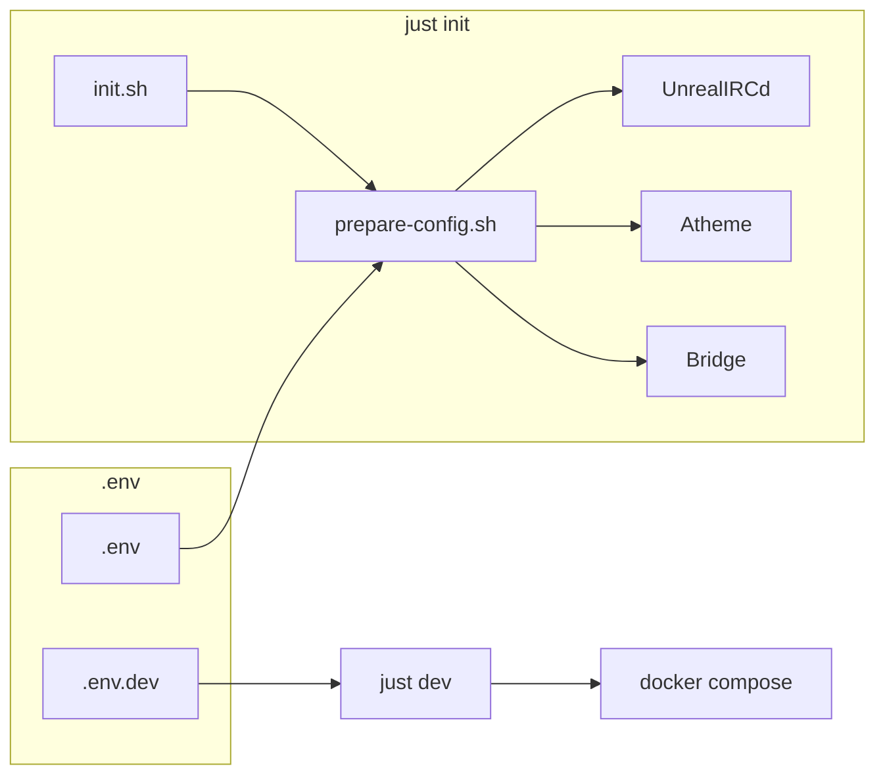

# AGENTS.md and Related Systems Audit Plan

## Scope

Audit all 17 AGENTS.md files and every system they reference:

- **Scripts** — init.sh, prepare-config.sh, gencloak-update-env.sh, cert-manager
- **Lifecycle** — init, dev, staging, prod, down
- **Orchestration** — Docker Compose, profiles, volume mounts
- **Configs** — templates, generated paths, env substitution
- **Env vars** — .env, .env.dev, .env.example structure
- **Dev vs prod** — profiles, TLS verify, domain overrides
- **Docker** — compose fragments, build contexts, health checks
- **Just** — root + per-app commands, mod loading

---

## Phase 1: Root and Orchestration

### 1.1 Root [AGENTS.md](AGENTS.md)

| Item                         | Verify Against                                                                                                                                    |
| ---------------------------- | ------------------------------------------------------------------------------------------------------------------------------------------------- |
| Key Commands table           | Root [justfile](justfile) — every `just X` must exist                                                                                             |
| `just dev` uses `.env.dev`   | [justfile](justfile) L29-35: `--env-file .env --env-file .env.dev --profile dev`                                                                  |
| `just prod` / `just staging` | [justfile](justfile) L37-45: exist but compose has no `staging`/`prod` profile in fragments — only `dev` (Dozzle) in [compose.yaml](compose.yaml) |
| `just scan`                  | [justfile](justfile) L77-80: placeholder only; document or remove from AGENTS                                                                     |
| `just down` stops dev        | [justfile](justfile) L50: `docker compose --profile dev down` — correct                                                                           |
| Repository Structure         | Match [infra/compose/](infra/compose/), [scripts/](scripts/), [tests/](tests/)                                                                    |
| Related links                | All 10 links must resolve                                                                                                                         |

**Gaps:** staging/prod profiles not defined in compose; scan is placeholder.

### 1.2 [infra/AGENTS.md](infra/AGENTS.md)

| Item                   | Verify Against                                                              |
| ---------------------- | --------------------------------------------------------------------------- |
| compose fragments list | [infra/compose/](infra/compose/): irc, xmpp, bridge, cert-manager, networks |
| TURN standalone path   | [infra/turn-standalone/](infra/turn-standalone/) exists                     |
| Main stack usage       | Root [compose.yaml](compose.yaml) `include:` matches                        |

### 1.3 [scripts/AGENTS.md](scripts/AGENTS.md)

| Item                    | Verify Against                                                                                                                                      |
| ----------------------- | --------------------------------------------------------------------------------------------------------------------------------------------------- |
| prepare-config.sh scope | [scripts/prepare-config.sh](scripts/prepare-config.sh): generates UnrealIRCd, Atheme, **and Bridge** config — AGENTS says only "UnrealIRCd, Atheme" |
| init.sh flow            | [scripts/init.sh](scripts/init.sh): creates data dirs, runs prepare-config, generates dev certs                                                     |
| cert-manager/           | [scripts/cert-manager/](scripts/cert-manager/) exists                                                                                               |
| gencloak                | [scripts/gencloak-update-env.sh](scripts/gencloak-update-env.sh) — `just irc gencloak` runs it                                                      |

**Fix:** Add Bridge to prepare-config description in scripts/AGENTS.md.

---

## Phase 2: App AGENTS.md

### 2.1 [apps/unrealircd/AGENTS.md](apps/unrealircd/AGENTS.md)

| Item                 | Verify Against                                                                                                                         |
| -------------------- | -------------------------------------------------------------------------------------------------------------------------------------- |
| `just irc shell`     | [apps/unrealircd/justfile](apps/unrealircd/justfile) L7-8: `docker compose -f ../../compose.yaml -p atl-chat exec atl-irc-server bash` |
| `just irc reload`    | L72-74: `docker compose -f ../../compose.yaml kill -s HUP atl-irc-server`                                                              |
| `just irc test`      | L11-14: `uv run pytest ../../tests/`                                                                                                   |
| `just irc ssl-setup` | L88-89: `docker compose -f ../../compose.yaml` — path from apps/unrealircd                                                             |
| `just irc gencloak`  | L139: `../../scripts/gencloak-update-env.sh`                                                                                           |
| config path          | prepare-config writes to `apps/unrealircd/config/unrealircd.conf`; template `unrealircd.conf.template`                                 |
| docs link            | [docs/services/irc/](docs/services/irc/) exists                                                                                        |

### 2.2 [apps/prosody/AGENTS.md](apps/prosody/AGENTS.md)

| Item                   | Verify Against                                                                                         |
| ---------------------- | ------------------------------------------------------------------------------------------------------ |
| Commands               | [apps/prosody/justfile](apps/prosody/justfile): shell, reload, adduser, deluser, db-backup, check-cert |
| docker compose project | Prosody uses `atl-xmpp-server`; justfile uses `docker compose -p atl-chat ps -q atl-xmpp-server`       |
| config                 | [apps/prosody/config/prosody.cfg.lua](apps/prosody/config/prosody.cfg.lua)                             |

### 2.3 [apps/web/AGENTS.md](apps/web/AGENTS.md)

| Item      | Verify Against                                                                   |
| --------- | -------------------------------------------------------------------------------- |
| Commands  | [apps/web/justfile](apps/web/justfile): dev, build, start, lint, fix, type-check |
| Env vars  | just dev sets `NEXT_PUBLIC_IRC_WS_URL`, `NEXT_PUBLIC_XMPP_BOSH_URL`              |
| Structure | [apps/web/app/](apps/web/app/), [apps/web/components/](apps/web/components/)     |

### 2.4 [apps/atheme/AGENTS.md](apps/atheme/AGENTS.md)

| Item            | Verify Against                                                                                                      |
| --------------- | ------------------------------------------------------------------------------------------------------------------- |
| No justfile mod | Correct — atheme runs via compose, no `just atheme`                                                                 |
| config path     | [apps/atheme/config/atheme.conf.template](apps/atheme/config/atheme.conf.template) → atheme.conf via prepare-config |
| docs link       | [docs/services/irc/ATHEME.md](docs/services/irc/ATHEME.md)                                                          |

### 2.5 [apps/bridge/AGENTS.md](apps/bridge/AGENTS.md)

| Item                 | Verify Against                                                                                                   |
| -------------------- | ---------------------------------------------------------------------------------------------------------------- |
| Commands             | [apps/bridge/justfile](apps/bridge/justfile): lint, format, typecheck, test, check                               |
| Entry point          | `uv run bridge --config config.yaml`                                                                             |
| config generation    | prepare-config.sh generates [apps/bridge/config.yaml](apps/bridge/config.yaml) from config.template.yaml         |
| Env vars             | [.env.example](.env.example) L349-368: BRIDGE_*, [infra/compose/bridge.yaml](infra/compose/bridge.yaml) env_file |
| Repository structure | [apps/bridge/src/bridge/](apps/bridge/src/bridge/) — adapters, gateway, formatting                               |
| Test count           | 765 (verified)                                                                                                   |

---

## Phase 3: Config and Env

### 3.1 Config Generation Flow

| Config     | Template                 | Output          | Script         |
| ---------- | ------------------------ | --------------- | -------------- |
| UnrealIRCd | unrealircd.conf.template | unrealircd.conf | prepare-config |
| Atheme     | atheme.conf.template     | atheme.conf     | prepare-config |
| Bridge     | config.template.yaml     | config.yaml     | prepare-config |

### 3.2 Env Var Structure

| Source                       | Purpose                                           |
| ---------------------------- | ------------------------------------------------- |
| [.env.example](.env.example) | Master registry (~300 lines), 9 sections          |
| .env                         | Copy of .env.example, customize                   |
| .env.dev                     | Overlay for `just dev` — localhost domains, debug |

**Verify:** .env.dev existence and what it overrides (IRC_DOMAIN, PROSODY_DOMAIN, etc. for localhost).

### 3.3 Dev vs Prod

| Aspect              | Dev                           | Prod                        |
| ------------------- | ----------------------------- | --------------------------- |
| Domains             | irc.localhost, xmpp.localhost | irc.atl.chat, xmpp.atl.chat |
| TLS verify (bridge) | BRIDGE_IRC_TLS_VERIFY=false   | true                        |
| Cert source         | init.sh dev certs             | Lego / Let's Encrypt        |
| Profile             | `--profile dev` (Dozzle)      | default                     |

**Verify:** prepare-config L66: `IRC_TLS_VERIFY` from `ATL_ENVIRONMENT=dev` → false.

---

## Phase 4: Docker and Compose

### 4.1 Compose Structure

| Fragment                                                           | Services                                           | Profiles |
| ------------------------------------------------------------------ | -------------------------------------------------- | -------- |
| [infra/compose/networks.yaml](infra/compose/networks.yaml)         | atl-chat network                                   | —        |
| [infra/compose/irc.yaml](infra/compose/irc.yaml)                   | atl-irc-server, atl-irc-services, atl-irc-webpanel | —        |
| [infra/compose/xmpp.yaml](infra/compose/xmpp.yaml)                 | atl-xmpp-server, xmpp-postgres                     | —        |
| [infra/compose/bridge.yaml](infra/compose/bridge.yaml)             | atl-bridge                                         | —        |
| [infra/compose/cert-manager.yaml](infra/compose/cert-manager.yaml) | cert-manager                                       | —        |
| [compose.yaml](compose.yaml)                                       | dozzle                                             | dev      |

**Gap:** Root justfile has `staging` and `prod` but no compose services use those profiles.

### 4.2 Volume Mounts

Cross-check [docs/infra/data-structure.md](docs/infra/data-structure.md) with [infra/compose/irc.yaml](infra/compose/irc.yaml), xmpp.yaml, bridge.yaml:

- data/irc/data, logs, webpanel-data
- data/atheme/data, logs
- data/xmpp/data, uploads
- data/certs
- apps/bridge/config.yaml → /app/config.yaml

### 4.3 Env File Usage

| Compose fragment | env_file   | Key vars          |
| ---------------- | ---------- | ----------------- |
| irc.yaml         | ../../.env | IRC_*, ATHEME_*   |
| xmpp.yaml        | ../../.env | PROSODY_*, XMPP_* |
| bridge.yaml      | ../../.env | BRIDGE_*          |

---

## Phase 5: Bridge Sub-AGENTS.md

### 5.1 [apps/bridge/src/AGENTS.md](apps/bridge/src/AGENTS.md), [src/bridge/AGENTS.md](apps/bridge/src/bridge/AGENTS.md)

- Verify structure tree matches [apps/bridge/src/bridge/](apps/bridge/src/bridge/)
- Verify Related links (gateway, adapters, formatting)
- Verify events.py dataclasses match Event table

### 5.2 [apps/bridge/src/bridge/adapters/AGENTS.md](apps/bridge/src/bridge/adapters/AGENTS.md)

- Files table: all 9 adapter files exist
- Env vars per adapter (BRIDGE_DISCORD_TOKEN, BRIDGE_IRC_NICK, BRIDGE_XMPP_*)

### 5.3 [apps/bridge/src/bridge/gateway/AGENTS.md](apps/bridge/src/bridge/gateway/AGENTS.md), [formatting/AGENTS.md](apps/bridge/src/bridge/formatting/AGENTS.md)

- Files table accuracy
- Related links

### 5.4 [apps/bridge/tests/AGENTS.md](apps/bridge/tests/AGENTS.md)

- Test files table: all 37 test_*.py files listed
- Commands: `just test` (from bridge dir)
- Related links

---

## Phase 6: docs/ and tests/

### 6.1 [docs/AGENTS.md](docs/AGENTS.md)

- Structure table matches [docs/](docs/) subdirs
- Key Files links resolve
- architecture/new-service.md exists

### 6.2 [tests/AGENTS.md](tests/AGENTS.md)

- Structure table: unit, integration, e2e, protocol, legacy, controllers, fixtures, utils
- Commands: `just test`, `uv run pytest tests/`
- Root pyproject testpaths = ["tests"]

---

## Phase 7: Cross-Cut Checks

### 7.1 Broken Links

For every AGENTS.md, resolve each `[text](path)` link. Paths are relative to the AGENTS.md file.

### 7.2 Orphaned References

- Any AGENTS.md referencing scripts/commands/files that no longer exist
- Any script/command not documented where relevant

### 7.3 Consistency

- Same command described differently in root vs app AGENTS
- Same config path in scripts vs compose vs docs

---

## Deliverables

1. **Audit checklist** — Per-file verification matrix (pass/fail per item)
2. **Fix list** — Concrete edits: add Bridge to scripts/AGENTS.md; document or fix staging/prod; fix any broken links
3. **Gap report** — Undocumented: .env.dev, staging/prod profile behavior, scan placeholder

---

## Execution Order

1. Phase 1 (root, infra, scripts) — highest impact
2. Phase 2 (app AGENTS) — command and path verification
3. Phase 3 (config, env) — data flow accuracy
4. Phase 4 (Docker) — compose and volume alignment
5. Phase 5 (bridge sub) — file and link verification
6. Phase 6 (docs, tests) — structure accuracy
7. Phase 7 (cross-cut) — links and consistency

