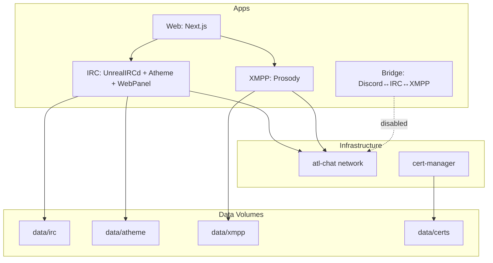

# atl.chat Codebase Architecture Audit & Restructuring Plan

## Current State Summary

The monorepo contains:

- **apps/irc** – UnrealIRCd + Atheme + WebPanel (Python tests, shell scripts)
- **apps/xmpp** – Prosody XMPP server (Lua config)
- **apps/web** – Next.js 15 landing page
- **apps/bridge** – Discord↔IRC↔XMPP bridge (submodule)
- **infra/** – Shared Docker networks, cert-manager, base images
- **docs/** – Centralized documentation (IRC-heavy)
- **lib/** – Empty Python package stubs (`atl_docker`, `atl_testing`, `atl_common`)

---

## P0: Repo Hygiene (Highest Impact)

**Note:** `.gitignore` already excludes `data/`, `.venv/`, `.uv_cache/`, `.pytest_cache/`, `prosody-modules/`, `prosody-modules-enabled/`. If these were ever committed, they may need to be removed from git history. Verify with `git ls-files`.

### 1. tmp/ Directory Committed

`tmp/` is **not** in .gitignore. Five files are tracked:

- `tmp/cloudflare-credentials.ini.example`
- `tmp/nginx-docker.conf`, `tmp/nginx-docker.dev.conf`
- `tmp/prometheus-scrape-config.yml`
- `tmp/turnserver.conf`

**Fix:** Add `tmp/` to .gitignore. Move any useful configs to `infra/` or `docs/examples/`, then remove from tracking.

### 2. Prosody Modules at Build Time

The Prosody Containerfile clones the **entire** prosody-modules Mercurial repo at build time (`hg clone https://hg.prosody.im/prosody-modules/`), then symlinks only the ~21 modules in [modules.list](apps/xmpp/services/prosody/modules.list). This is slow and pulls hundreds of unused modules.

**Fix:** Fetch only needed modules. Options:

- Use `hg clone` with sparse checkout if Mercurial supports it
- Or: maintain a minimal clone script that fetches only listed modules via `hg archive` or per-module clone
- Pin modules as LuaRocks where available

### 3. Data Directory Verification

Ensure `data/` is never committed. If it was committed before .gitignore, run `git rm -r --cached data/` and commit. Add `just init` task to create `data/` structure on first run so removal doesn't break onboarding.

---

## P0: Container Security

### 4. UnrealIRCd Runtime Image – Build Tools

The [UnrealIRCd Containerfile](apps/irc/services/unrealircd/Containerfile) runtime stage includes full build toolchain (build-base, cmake, openssl-dev, pcre2-dev, etc.) to support runtime module installation. This significantly increases attack surface.

**Fix:** Strip build tools from runtime. Build third-party modules in the builder stage using the manifest, copy only compiled `.so` files to runtime. Module changes = image rebuild (immutable infrastructure).

---

## Critical Issues (Fix Next)

### 5. Path Inconsistency: `conf` vs `config`

The IRC service uses **config** at `apps/irc/services/unrealircd/config/`, but tests and some docs reference **conf**:


| Location                                                     | Uses                           | Actual Path                         |
| ------------------------------------------------------------ | ------------------------------ | ----------------------------------- |
| [apps/irc/compose.yaml](apps/irc/compose.yaml)               | `./services/unrealircd/config` | Correct                             |
| [apps/irc/tests/conftest.py](apps/irc/tests/conftest.py) L36 | `services/unrealircd/conf`     | **Wrong**                           |
| [docs/services/irc/](docs/services/irc/)*                    | `src/backend/unrealircd/conf`  | **Legacy**                          |
| [.env.example](.env.example)                                 | `/home/.../conf/tls/`          | **Wrong** (container uses `config`) |


**Fix:** Update conftest `source_dir` to `services/unrealircd/config`, fix all legacy docs to `apps/irc/services/unrealircd/config`, align .env.example.

### 6. Broken References in Documentation

[docs/README.md](docs/README.md) links to non-existent paths:

- `./onboarding/README.md` – does not exist
- `./architecture/README.md` – does not exist
- `./architecture/ci-cd.md` – does not exist
- `./architecture/new-service.md` – does not exist
- `./bridges/README.md` – does not exist
- `./services/irc/README.md` – actual path is `./services/irc/README.md` (exists)
- `../apps/bridge/README.md` – bridge submodule

**Fix:** Either create stub docs or remove/fix broken links.

### 7. pnpm Workspace Mismatch

[pnpm-workspace.yaml](pnpm-workspace.yaml) includes `packages/`* but no `packages/` directory exists. Root [package.json](package.json) only has `workspaces: ["apps/*"]`.

**Fix:** Remove `packages/`* from pnpm-workspace.yaml to avoid confusion.

### 8. Stale package.json Scripts (IRC, XMPP)

[apps/irc/package.json](apps/irc/package.json) and [apps/xmpp/package.json](apps/xmpp/package.json) reference `make up`, `make build`, `make test` but the project uses **justfile**.

**Fix:** Update to `just` commands or remove scripts if not used by pnpm.

### 9. Root package.json Scripts vs justfile

Root [package.json](package.json) has `"build": "just build"`, `"test": "just test"` but root [justfile](justfile) has no `build` or `test` recipes.

**Fix:** Add root `build` and `test` that delegate to apps (e.g. `just irc test`, `just web build`) or remove from package.json.

### 10. IRC pyproject.toml Hatch Misconfiguration

[apps/irc/pyproject.toml](apps/irc/pyproject.toml) declares:

```toml
[tool.hatch.build.targets.wheel]
packages = ["services/atheme", "services/unrealircd"]
```

These are config directories, not Python packages. The IRC app is a service + tests, not a distributable Python package.

**Fix:** Remove the hatch wheel config or make it a proper package if you intend to ship Python code.

### 11. Prosody mod_net_proxy Missing

Compose and NPM_SETUP.md assume Prosody handles PROXY protocol for TCP streams (5222, 5269). `mod_net_proxy` is:

- **Not** in [prosody.cfg.lua](apps/xmpp/services/prosody/config/prosody.cfg.lua) `modules_enabled`
- **Not** in [modules.list](apps/xmpp/services/prosody/modules.list) (so not fetched from prosody-modules)

Without it, PROXY protocol from NPM will break XMPP C2S/S2S when NPM is in front (Scenario B/C).

**Fix:** Add `mod_net_proxy` to modules.list; add `"net_proxy"` to prosody.cfg.lua `modules_enabled`; configure `proxy_port_mappings` and `proxy_trusted_proxies` per [Prosody docs](https://modules.prosody.im/mod_net_proxy). Or, if not using NPM PROXY for XMPP, document that and remove PROXY from NPM stream config for 5222/5269.

### 12. Bridge Compose

- [infra/compose/bridge.yaml](infra/compose/bridge.yaml) defines `bridge` service using `ghcr.io/allthingslinux/bridge` image
- Root [compose.yaml](compose.yaml) includes `infra/compose/bridge.yaml`

### 13. E2E Test Fixture Assumptions

[apps/irc/tests/e2e/test_e2e_workflow.py](apps/irc/tests/e2e/test_e2e_workflow.py) copies `Makefile`, `src`, `docs` for temp project setup. `Makefile` does not exist (only `Makefile.bak`), `src` does not exist.

**Fix:** Update E2E fixtures to copy `justfile`, `apps/irc/scripts`, and only necessary configs.

---

## Structural Recommendations

### A. Directory Layout (Proposed)

Two options from the audit feedback:

**Option A – Keep app-centric compose (current pattern, cleaned up):**

```
atl.chat/
├── apps/
│   ├── irc/           # UnrealIRCd + Atheme + WebPanel
│   ├── xmpp/          # Prosody
│   ├── web/            # Next.js
│   └── bridge/         # Discord↔IRC↔XMPP (submodule)
├── infra/
│   └── docker/
│       ├── compose/
│       ├── cert-manager/
│       ├── base-images/
│       └── turn-standalone/
├── docs/
├── data/               # Runtime data (gitignored)
└── ...
```

**Option B – Consolidate compose under infra (recommended by feedback):**

```
atl.chat/
├── apps/
│   ├── irc/            # config/ + Containerfile + tests/
│   ├── xmpp/           # config/ + Containerfile + modules.list
│   ├── web/
│   └── bridge/
├── infra/
│   ├── compose/        # ALL compose files here
│   │   ├── networks.yaml
│   │   ├── irc.yaml
│   │   ├── xmpp.yaml
│   │   ├── web.yaml
│   │   ├── bridge.yaml
│   │   └── monitoring.yaml
│   └── base-images/
├── docs/
├── tests/              # Top-level test runner (optional)
└── compose.yaml        # Root orchestrator only
```

### A2. Compose Network Pattern

**Current:** Each sub-app compose includes `../../infra/docker/compose/networks.yaml`. Docker deduplicates, but it's redundant.

**Better:** Root `compose.yaml` defines the network once. Sub-app compose files reference it as `external: true`:

```yaml
# infra/compose/irc.yaml
services:
  atl-irc-server:
    networks:
      - atl-chat

networks:
  atl-chat:
    external: true
```

### B. lib/ Directory Decision

`lib/` contains only stub packages (`atl_docker`, `atl_testing`, `atl_common`). They are not imported anywhere. The root `pyproject.toml` has `dependencies = ["atl-chat-irc"]` – the root project shouldn't depend on a sub-package; it should be a dev-only workspace. `lib/` packages aren't workspace members, so they can't be imported.

**Options:**

1. **Remove** – if no shared Python code is planned
2. **Populate** – move shared test utilities from `apps/irc/tests/` (e.g. `DockerComposeHelper`, controllers) into `lib/atl_testing`, add `lib/`* to `[tool.uv.workspace] members`, and have IRC depend on it
3. **Convert to packages/** – if you want npm/pnpm shared packages instead

Recommendation: Either remove or populate. Stubs add confusion. Fix root `pyproject.toml` to remove `dependencies = ["atl-chat-irc"]` or make it dev-only.

### C. Documentation Consolidation

- **docs/services/irc/** – Very detailed; keep as-is but fix all `src/backend/unrealircd/conf` → `apps/irc/services/unrealircd/config`
- **docs/services/xmpp**, **docs/services/web** – Minimal; expand as needed
- **Create** `docs/onboarding/README.md` and `docs/architecture/README.md` (or remove links)

### D. Data Directory Standardization

[apps/irc/scripts/init.sh](apps/irc/scripts/init.sh) creates:

- `data/unrealircd`, `data/atheme`
- `data/irc/logs`, `data/atheme/logs`

Compose uses:

- `data/irc/data`, `data/irc/logs`, `data/atheme/data`, `data/atheme/logs`
- `data/xmpp/data`, `data/xmpp/uploads`
- `data/certs`

**Fix:** Align init.sh with compose paths (e.g. `data/irc/data`, `data/irc/logs`).

### E. CI/CD Gaps

- **IRC:** CI runs lint (shell) and Docker build but **not pytest**
- **XMPP:** No tests in CI
- **Web:** Lint and build run

**Recommendation:** Add `uv run pytest apps/irc/tests/` to CI when IRC changes. Add XMPP tests if/when they exist.

### F. Compose Profile Alignment

Root compose uses `dev`, `staging`, `prod`. Bridge sub-composes use `bridge` profile. Ensure profiles are consistent and documented.

### G. Bridge – Delete or Implement

Bridge is defined in `infra/compose/bridge.yaml` using the `bridge` service.

### H. Gamja (IRC Web Client)

`apps/irc/services/gamja/` has a Containerfile but is never wired into any compose file. Either add it to the IRC stack or remove if unused.

### I. Secrets / Config Separation

- `ATL_CHAT_IP`, `ATL_GATEWAY_IP` in `.env.example` are Tailscale IPs – host-specific; shouldn't be in the example.
- Consider splitting: `.env.example` (non-secret: domains, ports) and `.env.secrets.example` (passwords, tokens). In production, secrets come from a secrets manager.
- `ssl-manager.sh` (23KB) is complex – consider simplifying or documenting the flow.

### J. just init Task

Add `just init` that creates the `data/` directory structure so removing `data/` from the repo doesn't break first-run. Consolidate with `apps/irc/scripts/init.sh` logic.

---

## Scripts, Init, and Containers – Deep Dive

### Data Directory Mismatch (init.sh vs compose)

**init.sh creates:**

- `data/unrealircd` – **Wrong.** Compose mounts `data/irc/data`, `data/irc/logs`
- `data/atheme` – Partial. Compose uses `data/atheme/data`, `data/atheme/logs`
- `data/irc/logs`, `data/atheme/logs` – Correct

**Compose actually mounts:**

- `data/irc/data`, `data/irc/logs`, `data/irc/webpanel-data`
- `data/atheme/data`, `data/atheme/logs`
- `data/xmpp/data`, `data/xmpp/uploads`
- `data/certs` (Prosody, cert-manager)

**Fix:** init.sh should create exactly what compose expects:

```bash
data_dirs=(
  "$PROJECT_ROOT/data/irc/data"
  "$PROJECT_ROOT/data/irc/logs"
  "$PROJECT_ROOT/data/irc/webpanel-data"
  "$PROJECT_ROOT/data/atheme/data"
  "$PROJECT_ROOT/data/atheme/logs"
  "$PROJECT_ROOT/data/xmpp/data"
  "$PROJECT_ROOT/data/xmpp/uploads"
  "$PROJECT_ROOT/data/certs"
)
```

Remove `data/unrealircd` – it is never used.

### init.sh Bug: Invalid Path

Line 144: `find "$PROJECT_ROOT/atheme"` – **Wrong.** There is no `atheme` at project root. Should be `$PROJECT_ROOT/data/atheme` or remove (data/atheme subdirs are already handled).

### DRY Violations Across Scripts


| Pattern                                       | init.sh                    | prepare-config.sh    | ssl-manager.sh                      |
| --------------------------------------------- | -------------------------- | -------------------- | ----------------------------------- |
| SCRIPT_DIR, APPS_IRC_ROOT, PROJECT_ROOT       | Yes                        | Yes                  | Yes (REPO_ROOT)                     |
| log_info, log_success, log_warning, log_error | Yes                        | Yes                  | Yes (log_info, log_warn, log_error) |
| .env loading (set -a; source .env; set +a)    | Yes                        | Yes                  | Yes                                 |
| envsubst for UnrealIRCd + Atheme              | Yes (prepare_config_files) | Yes (prepare_config) | No                                  |


**Recommendation:** Create `lib/scripts/common.sh` (or `infra/scripts/lib.sh`):

```bash
# Source by: source "$(dirname "$0")/../lib/common.sh" or similar
log_info() { echo -e "\033[0;34m[INFO]\033[0m $1"; }
log_success() { echo -e "\033[0;32m[SUCCESS]\033[0m $1"; }
log_warning() { echo -e "\033[0;33m[WARNING]\033[0m $1"; }
log_error() { echo -e "\033[0;31m[ERROR]\033[0m $1"; }
load_env() { [ -f "$1" ] && set -a && source "$1" && set +a; }
get_project_root() { ... }  # Single source of truth
```

Each script sources this and uses shared helpers. Reduces ~100 lines of duplication.

### init.sh vs prepare-config.sh Overlap

Both perform envsubst for UnrealIRCd and Atheme configs. init.sh calls `prepare_config_files`; prepare-config.sh is a standalone script. Tests run both.

**Recommendation:** Have init.sh call prepare-config.sh instead of duplicating logic. Or extract a single `prepare_irc_config()` function into common.sh and have both use it. Eliminates ~60 lines of duplicate template logic.

### SSL: Two Competing Systems

1. **infra/docker/cert-manager** – Uses Lego, hardcoded `*.atl.chat atl.chat`, outputs to `data/certs`. Used by compose cert-manager service.
2. **apps/irc/scripts/ssl-manager.sh** – Uses Certbot (docker run certbot/dns-cloudflare), `IRC_ROOT_DOMAIN` from .env, outputs to `data/letsencrypt` then copies to `apps/irc/.../tls/server.cert.pem`.

They are **incompatible**. cert-manager uses Lego/Cloudflare; ssl-manager uses Certbot. Different output layouts. UnrealIRCd template expects `IRC_SSL_CERT_PATH` / `IRC_SSL_KEY_PATH` – flexible, but the tooling is fragmented.

**Recommendation:** Pick one:

- **Option A:** Use cert-manager (Lego) for everything. Extend it to support configurable domains, and add a copy step to UnrealIRCd tls dir. Remove ssl-manager.sh.
- **Option B:** Use ssl-manager (Certbot) only. Remove or repurpose cert-manager. Document the flow.

**Decision: cert-manager (Option A).** Implementation plan below.

### cert-manager Implementation Plan

**Scope:** Use [infra/docker/cert-manager](infra/docker/cert-manager) (Lego) as the single SSL path. Remove ssl-manager.sh and ssl-monitor references.

**Lego output layout:** Writes to `data/certs/certificates/` with filenames `_.<domain>.crt` and `_.<domain>.key` for wildcards (e.g. `_.atl.chat.crt`, `_.atl.chat.key`). Base path is `--path /data` (host: `data/certs`).

**Tasks:**

1. **Extend cert-manager run.sh** – Make domains configurable via env (e.g. `IRC_ROOT_DOMAIN` or `SSL_DOMAIN`). Default `*.atl.chat atl.chat`. Pass `--domains` from env.
2. **Wire UnrealIRCd to cert-manager** – Mount `data/certs` into UnrealIRCd container. Set `IRC_SSL_CERT_PATH` and `IRC_SSL_KEY_PATH` to Lego output paths (e.g. `/home/unrealircd/certs/certificates/_.atl.chat.crt`). Add volume in [apps/irc/compose.yaml](apps/irc/compose.yaml).
3. **Prosody cert compatibility** – Prosody expects `certs/live/<domain>/fullchain.pem` and `privkey.pem` (Certbot layout). Options: (a) Add post-renewal symlink step in cert-manager to create `live/<domain>/` layout; or (b) Set `PROSODY_SSL_CERT` / `PROSODY_SSL_KEY` env to Lego paths. Option (b) is simpler; update [apps/xmpp/services/prosody/config/prosody.cfg.lua](apps/xmpp/services/prosody/config/prosody.cfg.lua) to use env when set.
4. **Remove ssl-manager.sh** – Delete [apps/irc/scripts/ssl-manager.sh](apps/irc/scripts/ssl-manager.sh).
5. **Remove ssl-monitor references** – Replace `apps/irc/justfile` ssl-setup, ssl-status, ssl-renew, ssl-logs, ssl-stop with cert-manager equivalents (e.g. `just irc ssl-setup` → `docker compose -f infra/docker/cert-manager/compose.yaml up -d`; `ssl-status` → check `data/certs/certificates/` exists and cert validity).
6. **Update tests** – Remove `--scale ssl-monitor=0`; remove or rewrite [apps/irc/tests/legacy/integration/test_ssl_management.py](apps/irc/tests/legacy/integration/test_ssl_management.py), [test_scripts.py](apps/irc/tests/legacy/integration/test_scripts.py) ssl-manager tests; update [test_infrastructure.py](apps/irc/tests/integration/test_infrastructure.py) ssl_script references.
7. **Update docs** – [docs/services/irc/SSL.md](docs/services/irc/SSL.md), [SCRIPTS.md](docs/services/irc/SCRIPTS.md), [DOCKER.md](docs/services/irc/DOCKER.md), [TROUBLESHOOTING.md](docs/services/irc/TROUBLESHOOTING.md), etc. Replace ssl-manager.sh / make ssl-* with cert-manager flow.

**Files to modify (cert-manager):**

- [infra/docker/cert-manager/scripts/run.sh](infra/docker/cert-manager/scripts/run.sh) – Configurable domains from env
- [infra/docker/cert-manager/compose.yaml](infra/docker/cert-manager/compose.yaml) – Pass `IRC_ROOT_DOMAIN` or `SSL_DOMAIN` env
- [apps/irc/compose.yaml](apps/irc/compose.yaml) – Add `data/certs` volume; set `IRC_SSL_CERT_PATH`, `IRC_SSL_KEY_PATH` to Lego paths
- [apps/xmpp/compose.yaml](apps/xmpp/compose.yaml) – Set `PROSODY_SSL_CERT`, `PROSODY_SSL_KEY` to Lego paths (if not using symlink layout)
- [apps/xmpp/services/prosody/config/prosody.cfg.lua](apps/xmpp/services/prosody/config/prosody.cfg.lua) – Prefer env over `certs/live/` when set
- [apps/irc/justfile](apps/irc/justfile) – Replace ssl-* recipes with cert-manager
- Delete [apps/irc/scripts/ssl-manager.sh](apps/irc/scripts/ssl-manager.sh)
- [apps/irc/tests/](apps/irc/tests/) – Remove ssl-monitor, ssl-manager references
- [docs/services/irc/](docs/services/irc/) – SSL.md, SCRIPTS.md, DOCKER.md, MAKE.md, TROUBLESHOOTING.md, etc.

### Scripts: Uncertain or Ambiguous Status

The following scripts have unclear status, wrong paths, or are orphaned. Decisions needed:


| Script                                                          | Location                                | Issue                                                                                                                                                                                                                                                                    |
| --------------------------------------------------------------- | --------------------------------------- | ------------------------------------------------------------------------------------------------------------------------------------------------------------------------------------------------------------------------------------------------------------------------ |
| **health-check.sh**                                             | `apps/irc/services/unrealircd/scripts/` | Tests and docs reference `apps/irc/scripts/health-check.sh` – **file does not exist there**. Actual file is under `services/unrealircd/scripts/`. Either move to `apps/irc/scripts/` (host-side) or fix test/doc paths.                                                  |
| **module-config.sh**                                            | `apps/irc/services/unrealircd/scripts/` | Docs say `docker compose exec atl-irc-server module-config.sh add webpanel` – but **module-config.sh is not copied into the container**. Containerfile only copies `install-modules.sh`, `manage-modules.sh`. Add `COPY ./scripts/module-config.sh` or remove from docs. |
| **test-docker-setup.sh**, **test-debug.sh**, **simple-test.sh** | `apps/xmpp/tests/`                      | All reference `**docker-compose.dev.yml`** – **file does not exist**. XMPP compose uses `compose.yaml`. Fix paths or delete scripts.                                                                                                                                     |
| **setup-environment.sh**                                        | `apps/xmpp/services/prosody/scripts/`   | Creates `.env.development` from `.env.example`. **Not referenced anywhere** (no justfile, no docs). Orphaned or one-off?                                                                                                                                                 |
| **setup-production-secrets.sh**                                 | `apps/xmpp/services/prosody/scripts/`   | Sets up Cloudflare credentials, production secrets. **Not referenced anywhere**. Orphaned.                                                                                                                                                                               |
| **setup-turn-server.sh**                                        | `apps/xmpp/services/prosody/scripts/`   | TURN server setup, references `.runtime/certs` and Let's Encrypt layout. **Not referenced anywhere**. Orphaned.                                                                                                                                                          |
| **create-admin-user.sh**                                        | `apps/xmpp/services/prosody/scripts/`   | Creates admin@localhost for Prosody. **Not referenced anywhere**. Orphaned or manual-only?                                                                                                                                                                               |
| **setup-modules-locally.sh**                                    | `apps/xmpp/services/prosody/scripts/`   | Used by `just xmpp setup-modules`. **In use** – keep.                                                                                                                                                                                                                    |


**Recommendation:** Fix health-check and module-config paths; fix or delete XMPP test scripts; decide whether Prosody setup scripts (setup-environment, setup-production-secrets, setup-turn-server, create-admin-user) are needed – if not, remove.

### ssl-monitor: Orphaned Reference

`apps/irc/justfile` references `ssl-monitor` (ssl-setup, ssl-status, ssl-logs, ssl-stop) but **ssl-monitor is not defined in apps/irc/compose.yaml**. The justfile commands will fail. Tests use `--scale ssl-monitor=0` to avoid starting it.

**Fix:** Either add ssl-monitor service to compose (e.g. a sidecar that runs ssl-manager.sh check on a schedule) or remove all ssl-monitor references from justfile and tests. **(Superseded by cert-manager plan – remove ssl-monitor refs.)**

### ssl-manager.sh Complexity (767 lines)

Responsibilities: validation, issue, renew, copy, restart, fix permissions, help. Good structure but could be split:

- `ssl-common.sh` – validation, log helpers, env loading
- `ssl-issue.sh`, `ssl-renew.sh` – thin wrappers calling common logic

Or keep as one file but extract `fix_letsencrypt_permissions`, `copy_certificates` into a separate "ssl-utils" script sourced by the main one. Reduces cognitive load.

### Container Entrypoints: Divergent Patterns


| Container  | Entrypoint style    | Key behavior                                                                                                                 |
| ---------- | ------------------- | ---------------------------------------------------------------------------------------------------------------------------- |
| UnrealIRCd | Minimal (~50 lines) | mkdir, chown, validate config, exec                                                                                          |
| Atheme     | Minimal (~60 lines) | mkdir, validate, first-run db init, exec                                                                                     |
| Prosody    | Full (~360 lines)   | validate env, setup dirs, setup certs (self-signed if missing), wait_for_db, validate config, setup modules, signal handlers |


**Prosody** does a lot: self-signed cert generation, DB wait, config sync from mount. **UnrealIRCd** and **Atheme** assume config/certs are pre-provisioned by host scripts (init.sh, ssl-manager).

**Recommendation:** Document this split. For consistency, consider moving dev cert generation into UnrealIRCd entrypoint (like Prosody) so `just dev` works without init.sh generating certs – or keep init.sh as the single source for dev certs and document it clearly.

### Prosody Containerfile: Full Clone

Line 87: `hg clone https://hg.prosody.im/prosody-modules/ prosody-modules` – clones **entire** repo. Then a loop symlinks only modules from modules.list (~21). Build is slow and image layers are large.

**Better approach:** Mercurial doesn't have sparse checkout. Options:

1. **hg archive** – `hg archive -I "path:mod_foo"` per module (if supported)
2. **Shallow clone + strip** – clone, then delete unneeded dirs (still downloads all)
3. **Per-module fetch** – script that `hg clone` each module as a separate repo (community modules may have different structure)
4. **LuaRocks** – Use for modules that publish there; fall back to hg for others

Pragmatic fix: After the clone, add `RUN find prosody-modules -mindepth 1 -maxdepth 1 ! -name "$(cat modules.list | tr '\n' ' ')" -exec rm -rf {} +` – but that's complex. Simpler: accept full clone for now, add a build cache. Or investigate `hg clone --include` if available.

### UnrealIRCd Containerfile: Build Tools in Runtime

Runtime stage (lines 90–114) includes build-base, cmake, openssl-dev, etc. for runtime module install. Security risk.

**Fix:** Build all third-party modules in builder stage. Copy only `.so` files and any required data to runtime. Remove build toolchain from final image. If new modules are needed, rebuild the image.

### Atheme Containerfile

Clean multi-stage build. No build tools in runtime. Good pattern.

---

## Config File Approaches

### Current State


| Service        | Config Format        | Env Support                | Current Approach                                                          |
| -------------- | -------------------- | -------------------------- | ------------------------------------------------------------------------- |
| **Prosody**    | Lua                  | Native (`Lua.os.getenv()`) | Config reads env at runtime; no templating                                |
| **UnrealIRCd** | Block-based (no env) | None                       | Template with `${VAR}`; envsubst on **host** (init.sh, prepare-config.sh) |
| **Atheme**     | Block-based (no env) | None                       | Same as UnrealIRCd                                                        |


**Flow today:**

1. `just dev` runs `init.sh` before `docker compose up`
2. init.sh sources `.env`, runs `envsubst` on `*.template` → writes `*.conf` to mounted config dir
3. Containers start with pre-generated config; entrypoints do not run envsubst
4. If you run `docker compose up` without init.sh, config may be missing or have unsubstituted `${VAR}`

### Problems

- **Tight coupling:** Config generation depends on host scripts (init.sh, prepare-config.sh). Containers are not self-sufficient.
- **Two sources of truth:** init.sh and prepare-config.sh both do envsubst; logic duplicated.
- **Easy to break:** Forgetting to run init, or changing .env without re-running prepare-config, leaves stale config.
- **Inconsistent:** Prosody uses env at runtime; IRC/Atheme require host-side preprocessing.

### Alternative Approaches

#### Option A: Move envsubst into Container Entrypoints (Recommended)

**Idea:** UnrealIRCd and Atheme entrypoints run `envsubst` at container startup, using env vars Docker injects (`env_file`, `environment`).

**Flow:**

```
Container start → entrypoint runs envsubst < template > config → start daemon
```

**Changes:**

- Add `gettext` (provides envsubst) to UnrealIRCd and Atheme runtime images
- Entrypoint: `envsubst < /path/to/unrealircd.conf.template > /path/to/unrealircd.conf` then `exec unrealircd`
- Remove config generation from init.sh and prepare-config.sh
- Keep template in repo; generated config written to writable config dir (or tmp + move)

**Pros:**

- Containers self-sufficient; `docker compose up` works with just `.env`
- Single place for config logic (entrypoint)
- Aligns with 12-factor (config from env)
- init.sh can focus on data dirs, certs, .env creation

**Cons:**

- Need writable config dir (compose mounts `./config` – usually writable on host; in container it's the mount)
- Slightly slower startup (negligible)
- Must ensure all required env vars are in compose `environment` (already done for IRC_DOMAIN, etc.)

**Mount consideration:** Compose mounts `./services/unrealircd/config` into the container. The container writes to that path – it writes to the host's directory. So `unrealircd.conf` would be created/overwritten on the host. That's fine. The template is in the repo; we'd keep `unrealircd.conf` in .gitignore (already is per .gitignore).

#### Option B: UnrealIRCd Include + Minimal Generated File

**Idea:** Main config uses `include "env.conf";`. Entrypoint generates only `env.conf` from env (small file with just the variable parts).

**Pros:** Smaller generated output; main config stays static.
**Cons:** Must map each env var to UnrealIRCd syntax; two files to maintain; more complex.

#### Option C: Keep Host-Side, Simplify

**Idea:** Keep envsubst on host but: (1) fold prepare-config into init.sh, (2) entrypoint fails fast with clear message if config missing.

**Pros:** No container changes; minimal work.
**Cons:** Still requires init.sh before compose up; not self-sufficient.

#### Option D: Confd / Templating Daemon

**Idea:** Use confd or similar to watch env and regenerate config.
**Cons:** Extra moving parts; overkill for this scale.

### Recommendation

**Option A** – move envsubst into entrypoints. UnrealIRCd and Atheme entrypoints would:

1. Ensure template exists
2. Run `envsubst` to produce config (use `envsubst` with explicit variable list to avoid substituting shell vars like `$1`)
3. Start the daemon

**Variable list for envsubst:** Use `envsubst '$IRC_DOMAIN $IRC_NETWORK_NAME ...'` to avoid substituting unintended vars (e.g. `$1` in config). Maintain an explicit list in the entrypoint or a small `envsubst-vars.txt` file.

**init.sh after:** Would only handle: data dirs, CA bundle, dev certs, .env creation. Config generation removed. prepare-config.sh can be deleted or repurposed for manual one-off runs.

**Prosody:** No change; already uses env at runtime.

### UnrealIRCd Config Notes (from official docs)

- **No native env var support** – UnrealIRCd config is strictly block-based; template + envsubst is the correct approach.
- **Quote usage:** Double quotes for paths/strings with spaces; single quotes for literal strings. Current template usage is correct.
- **Include directive:** `include "https://...";` exists for remote config but adds external HTTP dependency; not recommended for typical use.
- **WebIRC vs Proxy block:** In UnrealIRCd 6.1.1+, the `proxy` block supersedes `webirc` and supports four types:
  - **webirc** – Gateway sends WEBIRC IRC command (KiwiIRC, Gamja)
  - **forwarded** – HTTP `Forwarded` header (RFC 7239)
  - **x-forwarded** – `X-Forwarded-For` / `X-Forwarded-Proto` headers
  - **cloudflare** – `CF-Connecting-IP` header
  All are **HTTP-level** mechanisms. None support raw TCP **PROXY protocol** (HAProxy/Nginx stream mode).
- **WebSocket vs raw TCP:** For **WebSocket** IRC (port 8000) behind an HTTP reverse proxy, `proxy { type forwarded; }` or `proxy { type x-forwarded; }` with `match { ip ATL_GATEWAY_IP; }` can preserve real client IP if NPM adds those headers. For **raw TCP** IRC (6697), only PROXY protocol would work – UnrealIRCd does not support it.

### UnrealIRCd PROXY Protocol Limitation (Critical)

**UnrealIRCd does NOT support PROXY protocol.** It remains an open feature request ([bug 5306](https://bugs.unrealircd.org/view.php?id=5306)).

**Implications for NPM setup:**

- NPM sends **PROXY protocol** on TCP streams (6697, 5222, 5269).
- UnrealIRCd cannot parse PROXY protocol headers.
- The `webirc` block trusts connections from `ATL_GATEWAY_IP` – but webirc expects the gateway to send the **WEBIRC** command with real client IP. NPM sends PROXY protocol, not WEBIRC.
- **Result:** Real client IPs are **not preserved** for IRC connections through NPM. All users appear as coming from NPM's IP.

**Options:**

1. **Accept limitation** – Document that IRC users behind NPM show NPM's IP. Fine for small/private networks.
2. **Disable PROXY protocol for IRC** – NPM streams without PROXY; UnrealIRCd sees NPM IP anyway; no change in behavior.
3. **Use a WEBIRC-capable gateway** – If a gateway exists that speaks WEBIRC (not PROXY) and sits behind NPM, it could forward real IPs. Uncommon.
4. **Track upstream** – Monitor UnrealIRCd for PROXY protocol support; update NPM_SETUP when available.

**Prosody:** `mod_net_proxy` supports PROXY protocol for XMPP TCP. Add it to Prosody if using NPM PROXY for XMPP (see item 11).

**WebSocket IRC (port 8000):** If NPM proxies WebSocket as **HTTP** (not TCP stream) and adds `X-Forwarded-For` or `Forwarded` headers, use `proxy { type x-forwarded; match { ip ATL_GATEWAY_IP; } }` (or `type forwarded`) instead of/in addition to the webirc block. Real client IP will be preserved. See [Proxy block – NGINX reverse proxy for websockets](https://www.unrealircd.org/docs/Proxy_block#NGINX_reverse_proxy_for_websockets).

### NPM Streams vs Proxy Hosts (atl.network setup)

The [atl.network](https://github.com/allthingslinux/atl.network) repo configures NPM in two distinct ways (see `docs/services/npm-irc-integration.md`):


| NPM Type        | Port(s) | Protocol                 | Client IP mechanism                 | UnrealIRCd support                      |
| --------------- | ------- | ------------------------ | ----------------------------------- | --------------------------------------- |
| **Stream Host** | 6697    | Raw TCP pass-through     | PROXY protocol                      | **No** – not supported                  |
| **Proxy Host**  | 8000    | HTTP (WebSocket upgrade) | X-Forwarded-For / Forwarded headers | **Yes** – `proxy { type x-forwarded; }` |


**Implications:**

- **Direct IRC (6697):** NPM Stream → PROXY protocol → UnrealIRCd cannot parse it. All direct IRC clients appear as NPM's IP. No fix until UnrealIRCd adds PROXY support.
- **WebSocket IRC (8000):** NPM Proxy Host → NPM adds `X-Forwarded-For` automatically when proxying HTTP → UnrealIRCd's `proxy { type x-forwarded; match { ip ATL_GATEWAY_IP; } }` **preserves real client IP**. Web clients (KiwiIRC, Gamja, etc.) can show correct IPs.

**Recommendation:** Add `proxy { type x-forwarded; match { ip ATL_GATEWAY_IP; } }` to the UnrealIRCd config for WebSocket connections. The current `webirc` block is for WEBIRC protocol (gateway sends IRC command); for NPM Proxy Host we need the proxy block with `x-forwarded`. In UnrealIRCd 6.1.1+, the proxy block supersedes webirc; use `type webirc` only if a WEBIRC-capable gateway (e.g. KiwiIRC nextclient webircgateway) sits in front. For NPM Proxy Host directly in front, `type x-forwarded` is correct.

**XMPP (5222, 5269):** NPM_SETUP uses Streams with PROXY protocol. Prosody's `mod_net_proxy` supports PROXY protocol – add it to enable real client IP for XMPP TCP (see item 11).

### NPM_SETUP.md Update Required

[NPM_SETUP.md](NPM_SETUP.md) currently states PROXY protocol is required for both UnrealIRCd and Prosody. Update to clarify:

- **IRC TCP (6697):** NPM Stream uses PROXY protocol – UnrealIRCd lacks support. Direct IRC clients show NPM's IP. Document the limitation.
- **IRC WebSocket (8000):** NPM Proxy Host adds X-Forwarded-For – add `proxy { type x-forwarded; match { ip ATL_GATEWAY_IP; } }` to preserve real client IP for web clients.
- **XMPP (5222, 5269):** NPM Stream uses PROXY protocol – works **if** `mod_net_proxy` is enabled (currently missing – see item 11).

---

## Deployment Scenarios

The current setup is tailored to **remote + NPM on a different machine** (Tailscale). It does not cleanly support local dev or NPM-on-same-host. Below is how each scenario should work and what changes are needed.

### Scenario Matrix


| Scenario                          | Proxy Location    | Port Binding               | PROXY Protocol         | TLS                          | ATL_GATEWAY_IP        | ATL_CHAT_IP            |
| --------------------------------- | ----------------- | -------------------------- | ---------------------- | ---------------------------- | --------------------- | ---------------------- |
| **A. Local dev**                  | None              | 127.0.0.1                  | No                     | Self-signed (init.sh)        | N/A                   | 127.0.0.1              |
| **B. Remote, NPM same host**      | Same machine      | 127.0.0.1 or docker bridge | Yes (if NPM→localhost) | NPM or backend               | 127.0.0.1 or 172.x    | 0.0.0.0 or 127.0.0.1   |
| **C. Remote, NPM different host** | Different machine | Tailscale IP               | Yes                    | Backend (UnrealIRCd/Prosody) | NPM host Tailscale IP | Chat host Tailscale IP |


### Scenario A: Local Dev

**Current behavior:**

- `ATL_CHAT_IP=127.0.0.1` (default) – ports bind to localhost only
- `ATL_GATEWAY_IP` not needed (no proxy)
- init.sh generates self-signed certs for IRC and XMPP
- No NPM; clients connect directly to localhost:6697, localhost:5222, etc.

**Gaps:**

- UnrealIRCd `webirc` block requires `ATL_GATEWAY_IP` – if unset, template may fail or use wrong mask
- Prosody `trusted_proxies` includes 172.18.0.0/16, 10.0.0.0/8 – fine for dev
- Web app expects `NEXT_PUBLIC_IRC_WS_URL`, `NEXT_PUBLIC_XMPP_BOSH_URL` – dev uses localhost

**Recommendation:** Support `DEPLOYMENT_MODE=dev` (or similar). When set:

- Skip webirc/proxy validation or use a no-op mask for dev
- Ensure all services bind to 127.0.0.1
- Document that PROXY protocol is disabled

### Scenario B: Remote, NPM on Same Machine

**Topology:** NPM (Docker) + atl.chat (Docker) on same host. NPM proxies to `host.docker.internal` or `172.17.0.1` or a shared Docker network.

**Considerations:**

- **Port binding:** Chat services can bind to 127.0.0.1 (only host can reach). NPM connects from its container to host’s 127.0.0.1 – use `host.docker.internal` (Docker Desktop) or `172.17.0.1` (Linux host gateway).
- **PROXY protocol:** If NPM sends PROXY protocol, `ATL_GATEWAY_IP` must be the NPM container’s source IP (e.g. 172.18.0.x from docker network). If NPM and chat share a network, use that.
- **TLS:** Either NPM terminates TLS (HTTP proxy to backend) or backend terminates (TCP stream pass-through). Current design: backend terminates for IRC/XMPP TCP.

**Gaps:**

- `.env.example` uses Tailscale IPs. No example for “NPM same host”.
- `ATL_GATEWAY_IP` is NPM’s IP – on same host this could be docker0 bridge IP or `host.docker.internal` depending on setup.
- Prosody `trusted_proxies` has 172.18.0.0/16 – works if NPM is on same compose network (172.18.x). If NPM is separate stack, may need to add its subnet.

**Recommendation:** Add `DEPLOYMENT_MODE=colocated` or document “NPM same host” in NPM_SETUP.md with:

- `ATL_CHAT_IP=0.0.0.0` (or 127.0.0.1 if NPM uses host network)
- `ATL_GATEWAY_IP` = NPM container IP or host gateway
- Optional: shared Docker network so NPM reaches atl-irc-server, atl-xmpp-server by name

### Scenario C: Remote, NPM on Different Machine (Current Design)

**Topology:** atl.network (NPM) and atl.chat on different hosts, both on Tailscale.

**Current behavior:**

- `ATL_CHAT_IP` = atl.chat Tailscale IP (e.g. 100.64.7.x) – ports bind to that IP only (not public)
- `ATL_GATEWAY_IP` = atl.network Tailscale IP (e.g. 100.64.1.x) – allowed for webirc/PROXY
- NPM streams TCP to atl.chat:6697, 5222, 5269 with PROXY protocol
- TLS terminated at UnrealIRCd/Prosody (certs on atl.chat)

**Gaps:**

- Prosody: `mod_net_proxy` is not in `modules_enabled` – PROXY protocol may not work for XMPP TCP. Compose comment says it’s required; config may be incomplete.
- Single `.env` with host-specific IPs – fine for single deployment, awkward for multiple environments.

### Recommendations for Scenario Support

1. **Environment profiles**
  - `.env.example` → split into `.env.development.example`, `.env.production.example`, `.env.colocated.example`
  - Or use `DEPLOYMENT_MODE` with documented values: `dev`, `colocated`, `distributed`
2. **Port binding logic**
  - `ATL_CHAT_IP`:
    - `127.0.0.1` – local dev
    - `0.0.0.0` – bind all (when NPM on same host and needs to reach from container)
    - Tailscale IP – distributed (current)
  - Document each choice in README or docs/infra/networking.md
3. **PROXY protocol**
  - Dev: Disable or no-op (no proxy)
  - Colocated: Enable; `ATL_GATEWAY_IP` = NPM source IP
  - Distributed: Enable; `ATL_GATEWAY_IP` = NPM host Tailscale IP
  - Add `mod_net_proxy` to Prosody if using PROXY protocol for XMPP TCP
4. **TLS / Certs**
  - Dev: init.sh self-signed (current)
  - Colocated: Either shared `data/certs` with NPM or backend-managed certs
  - Distributed: cert-manager or ssl-manager on atl.chat; NPM does not terminate for IRC/XMPP streams
5. **Compose profiles**
  - `dev` – Dozzle, Converse.js, bind 127.0.0.1
  - `colocated` – Optional: expose to 0.0.0.0 for same-host NPM
  - `prod` / `distributed` – Current Tailscale binding
6. **Documentation**
  - Extend NPM_SETUP.md with:
    - “Local development” (no NPM)
    - “NPM on same host” (docker network, ATL_GATEWAY_IP)
    - “NPM on different host” (current Tailscale flow)

---

## Architecture Diagram (Current)




---

## Implementation Priority

**Per feedback priority order:**


| Priority | Task                                                                      | Effort |
| -------- | ------------------------------------------------------------------------- | ------ |
| P0       | Add tmp/ to .gitignore; move useful tmp/ configs to infra or docs         | Low    |
| P0       | Strip build tools from UnrealIRCd runtime image                           | Medium |
| P0       | Fix Prosody build – fetch only needed modules, not full repo              | Medium |
| P0       | Add just init; verify data/ never committed                               | Low    |
| P0       | Fix conf/config path in conftest and tests                                | Low    |
| P0       | Fix docs path references (conf → config, src/backend → apps/irc)          | Medium |
| P1       | Consolidate compose under infra/; fix network external pattern            | Medium |
| P1       | Delete or implement lib/ – no half-measures                               | Low    |
| P1       | Delete or implement apps/bridge/ – no commented-out compose               | Low    |
| P1       | Fix pyproject.toml root dependency on atl-chat-irc                        | Low    |
| P1       | Remove packages/* from pnpm-workspace or create packages                  | Low    |
| P1       | Fix IRC/XMPP package.json scripts (make → just)                           | Low    |
| P1       | Add root justfile build/test or fix package.json                          | Low    |
| P1       | Fix E2E test fixtures (Makefile, src)                                     | Low    |
| P1       | Fix init.sh data dirs to match compose; fix atheme path bug               | Low    |
| P1       | Consolidate init.sh + prepare-config.sh (DRY)                             | Medium |
| P1       | Move envsubst into UnrealIRCd/Atheme entrypoints (Option A)               | Medium |
| P1       | Create shared lib for scripts (log/env/root helpers)                      | Low    |
| P1       | cert-manager: extend run.sh, wire IRC/XMPP, remove ssl-manager.sh         | Medium |
| P1       | cert-manager: replace ssl-monitor refs in justfile and tests              | Low    |
| P2       | Create missing docs (onboarding, architecture) or fix links               | Medium |
| P2       | Wire Gamja into compose or remove                                         | Low    |
| P2       | Split .env.example (config vs secrets); remove host-specific IPs          | Low    |
| P2       | Add deployment scenario docs (dev, colocated, distributed)                | Medium |
| P2       | Fix health-check.sh path (tests/docs vs actual location)                  | Low    |
| P2       | Add module-config.sh to UnrealIRCd container or remove from docs          | Low    |
| P2       | Fix or delete XMPP test scripts (docker-compose.dev.yml missing)          | Low    |
| P2       | Decide: remove orphaned Prosody scripts (setup-*, create-admin-user)      | Low    |
| P2       | Add mod_net_proxy to Prosody if using NPM PROXY protocol                  | Low    |
| P2       | Add proxy block (type x-forwarded) for IRC WebSocket (port 8000)          | Low    |
| P2       | Update NPM_SETUP.md: PROXY limitation for 6697; WebSocket uses Proxy Host | Low    |
| P2       | Support DEPLOYMENT_MODE or env profiles for different scenarios           | Medium |
| P3       | Add pytest to CI for IRC                                                  | Low    |
| P3       | Standardize data dir creation in init.sh                                  | Low    |


---

## Files to Modify (Summary)

**Repo hygiene:**

- [.gitignore](.gitignore) – Add `tmp/`
- Move `tmp/`* useful configs to `infra/` or `docs/examples/`; remove from tracking

**Containers:**

- [apps/irc/services/unrealircd/Containerfile](apps/irc/services/unrealircd/Containerfile) – Strip build tools from runtime
- [apps/xmpp/services/prosody/Containerfile](apps/xmpp/services/prosody/Containerfile) – Fetch only modules from modules.list

**Orchestration:**

- [justfile](justfile) – Add `init` recipe; add `build`, `test` or fix package.json
- [compose.yaml](compose.yaml), [infra/docker/compose/](infra/docker/compose/) – Consolidate and fix network pattern
- [apps/bridge/](apps/bridge/) – Delete commented compose or implement

**Python / Tests:**

- [pyproject.toml](pyproject.toml) – Remove/fix root `dependencies`; add `lib/`* to workspace if keeping
- [apps/irc/tests/conftest.py](apps/irc/tests/conftest.py) – `conf` → `config`
- [apps/irc/tests/](apps/irc/tests/) – All fixtures referencing `conf`
- [apps/irc/tests/e2e/test_e2e_workflow.py](apps/irc/tests/e2e/test_e2e_workflow.py) – Fixture updates

**Docs / Config:**

- [docs/services/irc/](docs/services/irc/)* – Path updates
- [docs/README.md](docs/README.md) – Fix or create linked docs
- [.env.example](.env.example) – Split config vs secrets; remove host-specific IPs

**Package manifests:**

- [pnpm-workspace.yaml](pnpm-workspace.yaml) – Remove `packages/`* or add packages
- [apps/irc/package.json](apps/irc/package.json), [apps/xmpp/package.json](apps/xmpp/package.json) – Script updates
- [package.json](package.json) – Align scripts with justfile

**Data / Init:**

- [apps/irc/scripts/init.sh](apps/irc/scripts/init.sh) – Fix data dirs to match compose; fix `find $PROJECT_ROOT/atheme` bug; integrate into `just init`; consider calling prepare-config.sh instead of duplicating

**Scripts (DRY):**

- Create `infra/scripts/lib.sh` or `lib/scripts/common.sh` – log helpers, load_env, get_project_root
- [apps/irc/scripts/init.sh](apps/irc/scripts/init.sh), [prepare-config.sh](apps/irc/scripts/prepare-config.sh) – Source common lib; remove duplication (ssl-manager.sh deleted per cert-manager plan)

**Scripts (uncertain status – see plan section):**

- health-check.sh – Fix path: tests/docs expect `apps/irc/scripts/`, actual is `services/unrealircd/scripts/`
- module-config.sh – Add to UnrealIRCd Containerfile or remove from [docs/services/irc/MODULES.md](docs/services/irc/MODULES.md)
- [apps/xmpp/tests/](apps/xmpp/tests/) test-docker-setup.sh, test-debug.sh, simple-test.sh – Fix docker-compose.dev.yml ref or delete
- Prosody: setup-environment.sh, setup-production-secrets.sh, setup-turn-server.sh, create-admin-user.sh – Orphaned; decide keep/remove

**Config (Option A – entrypoint envsubst):**

- [apps/irc/services/unrealircd/Containerfile](apps/irc/services/unrealircd/Containerfile) – Add `gettext` (envsubst) to runtime
- [apps/irc/services/unrealircd/docker-entrypoint.sh](apps/irc/services/unrealircd/docker-entrypoint.sh) – Run envsubst on template before starting UnrealIRCd
- [apps/irc/services/atheme/Containerfile](apps/irc/services/atheme/Containerfile) – Add `gettext` to runtime
- [apps/irc/services/atheme/docker-entrypoint.sh](apps/irc/services/atheme/docker-entrypoint.sh) – Run envsubst on template before starting Atheme
- [apps/irc/scripts/init.sh](apps/irc/scripts/init.sh) – Remove prepare_config_files; keep dirs, certs, .env
- Delete or deprecate [apps/irc/scripts/prepare-config.sh](apps/irc/scripts/prepare-config.sh)

**SSL (cert-manager chosen):**

- [infra/docker/cert-manager/scripts/run.sh](infra/docker/cert-manager/scripts/run.sh) – Configurable domains from env
- [apps/irc/compose.yaml](apps/irc/compose.yaml) – Mount data/certs; set IRC_SSL_CERT_PATH/KEY to Lego paths
- [apps/xmpp/compose.yaml](apps/xmpp/compose.yaml) – Set PROSODY_SSL_CERT/KEY to Lego paths
- [apps/irc/justfile](apps/irc/justfile) – Replace ssl-* recipes with cert-manager equivalents
- Delete [apps/irc/scripts/ssl-manager.sh](apps/irc/scripts/ssl-manager.sh)
- [apps/irc/tests/](apps/irc/tests/) – Remove ssl-monitor, ssl-manager references
- [docs/services/irc/](docs/services/irc/) – SSL.md, SCRIPTS.md, DOCKER.md, etc.

**Deployment scenarios:**

- [NPM_SETUP.md](NPM_SETUP.md) – Add “Local dev” and “NPM same host” sections; document UnrealIRCd PROXY protocol limitation (real client IPs not preserved)
- [docs/infra/networking.md](docs/infra/networking.md) – Document deployment modes
- [apps/xmpp/services/prosody/config/prosody.cfg.lua](apps/xmpp/services/prosody/config/prosody.cfg.lua) – Add `mod_net_proxy` if using PROXY protocol
- [apps/irc/services/unrealircd/config/unrealircd.conf.template](apps/irc/services/unrealircd/config/unrealircd.conf.template) – Add `proxy { type x-forwarded; match { ip ATL_GATEWAY_IP; } }` for WebSocket (port 8000); keep webirc for compatibility or migrate to proxy block

