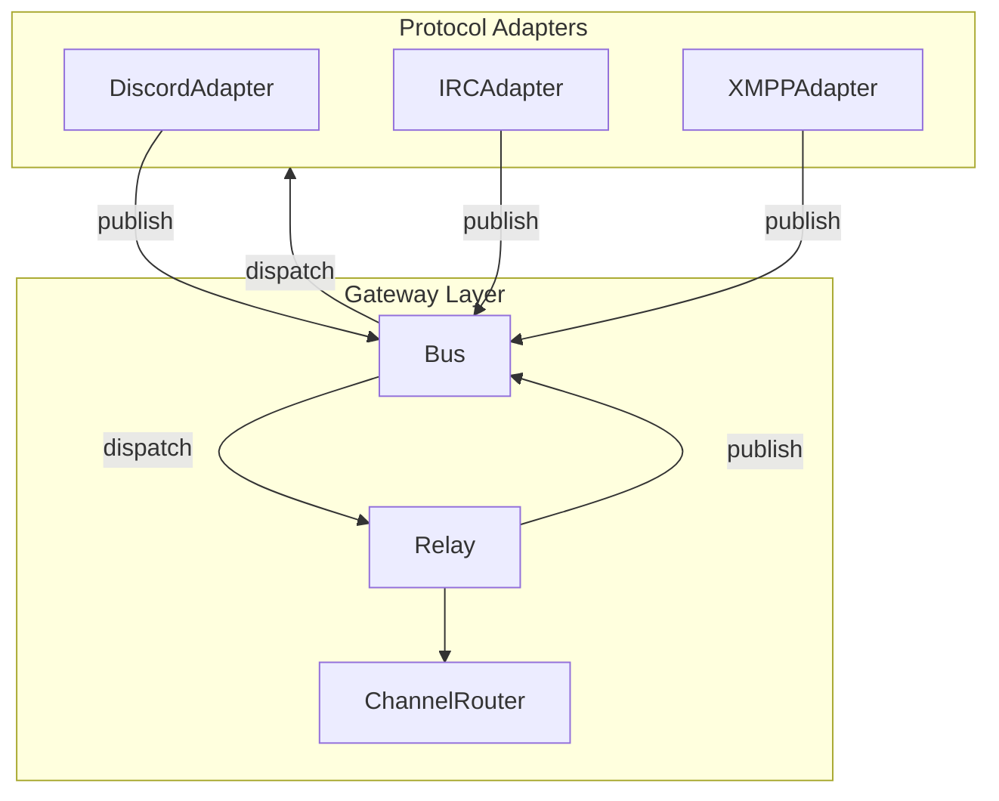

# Bridge Codebase Architecture Audit

## Executive Summary

The bridge has grown into a ~4,500-line codebase with a solid event-driven core (Bus, Relay, Router) but accumulated technical debt: duplicated logic, inconsistent interfaces, adapter coupling, and scattered patterns. This audit identifies issues and proposes formalization steps.

---

## 1. Architecture Overview




**Strengths:** Event-driven design, no direct adapter-to-adapter imports, clear separation of gateway vs adapters.

---

## 2. Proposed File Structure

A cleaner layout that separates domain, application, and infrastructure while keeping the event-driven core. Migration can be incremental.

### 2.A Current Structure (condensed)

```
src/bridge/
├── __main__.py
├── config.py
├── events.py
├── identity.py
├── gateway/
│   ├── bus.py
│   ├── relay.py
│   └── router.py
├── formatting/
│   ├── discord_to_irc.py
│   ├── irc_to_discord.py
│   ├── irc_message_split.py
│   └── reply_fallback.py
└── adapters/
    ├── base.py
    ├── disc.py              # 934 lines
    ├── irc.py                # 897 lines (IRCClient + IRCAdapter)
    ├── irc_puppet.py
    ├── irc_throttle.py
    ├── irc_msgid.py
    ├── xmpp.py
    ├── xmpp_component.py     # 960 lines
    └── xmpp_msgid.py
```

### 2.B Proposed Structure

```
src/bridge/
├── __init__.py
├── __main__.py
│
├── core/                          # Domain & shared primitives
│   ├── __init__.py
│   ├── constants.py               # ProtocolOrigin, ORIGINS, magic numbers
│   ├── events.py                  # Event dataclasses, factories, Dispatcher
│   └── protocols.py               # BridgeAdapter, EventTarget, IdentityResolverProtocol, MessageIDResolver
│
├── config/
│   ├── __init__.py
│   ├── loader.py                  # load_config, load_config_with_env
│   └── schema.py                 # Config class, IrcConfig, XmppConfig dataclasses
│
├── gateway/                       # Application layer
│   ├── __init__.py
│   ├── bus.py
│   ├── relay.py
│   └── router.py
│
├── identity/
│   ├── __init__.py
│   ├── portal.py                 # PortalClient, IdentityResolver
│   └── dev.py                    # DevIdentityResolver
│
├── formatting/
│   ├── __init__.py
│   ├── discord_to_irc.py
│   ├── irc_to_discord.py
│   ├── irc_message_split.py
│   └── reply_fallback.py
│
├── adapters/
│   ├── __init__.py
│   ├── discord/
│   │   ├── __init__.py
│   │   ├── adapter.py            # DiscordAdapter (orchestrator)
│   │   ├── handlers.py           # _handle_delete_out, _handle_reaction_out, _handle_typing_out, _handle_attachments
│   │   └── webhook.py             # _get_or_create_webhook, _webhook_send, _webhook_edit, _reply_button_view
│   ├── irc/
│   │   ├── __init__.py
│   │   ├── adapter.py            # IRCAdapter
│   │   ├── client.py             # IRCClient (pydle)
│   │   ├── puppet.py
│   │   ├── throttle.py
│   │   └── msgid.py
│   ├── xmpp/
│   │   ├── __init__.py
│   │   ├── adapter.py
│   │   ├── component.py          # XMPPComponent
│   │   └── msgid.py
│   └── shared/
│       ├── __init__.py
│       └── msgid_resolver.py     # MessageIDResolver port (optional: central registry)
│
└── main.py                       # Or keep __main__; entry wiring
```

### 2.C Key Changes


| Change                                                 | Rationale                                                                                                        |
| ------------------------------------------------------ | ---------------------------------------------------------------------------------------------------------------- |
| `core/`                                                | Events, constants, protocols in one place. Clear "domain" boundary.                                              |
| `core/protocols.py`                                    | Single file for all Protocol interfaces (BridgeAdapter, IdentityResolver, MessageIDResolver). Avoids scattering. |
| `config/loader.py` + `config/schema.py`                | Split load vs access. Schema can hold domain-specific dataclasses.                                               |
| `identity/portal.py` + `identity/dev.py`               | Separate Portal vs dev implementations. Clear identity boundary.                                                 |
| `adapters/discord/`, `adapters/irc/`, `adapters/xmpp/` | One package per protocol. Each adapter split into adapter + handlers + client/component.                         |
| `adapters/shared/`                                     | Cross-adapter concerns (MessageIDResolver port).                                                                 |
| `adapters/irc/client.py`                               | IRCClient extracted from irc.py (single responsibility).                                                         |


### 2.D Import Paths (After Migration)

```python
# New canonical imports (no backward compatibility needed — not production yet)
from bridge.core.events import MessageIn, message_in
from bridge.core.constants import ProtocolOrigin, ORIGINS
from bridge.core.protocols import BridgeAdapter, IdentityResolverProtocol
from bridge.config.schema import cfg
from bridge.config.loader import load_config_with_env
from bridge.identity.portal import IdentityResolver
from bridge.gateway import Bus, ChannelRouter
from bridge.adapters.discord import DiscordAdapter
```

### 2.E Migration Strategy

Direct restructure — no re-exports or compatibility shims. Update all imports in one pass.

1. **Phase 0:** Add `core/` (constants, protocols, events, errors). Move events from root. Delete old `events.py`.
2. **Phase 1:** Create `config/`, `identity/` packages. Move and split. Delete old files.
3. **Phase 2:** Create `adapters/discord/`, `adapters/irc/`, `adapters/xmpp/` packages. Split files. Delete old flat adapters.
4. **Phase 3:** Add `adapters/shared/` if MessageIDResolver is centralized.
5. **Phase 4:** Update `__main__.py`, tests, and any other consumers. Run full test suite.

### 2.F Reference Audit: `~/dev/allthingslinux/misc/bridge/references`

Findings from reference implementations that inform the plan:


| Reference                                | Pattern / Idea                                                                                                                                                                                                                                       | Applicability to ATL Bridge                                                                                                                                                                                                                                                                                                  |
| ---------------------------------------- | ---------------------------------------------------------------------------------------------------------------------------------------------------------------------------------------------------------------------------------------------------- | ---------------------------------------------------------------------------------------------------------------------------------------------------------------------------------------------------------------------------------------------------------------------------------------------------------------------------- |
| **Matterbridge** (Go)                    | `Bridger` interface: `Send`, `Connect`, `JoinChannel`, `Disconnect`. Factory: `func(*Config) Bridger`. One package per protocol (`bridge/irc/`, `bridge/discord/`, `bridge/xmpp/`).                                                                  | Aligns with proposed `adapters/<protocol>/` layout. Consider `BridgeFactory` for adapter creation.                                                                                                                                                                                                                           |
| **Matterbridge**                         | `config.Message` struct: `Text`, `Channel`, `Username`, `UserID`, `Avatar`, `Account`, `Event`, `Protocol`, `Gateway`, `ParentID`, `Timestamp`, `ID`, `Extra`.                                                                                       | ATL already has `MessageIn`/`MessageOut` — similar canonical format. Consider `Extra` for protocol-specific payloads.                                                                                                                                                                                                        |
| **Matterbridge**                         | Config key resolution: `account.key` with fallback to `general.key`.                                                                                                                                                                                 | Mirrors ATL's need for per-protocol vs global config.                                                                                                                                                                                                                                                                        |
| **Out-of-your-element** (Discord–Matrix) | **Actions + Converters + Event-dispatcher**: Converters are pure, stateless, testable. Actions orchestrate and call converters. Event-dispatcher routes events to actions.                                                                           | ATL's `formatting/` (discord_to_irc, irc_to_discord) are converters. Relay is the dispatcher. Consider explicit `actions/` for complex flows.                                                                                                                                                                                |
| **OOYE**                                 | "Keep logic in converters, not actions. Never unit-test actions."                                                                                                                                                                                    | Reinforces: format conversion = pure functions; orchestration = thin.                                                                                                                                                                                                                                                        |
| **OOYE**                                 | `d2m/` and `m2d/` as directional packages (Discord→Matrix, Matrix→Discord).                                                                                                                                                                          | ATL is multi-protocol; `formatting/` is already directional (discord_to_irc, irc_to_discord). Could add `relay/d2irc/`, `relay/irc2d/` if relay grows.                                                                                                                                                                       |
| **OOYE**                                 | SQLite for message ID mapping (`event_message` table). `without rowid` for storage efficiency.                                                                                                                                                       | ATL uses in-memory TTL caches (irc_msgid, xmpp_msgid). For long-running or persistence, consider SQLite.                                                                                                                                                                                                                     |
| **OOYE**                                 | Test data in `test/data.js`; converters tested with fabricated samples.                                                                                                                                                                              | ATL tests use mocks — consider `tests/fixtures/` for event samples.                                                                                                                                                                                                                                                          |
| **drc** (CLAUDE.md)                      | Custom error classes in `lib/Errors.js`. Comments only for "why", not "what".                                                                                                                                                                        | Add `bridge/errors.py` with domain exceptions.                                                                                                                                                                                                                                                                               |
| **dibridge**                             | Multi-presence goal: IRC puppets + Discord webhooks. "As native as possible."                                                                                                                                                                        | ATL already does this; dibridge validates the approach.                                                                                                                                                                                                                                                                      |
| **slixmpp** (library source)             | `ComponentXMPP`: jid, secret, host, port; `connect()` returns Future. Plugin system: `register_plugin('xep_0045')`, `self.plugin.get('xep_0045')`. XEP_0045 `multi_from`: True for components simulating multiple entities.                          | Bridge extends ComponentXMPP; uses per-user JIDs (`nick@bridge.domain`). **Action:** Pass `plugin_config={'xep_0045': {'multi_from': True}}` when registering xep_0045. Handle IqError/IqTimeout in async MUC ops.                                                                                                           |
| **pydle** (library source)               | `BasicClient`: `RECONNECT_DELAYS`, `_reset_attributes`, `on_raw_*` dispatch, `on_capability_<name>_available`. Cap negotiation: CAP LS → REQ → ACK/NAK → END. Exception hierarchy: `Error`, `NotInChannel`, `AlreadyInChannel`, `ProtocolViolation`. | Bridge uses custom `_connect_with_backoff` (jitter, 10 attempts) — more resilient than pydle defaults. Aligns with `on_raw_*`, `CAPABILITIES`. **Action:** When adding `bridge/errors.py`, consider `IRCNotInChannel`, `IRCAlreadyInChannel` subclasses for IRC ops. Verify `READ_TIMEOUT` (pydle default 300s) is adequate. |


**Takeaways for ATL:**

1. **Converters = pure, testable** — Keep `formatting/` stateless; move any bridge-state logic out.
2. **One package per protocol** — Matterbridge and OOYE both use protocol-scoped dirs.
3. **Factory for adapters** — Matterbridge's `Factory func(*Config) Bridger` could inform `__main__` wiring.
4. **Config key hierarchy** — `protocol.key` with `general.key` fallback.
5. **Domain errors** — Introduce `BridgeError`, `AdapterError`, `ConfigError` hierarchy.

### 2.G ATL.Chat Sub-Apps Context

How the bridge fits into the monorepo and config flow:


| App            | Config                                                | Generation                         | Bridge Coupling                                                                                                       |
| -------------- | ----------------------------------------------------- | ---------------------------------- | --------------------------------------------------------------------------------------------------------------------- |
| **UnrealIRCd** | `config/unrealircd.conf.template` → `unrealircd.conf` | `envsubst` via `prepare-config.sh` | `relaymsg` hostmask `bridge@${IRC_DOMAIN}`; oper `atl-bridge` with `BRIDGE_IRC_OPER_PASSWORD`; WebIRC for The Lounge  |
| **Atheme**     | `config/atheme.conf.template` → `atheme.conf`         | `envsubst`                         | No direct bridge coupling                                                                                             |
| **Prosody**    | `config/prosody.cfg.lua` (Lua, no template)           | Runtime `Lua.os.getenv()`          | Component `bridge.${domain}` with `BRIDGE_XMPP_COMPONENT_SECRET`; MUC `general@muc.${PROSODY_DOMAIN}`                 |
| **Bridge**     | `config.template.yaml` → `config.yaml`                | `envsubst`                         | Consumes `IRC_BRIDGE_SERVER`, `PROSODY_DOMAIN`, `BRIDGE_DISCORD_CHANNEL_ID`, `IRC_TLS_VERIFY`, `XMPP_AVATAR_BASE_URL` |


**Config flow (prepare-config.sh):**

1. Loads `.env` then `.env.dev` (overrides).
2. Exports bridge-related vars: `IRC_BRIDGE_SERVER`, `BRIDGE_IRC_OPER_PASSWORD`, `PROSODY_DOMAIN`, `BRIDGE_DISCORD_CHANNEL_ID`, `IRC_TLS_VERIFY`, `XMPP_AVATAR_BASE_URL`.
3. Runs `envsubst` on UnrealIRCd, Atheme, Bridge, The Lounge templates.
4. Bridge config template embeds `${IRC_BRIDGE_SERVER}`, `${IRC_TLS_PORT}`, `${PROSODY_DOMAIN}` in `mappings`.

**Implications for bridge refactor:**

1. **Config schema** — Bridge `Config` class reads YAML produced by `prepare-config.sh`. Any `config/schema.py` must validate the same structure (mappings, irc.*, xmpp_*, etc.) that the template produces.
2. **Env vars** — Bridge also reads env at runtime (`BRIDGE_DISCORD_TOKEN`, `BRIDGE_PORTAL_*`, `BRIDGE_XMPP_*`, etc.). Config cleanup should document which keys come from YAML vs env.
3. **Compose** — Bridge container mounts `config.yaml:ro`; depends on `atl-irc-server` and `atl-xmpp-server`. No shared volume with other apps.
4. **Naming** — UnrealIRCd uses `atl-bridge` oper nick; Prosody uses `bridge.${domain}` component JID. Bridge should not hardcode these; they come from config/env.
5. **Consistency** — Other apps use `config/` dir. Bridge uses `config.yaml` at app root. Proposed `config/` package is internal Python layout; the YAML file stays at `apps/bridge/config.yaml` (or `config/config.yaml` if desired).

### 2.H Portal Audit (`~/dev/allthingslinux/portal`)

Portal is the **identity source of truth** for the bridge. Bridge's `IdentityResolver` calls Portal's API.

**API contract: `GET /api/bridge/identity`**


| Query param | Required     | Response fields                                                                               |
| ----------- | ------------ | --------------------------------------------------------------------------------------------- |
| `discordId` | One of three | `user_id`, `discord_id`, `irc_nick`, `irc_status`, `xmpp_jid`, `xmpp_username`, `xmpp_status` |
| `ircNick`   | One of three | Same                                                                                          |
| `xmppJid`   | One of three | Same                                                                                          |


- **Auth:** Bearer token (better-auth `apiKey` plugin). Bridge uses `BRIDGE_PORTAL_TOKEN` / `BRIDGE_PORTAL_API_TOKEN`.
- **404:** When no matching account. Bridge treats 404 as "not linked" (returns `None`).
- **ircServer:** Bridge's `PortalClient.get_identity_by_irc_nick(nick, server=server)` sends it, but Portal **intentionally omits** it — single-server deployment (irc.atl.chat).

**Portal data model:**

- `account` (better-auth): `providerId="discord"`, `accountId` = Discord snowflake
- `ircAccount`: `userId`, `nick`, `server`, `port`, `status` (active|pending|suspended|deleted)
- `xmppAccount`: `userId`, `jid`, `username`, `status` (active|suspended|deleted)

**Implications for bridge refactor:**

1. **IdentityResolverProtocol** — Must match Portal response shape: `irc_nick`, `xmpp_jid`, `discord_id`, etc. Bridge's `IdentityResolver` and `DevIdentityResolver` both implement this; formal Protocol should reflect it.
2. **PortalClient** — Lives in `identity/portal.py` (proposed). Keep `_extract()` handling both `{ ok, identity }` and raw dict (tests).
3. **Env vars** — `BRIDGE_PORTAL_BASE_URL`, `BRIDGE_PORTAL_TOKEN` are bridge concerns; Portal has no bridge-specific env (bridge uses user-created API keys).
4. **Error handling** — Portal returns 404 for "not linked". Bridge's tenacity retries on 5xx, ConnectError, etc. 404 is not retried (correct).
5. **Future** — If Portal adds `ircServer` for multi-network, bridge already sends it; no bridge change needed.

**Context: Dev vs production**

Much of the bridge (relaymsg, puppeting, some identity/oper logic) was built for **local dev testing without Portal**. Progress required testing without Portal as a dependency. In production with Portal as identity source of truth, some of this may be overkill or unused.

**Two key separations (no hardcoded Portal logic in adapters):**


| Separation                 | What                                                                                                                                 | Production                                                                    | Dev/test                                                                                       |
| -------------------------- | ------------------------------------------------------------------------------------------------------------------------------------ | ----------------------------------------------------------------------------- | ---------------------------------------------------------------------------------------------- |
| **1. Identity resolution** | Adapters receive identity resolver or None; call `discord_to_irc`, `discord_to_xmpp`, `has_irc`, etc. No Portal imports in adapters. | `IdentityResolver` wraps `PortalClient`; nicks from Portal API                | `DevIdentityResolver`; nicks from `BRIDGE_DEV_IRC_NICK_MAP` or `atl_dev_{id}`                  |
| **2. IRC outbound**        | Puppets vs main connection                                                                                                           | Identity from Portal → puppets for linked users; main + relaymsg for unlinked | Identity from DevIdentityResolver → puppets for all (has_irc=True); or no identity → main only |


**Wiring (`__main__.py`):** `portal_url` → IdentityResolver; `BRIDGE_DEV_IRC_PUPPETS` (no Portal) → DevIdentityResolver; else → None.

**relaymsg:** Main connection uses RELAYMSG when server supports it (spoofed nick). Used when no puppet (unlinked user or no identity). `irc_relaymsg_clean_nicks` + UnrealIRCd `require-separator` were for local testing; production with Portal mostly uses puppets (real nicks). Echo detection (`_recent_relaymsg_sends`, `_puppet_nick_check`) needed for both paths.

**XMPP fallback:** When identity is None, `_resolve_nick_async` falls back to `author_display` or `author_id` — dev without Portal.

**Implication:** The abstraction is sound. Adapters never hardcode Portal. Refactor should formalize `IdentityResolverProtocol` and keep this separation; avoid over-investing in relaymsg/echo logic polish for dev-only scenarios.

**Mock Portal API (recommended)**

Add a mock HTTP server that replicates `GET /api/bridge/identity` so dev and tests can run without real Portal:


| Aspect       | Proposal                                                                                                             |
| ------------ | -------------------------------------------------------------------------------------------------------------------- |
| **Endpoint** | `GET /api/bridge/identity` with `discordId`, `ircNick`, or `xmppJid` (same as Portal)                                |
| **Response** | `{ ok: true, identity: {...} }` or 404                                                                               |
| **Store**    | YAML/JSON fixture or in-memory dict (e.g. `discord_id -> { irc_nick, xmpp_jid }`)                                    |
| **Auth**     | Optional Bearer; mock can accept any token or none for dev                                                           |
| **Usage**    | `uv run python -m bridge.mock_portal` (or `just bridge mock-portal`); `BRIDGE_PORTAL_BASE_URL=http://localhost:8765` |
| **Tests**    | pytest fixture that starts mock server; integration tests hit real HTTP instead of mocking PortalClient              |


**Benefits:** (1) Full stack dev without Portal; (2) Integration tests exercise `PortalClient` + `IdentityResolver` + adapters against real HTTP; (3) More realistic than `DevIdentityResolver` (same API contract). **Placement:** `identity/mock_portal.py` or `tests/fixtures/mock_portal_server.py` + optional `__main`__ entry point.

### 2.I Tux Audit (`~/dev/allthingslinux/tux`)

Tux is an ATL Discord bot (Python, discord.py, uv). Same ecosystem; useful patterns for bridge.

**Config (pydantic-settings):**

- `Config(BaseSettings)` with `model_config` for env, dotenv, JSON file, secrets dir.
- `settings_customise_sources()` — explicit priority: init → env → .env → JSON → secrets.
- Nested models: `BotInfo`, `IRC`, `XP`, `ExternalServices` etc. in `shared/config/models.py`.
- `CONFIG` global singleton. `@computed_field` for `database_url`, `valkey_url`.
- Env validation: `validate_environment()` on import (warns on weak passwords).

**Exceptions (`shared/exceptions.py`):**

- Base: `TuxError`. Domain: `TuxConfigurationError`, `TuxDatabaseError`, `TuxAPIError`, `TuxPermissionError`, `TuxServiceError`.
- Subclasses carry context: `TuxAPIConnectionError(service_name, original_error)`, `TuxAPIResourceNotFoundError(service_name, resource_identifier)`.
- `handle_gather_result(result, expected_type)` for `asyncio.gather(..., return_exceptions=True)`.

**Cache:**

- `AsyncCacheBackend` Protocol: `get`, `set`, `delete`, `exists`.
- `InMemoryBackend` (TTLCache) and `ValkeyBackend`; `get_cache_backend(bot)` factory.
- Optional Valkey; fallback to in-memory when unset.

**Structure:**

- `core/` — bot, base_cog, cog_loader, setup (orchestrator, database_setup, cache_setup).
- `shared/` — config, exceptions, constants, functions.
- `database/` — models, controllers, service, migrations.
- `services/` — handlers, moderation, sentry.
- `modules/` — cogs by domain (admin, config, moderation, utility, etc.).
- Max 1600 lines per file (AGENTS.md).

**Implications for bridge:**

1. **Config** — Consider `pydantic-settings` for bridge: env + YAML/JSON. Bridge currently uses raw YAML + manual `Config` class. Tux's `JsonConfigSettingsSource` + `env_file` could replace `config.py` + `load_config_with_env`.
2. **Exceptions** — Tux's hierarchy matches plan: `BridgeError` base, `BridgeConfigurationError`, `BridgeAPIError`, `BridgeAdapterError`. Add `original_error` where useful.
3. **Cache** — Bridge uses `cachetools.TTLCache` directly. Tux's `AsyncCacheBackend` Protocol + `InMemoryBackend` is a cleaner abstraction if bridge ever needs Valkey/Redis for identity or msgid persistence.
4. **File structure** — Tux's `shared/` (config, exceptions, constants) aligns with proposed `core/`. `modules/` by domain = `adapters/<protocol>/`.
5. **AGENTS.md** — Tux's AGENTS.md is comprehensive (structure, commands, conventions, troubleshooting). Bridge could adopt similar structure for onboarding.

### 2.J Discord Audit (`tux/examples/discord.py`)

discord.py library clone + examples. Bridge's Discord adapter validated against these patterns.

**Already correct:**

- Intents: `message_content`, `guild_messages`, `reactions`, `members` (for `fetch_user` on reaction)
- Raw events for uncached: `on_raw_message_delete`, `on_raw_bulk_message_delete`, `on_raw_message_edit`, `on_raw_reaction_add/remove`
- Echo prevention: `message.webhook_id` check, `payload.user_id == bot.user.id` for reactions
- Webhook avatar: `_avatar_url_ok_for_discord` filters internal URLs (localhost, Docker hostnames)
- Username 2–32 chars, content 2000 limit, `AllowedMentions(everyone=False, roles=False)`
- Custom emoji reactions skipped (`is_unicode_emoji()`)

**Recommendations (low priority):**

1. **Lifecycle** — Consider `async with bot` + `setup_hook` (per `advanced_startup.py`) for cleaner startup/shutdown and pre-websocket setup (webhook cache init, etc.).
2. **setup_hook** — Move any setup that must run before handling events into `setup_hook`; bridge currently does this in `start()`.
3. **Discord API constants** — Webhook URL regex, username length (2–32), content limit (2000) already enforced; consider moving to `core/constants.py` if shared.

**No changes needed:** Bridge uses correct raw events, webhook patterns, and echo prevention. Refactor phases do not require Discord-specific changes.

### 2.K Error Handling Patterns (`error-handling-patterns` + `python-error-handling`)

**Exception hierarchy (skill pattern):**

```python
class ApplicationError(Exception):
    def __init__(self, message: str, code: str = None, details: dict = None):
        super().__init__(message)
        self.code = code
        self.details = details or {}
        self.timestamp = datetime.utcnow()

class ExternalServiceError(ApplicationError):
    def __init__(self, message: str, service: str, **kwargs):
        super().__init__(message, **kwargs)
        self.service = service
```

**Bridge alignment:** `core/errors.py` should use `BridgeError` base with `code`, `details`, `original_error` (for chaining). Subclasses: `BridgeConfigurationError`, `BridgeAdapterError`, `BridgeAPIError` (Portal). Use `raise X from e` to preserve chain.

**Recoverable vs unrecoverable:**


| Recoverable                        | Unrecoverable                |
| ---------------------------------- | ---------------------------- |
| Portal 404 (not linked)            | Config missing required keys |
| Network timeout (tenacity retries) | Invalid token / auth failure |
| IRC reconnect                      | Programming bug              |


**Patterns to adopt:**

1. **Graceful degradation** — Bridge already does: XMPP fallback nicks when identity=None; DevIdentityResolver when Portal absent. Document as intentional.
2. **Circuit breaker** — Consider for Portal: after N consecutive failures, stop calling for T seconds (avoid hammering down service). Low priority; tenacity already handles retries.
3. **Context managers** — Use for adapter cleanup (ensure disconnect on error). Bridge uses `contextlib.suppress` in places; verify no swallowed errors.
4. **Don't swallow** — Audit `except Exception: pass` or bare `except`; replace with log + re-raise or explicit handling.
5. **Fail fast** — Config validation at load; raise `BridgeConfigurationError` with `details={"key": "..."}`.
6. **Best practices checklist** — Preserve context (`from e`), meaningful messages, log at right level (expected failure = debug, unexpected = error).

**Common pitfalls to avoid:** Catching too broadly (`except Exception`), empty catch blocks, duplicate log+rethrow (log once at handler boundary).

**Python-specific (python-error-handling skill):**

1. **Map to standard exceptions** — Use `ValueError` for bad config params, `FileNotFoundError` for missing config file, `KeyError` for missing dict keys. Reserve custom exceptions for domain failures.
2. **Convert to domain types at boundaries** — Parse config strings to enums (e.g. `ProtocolOrigin`) at load; fail fast with clear message listing valid options.
3. **Pydantic for config** — If adopting pydantic-settings (§2.I), use `Field` validators and `ValidationError` for config; structured `e.errors()` for debugging.
4. **Batch / partial failures** — Relay pushes to multiple adapters; Bus already isolates per-adapter exceptions. Consider formalizing: track which adapters succeeded/failed per event; log failures without aborting others. `BatchResult[T]` pattern if relay ever needs to report partial results.
5. **BridgeAPIError context** — For Portal: carry `status_code`, `response_body` (or `retry_after` for 429) like skill's `ApiError` / `RateLimitError`. Enables smarter retry and logging.
6. **Document failure modes** — Docstrings for `PortalClient.get_identity_by_`*, `IdentityResolver` methods: list `Raises` (e.g. `BridgeAPIError` on 5xx, returns `None` on 404).
7. **Test error paths** — Verify exceptions raised correctly; test 404, 5xx, timeout for PortalClient.

### 2.L Python Design Patterns (`python-design-patterns`)

**KISS** — Prefer simple dict over factory/registry when two mappings suffice. Bridge: `ProtocolOrigin` → formatter lookup; avoid `AdapterFactory` if `{origin: adapter}` dict works.

**Single Responsibility** — Bloated adapters (disc 847, irc 898, xmpp 960 lines) mix: event handling, webhook/IRC/XMPP I/O, msgid tracking, identity lookup. Split into handlers, client, component per §2.B.

**Separation of Concerns** — Bridge layers: Gateway (Bus, Relay, Router) → Adapters (I/O) → Formatting (pure). Keep formatting stateless; no bridge state in `formatting/`.

**Composition over Inheritance** — Adapters receive `Bus`, `Router`, `IdentityResolver` via constructor; no adapter base class required. `IdentityResolver` and `MessageIDResolver` are injected, not inherited.

**Rule of Three** — MessageIDTracker vs XMPPMessageIDTracker: wait for third tracker before `BidirectionalTTLMap` abstraction (§4.3). Relay `_push_`* duplication: three similar methods justify `_emit_targets` extraction.

**Function size** — Extract when >20–50 lines, multiple purposes, or 3+ nesting levels. Target: `_queue_consumer`, `_on_message`, `_send_via_puppet` in adapters.

**Dependency injection** — Use Protocol + constructor injection. `IdentityResolverProtocol`, `MessageIDResolver`; avoid `from bridge.identity import PortalClient` inside adapters.

**Anti-patterns to avoid** — (1) Don't expose internal types: adapters publish events, not raw pydle/Discord objects. (2) Don't mix I/O with business logic: config getters reading `os.environ` inline (§3.5); move to loader.

**Best practices** — Delete dead code before abstracting; explicit over clever; test each layer in isolation.

### 2.M Python Patterns (`python-patterns`)

Skill emphasizes **decision-making for context**, not copying. Bridge-specific:

**Async vs sync** — Bridge is I/O-bound (HTTP, IRC, XMPP, Discord). Async is correct. Use `httpx` (async), not `requests`. Don't mix sync libraries in async code; avoid `import time` inside hot paths (use at module top).

**Type hints** — Always type: function params, return types, class attributes, public APIs. Prefer `X | None` over `Optional[X]` (Python 3.10+). Skip for local variables (let inference work).

**Pydantic** — For config/settings, validation, serialization. If adopting pydantic-settings (§2.I), use for config schema; runtime validation, clear error messages.

**Project structure** — Bridge is "large application": `src/bridge/` with `core/`, `gateway/`, `adapters/`, `formatting/`. Aligns with skill's layer-by-feature principle.

**Error handling** — Domain exceptions in services; consistent format (code, message, details); no stack traces exposed. Aligns with §2.K.

**Anti-patterns** — Don't use sync HTTP in async code; don't skip type hints for public APIs; don't put business logic in I/O layer (formatting = pure, adapters = I/O).

**Decision checklist** — Before refactor: async strategy confirmed; type hint strategy; structure defined; error handling planned. Bridge already async; add type hints where missing; structure per §2.B.

### 2.N Python Performance (`python-performance-optimization`)

**Profile before optimizing** — Don't premature optimize. Use `cProfile`, `py-spy` (production), or `pytest-benchmark` only when latency/memory issues are observed.

**Bridge context** — I/O-bound (HTTP, IRC, XMPP, Discord). Async is correct (§2.M). CPU profiling unlikely to find hot paths; I/O wait dominates.

**Already appropriate:**

- **Dict for lookups** — Router mappings, msgid trackers use dict (O(1)); not list search.
- **Caching** — Identity TTLCache, webhook TTLCache; avoid redundant Portal/API calls.
- **Async I/O** — httpx, discord.py, pydle, slixmpp are async.

**Consider if profiling shows issues:**

- `**__slots__`** — Event dataclasses (`MessageIn`, `MessageOut`) if many instances in memory.
- **Generators** — For large message batches; bridge processes one-at-a-time, likely fine.
- **py-spy** — `py-spy record -o profile.svg -- python -m bridge` for production profiling.

**Best practices** — Use appropriate data structures; cache expensive ops; batch I/O where possible; avoid global variable access in hot loops.

**Pitfalls to avoid** — Optimizing without profiling; over-optimizing rare paths; ignoring algorithmic complexity (dict vs list for lookups).

### 2.O Python Resilience (`python-resilience`)

**Transient vs permanent** — Retry transient (network, 5xx, 429). Don't retry permanent (4xx except 429, auth failure, ValueError). Bridge: PortalClient returns `None` on 404 (correct); tenacity retries ConnectError, Timeout, 5xx.

**Current PortalClient retry** — 5 attempts, exponential 2–30s, no jitter. Retries: httpx.*Error, HTTPStatusError.

**Recommendations (low priority):**

1. **Jitter** — Add `wait_exponential_jitter(initial=2, max=30)` to prevent thundering herd when many bridge instances retry Portal simultaneously.
2. **Cap total duration** — `stop=stop_after_attempt(5) | stop_after_delay(60)` so retries don't run indefinitely.
3. **Log retries** — `before_sleep=before_sleep_log(logger, logging.WARNING)` for debugging; silent retries hide systemic issues.
4. **Timeouts everywhere** — Ensure all network calls have explicit timeout (httpx, aiohttp, pydle). Bridge: PortalClient 10s; XMPP avatar fetch 10s; verify IRC connect has timeout.

**Fail-safe defaults** — Bridge already does: XMPP fallback nicks when identity=None; DevIdentityResolver when Portal absent. Document as intentional graceful degradation.

**Best practices** — Don't retry bugs (ValueError, TypeError); set timeout on every network call; log every retry; use decorators to keep retry logic separate from business logic.

### 2.P Python Type Safety (`python-type-safety`)

**Annotate all public APIs** — Function params, return types, class attributes. Bridge uses basedpyright with `typeCheckingMode = "basic"`; many reports disabled. Incremental goal: enable stricter checks per module.

**Modern union syntax** — Prefer `X | None` over `Optional[X]` (Python 3.10+). Bridge targets 3.10+.

**Protocols for structural typing** — Plan already defines `IdentityResolverProtocol`, `MessageIDResolver`, `EventTarget`/`BridgeAdapter`. Use `Protocol` (not ABC) for adapters; no inheritance required.

**Type narrowing** — Use guards (`if x is None: raise ...`) so checker narrows; avoid redundant casts.

**Generic collections** — Use `list[str]`, `dict[str, int]` not bare `list`, `dict`. Event dataclasses: `raw: dict[str, object]` for protocol-specific payloads.

**Type aliases** — `type UserId = str` or `TypeAlias` for complex types (e.g. `ChannelMapping`).

**Strict mode checklist** — Incremental: enable `reportMissingParameterType`, `reportMissingTypeStubs` per module; minimize `Any`; run `just typecheck` in CI.

**Best practices** — Minimize `Any`; use protocols for interfaces; document with types; run type checker in CI.

---

## 3. Critical Issues

### 3.1 Adapter Discovery Anti-Pattern (Law of Demeter)

**Location:** [apps/bridge/src/bridge/adapters/disc.py](apps/bridge/src/bridge/adapters/disc.py) lines 280-286, 412-446, 483

**Problem:** Discord adapter iterates `self._bus._adapters` and uses `isinstance(adapter, IRCAdapter)` / `isinstance(adapter, XMPPAdapter)` to reach msgid trackers. This:

- Violates Law of Demeter (reaching into bus internals)
- Couples Discord to IRC/XMPP adapter types (despite "no adapter imports another")
- Requires `# type: ignore[attr-defined]` for `_adapters` (private attr)

**Fix:** Introduce a **MessageIDResolver** port (Protocol) that Bus provides to adapters needing cross-protocol ID resolution. Adapters register their trackers with the resolver; Discord asks the resolver, not the bus.

```python
# Proposed: MessageIDResolver protocol
class MessageIDResolver(Protocol):
    def get_discord_id(self, source: str, source_id: str) -> str | None: ...
    def get_source_id(self, source: str, discord_id: str) -> str | None: ...
```

### 3.2 EventTarget vs AdapterBase Duplication

**Locations:** [events.py](apps/bridge/src/bridge/events.py) (EventTarget Protocol), [adapters/base.py](apps/bridge/src/bridge/adapters/base.py) (AdapterBase ABC)

**Problem:** Two interfaces for the same concept:

- `EventTarget` (Protocol): `accept_event`, `push_event` — used by Bus
- `AdapterBase` (ABC): `name`, `accept_event`, `push_event`, `start`, `stop` — used only in tests

**Reality:** DiscordAdapter, IRCAdapter, XMPPAdapter do **not** inherit from `AdapterBase`. They implement `EventTarget` and have `start`/`stop` ad hoc.

**Fix:** Unify on a single `Protocol` (e.g. `BridgeAdapter`) that includes `name`, `accept_event`, `push_event`, `start`, `stop`. Remove `AdapterBase` ABC or make it a thin wrapper that implements the protocol. Update `adapters/__init__.py` (it says "AdapterInterface" but exports AdapterBase; XMPPAdapter is not exported).

### 3.3 Relay DRY Violation (~100 lines duplicated)

**Location:** [gateway/relay.py](apps/bridge/src/bridge/gateway/relay.py)

**Problem:** `_push_reaction`, `_push_typing`, `_push_message_delete` all repeat the same block:

```python
mapping = None
if evt.origin == "discord":
    mapping = self._router.get_mapping_for_discord(evt.channel_id)
elif evt.origin == "irc":
    parts = evt.channel_id.split("/", 1)
    if len(parts) == 2:
        mapping = self._router.get_mapping_for_irc(parts[0], parts[1])
elif evt.origin == "xmpp":
    mapping = self._router.get_mapping_for_xmpp(evt.channel_id)
# ... then loop over TARGETS with same skip logic
```

**Fix:** Extract `_get_mapping_for_origin(origin, channel_id) -> ChannelMapping | None` and `_emit_targets(mapping, origin, emit_fn)` helpers. Reduces ~80 lines to ~20.

### 3.4 Magic Protocol Strings

**Problem:** `"discord"`, `"irc"`, `"xmpp"` appear 50+ times as raw strings. Typos are undetected.

**Fix:** Add `ProtocolOrigin` enum or `Literal["discord","irc","xmpp"]` type alias. Use constants in one place.

```python
# bridge/constants.py or events.py
ProtocolOrigin = Literal["discord", "irc", "xmpp"]
ORIGINS: tuple[ProtocolOrigin, ...] = ("discord", "irc", "xmpp")
```

### 3.5 Config Property Sprawl

**Location:** [config.py](apps/bridge/src/bridge/config.py) — 50+ properties

**Problems:**

- Some properties read `os.environ` inside getters (`irc_redact_enabled`, `irc_relaymsg_clean_nicks`, `irc_tls_verify`) — inconsistent with YAML load
- `import os` inside property bodies — violates "import at top"
- No validation layer; invalid values fail at runtime

**Fix:** Group by domain (e.g. `irc_config`, `xmpp_config` dataclasses). Load env overrides once in `reload()`. Use typed accessors (e.g. `pydantic-settings` or `dataclasses` with validation).

### 3.6 Bloated Adapter Files


| File              | Lines | Status            |
| ----------------- | ----- | ----------------- |
| disc.py           | 934   | Approaching limit |
| xmpp_component.py | 960   | Approaching limit |
| irc.py            | 897   | Approaching limit |


**Per user rule:** 1600-line max; highlight bloated files. These are under 1k but contain multiple responsibilities.

**Recommendation:** Split by responsibility:

- **disc.py:** Extract `_handle_attachments`, `_handle_delete_out`, `_handle_reaction_out`, `_handle_typing_out` into a `DiscordHandler` or `DiscordEventHandlers` module. Keep `DiscordAdapter` as orchestrator.
- **irc.py:** Extract `IRCClient` to its own file (it's ~430 lines). Extract capability handlers to `irc_caps.py` if desired.
- **xmpp_component.py:** Extract XEP handlers (e.g. `_on_groupchat_message`, `_on_reactions`, `_on_retraction`) into a separate module.

---

## 4. Type & Pattern Issues

### 4.1 Lazy `import time` Inside Functions

**Locations:** disc.py lines 333, 751; irc.py line 732

**Fix:** Move `import time` to top of file.

### 4.2 IdentityResolver Protocol

**Location:** [identity.py](apps/bridge/src/bridge/identity.py)

**Problem:** `IdentityResolver` and `DevIdentityResolver` share the same interface but no formal Protocol. Callers use `IdentityResolver | None` and duck-type.

**Fix:** Define `IdentityResolverProtocol` (Protocol) with `discord_to_irc`, `discord_to_xmpp`, `has_irc`, etc. Both implement it.

### 4.3 MessageID Tracker Duplication

**Locations:** [irc_msgid.py](apps/bridge/src/bridge/adapters/irc_msgid.py), [xmpp_msgid.py](apps/bridge/src/bridge/adapters/xmpp_msgid.py)

**Problem:** `MessageIDTracker` and `XMPPMessageIDTracker` share similar structure: bidirectional TTL map, `store`, `get`_*, `_cleanup`. XMPP adds aliases and stanza-id logic.

**Recommendation:** Consider a generic `BidirectionalTTLMap[K, V]` with pluggable key extractors. Low priority — the XMPP tracker has distinct semantics (aliases, stanza-id). Rule of Three: wait for a third tracker before abstracting.

### 4.4 Event Factory Return Type

**Location:** [events.py](apps/bridge/src/bridge/events.py)

**Problem:** `@event("message_in")` returns `(type_name, instance)`. Callers always do `_, evt = message_in(...)`. The `type_name` is rarely used (only by dispatcher for logging?).

**Recommendation:** Consider simplifying factories to return just the instance; `type_name` could be derived from the class name. Or add `message_in(...).evt` property. No compatibility constraints.

---

## 5. Dispatcher vs Bus Redundancy

**Locations:** [events.py](apps/bridge/src/bridge/events.py) (Dispatcher + `dispatcher` singleton), [gateway/bus.py](apps/bridge/src/bridge/gateway/bus.py) (Bus)

**Problem:** `Bus` wraps `Dispatcher`. `__main`__ uses `dispatcher.dispatch("main", evt)` for SIGHUP, bypassing Bus. Two concepts for one job.

**Fix:** Either (a) Bus is the single entry point and `dispatcher` is removed, or (b) Dispatcher is internal and Bus exposes `publish` only. `__main`__ should use `bus.publish(...)` for ConfigReload.

---

## 6. Recommended Refactoring Order

1. **Phase 1: Low-risk** — Add `ProtocolOrigin` constants, move `import time` to top, fix `adapters/__init__.py` (export XMPPAdapter, fix docstring). Optionally: Discord adapter `setup_hook` + `async with bot` for lifecycle (per §2.J). Audit `except` blocks for swallowed errors, empty catch, duplicate log+rethrow (per §2.K). XMPP: pass `plugin_config={'xep_0045': {'multi_from': True}}` for per-user JIDs (per §2.F slixmpp).
2. **Phase 2: Relay DRY** — Extract `_get_mapping_for_origin` and `_emit_targets` in relay.py.
3. **Phase 3: MessageIDResolver** — Introduce port, inject into Discord adapter, remove `_bus._adapters` iteration.
4. **Phase 4: Unify EventTarget/AdapterBase** — Single Protocol, remove unused ABC.
5. **Phase 5: Config cleanup** — Group properties, centralize env loading. Fail fast: validate required keys at load; raise `BridgeConfigurationError` with `details` (per §2.K).
6. **Phase 6: File structure migration** — Introduce `core/`, `config/`, `identity/` packages per §2. Direct move; update all imports.
7. **Phase 7: Adapter package splits** — Create `adapters/discord/`, `adapters/irc/`, `adapters/xmpp/` and split bloated files (handlers, client, component) per SRP (§2.L).

---

## 7. Skills Summary


| Skill                           | Applied                                                                                                                  |
| ------------------------------- | ------------------------------------------------------------------------------------------------------------------------ |
| python-design-patterns          | KISS, SRP, separation of concerns, composition over inheritance, Rule of Three, function size, Protocol injection (§2.L) |
| architecture-patterns           | Ports/adapters (MessageIDResolver), Clean Architecture                                                                   |
| python-anti-patterns            | Scattered retry logic (identity), exposed internals (_adapters), mixed I/O                                               |
| clean-code                      | Law of Demeter, small functions, meaningful names                                                                        |
| error-handling-patterns         | Exception hierarchy (code, details, from e), graceful degradation, fail fast                                             |
| python-error-handling           | Map to standard exceptions, convert at boundaries, Pydantic, BatchResult, document Raises                                |
| python-patterns                 | Async for I/O-bound, httpx, union types over Optional, Pydantic for config, decision checklist (§2.M)                    |
| python-performance-optimization | Profile first, dict for lookups, cache, slots for events, py-spy for production (§2.N)                                   |
| python-resilience               | Jitter, stop_after_delay, before_sleep_log, timeouts everywhere, fail-safe defaults (§2.O)                               |
| python-type-safety              | Annotate public APIs, union types, Protocols, type narrowing, generic collections, incremental strict (§2.P)             |


---

## 8. Files to Modify (Summary)

**In-place changes (before structure migration):**

- `events.py` — Add ProtocolOrigin, unify EventTarget
- `gateway/relay.py` — DRY helpers
- `gateway/bus.py` — Expose MessageIDResolver or adapter lookup
- `adapters/base.py` — Remove or align with Protocol
- `adapters/disc.py` — Use MessageIDResolver, move imports
- `adapters/__init__.py` — Export XMPPAdapter, fix docstring
- `config.py` — Group properties, centralize env
- `__main__.py` — Use bus.publish for ConfigReload
- `identity.py` — Add IdentityResolverProtocol

**New files (per §2 Proposed File Structure):**

- `core/constants.py` — ProtocolOrigin, ORIGINS
- `core/errors.py` — Domain exceptions: `BridgeError` (base with `code`, `details`, `original_error`), `BridgeConfigurationError`, `BridgeAdapterError`, `BridgeAPIError`; use `raise X from e` (per §2.K, drc, Tux)
- `core/protocols.py` — BridgeAdapter, IdentityResolverProtocol, MessageIDResolver
- `config/loader.py` — load_config, load_config_with_env (reads `config.yaml` at `apps/bridge/`; produced by `prepare-config.sh` from `config.template.yaml`)
- `config/schema.py` — Config, IrcConfig, XmppConfig (must match template structure)
- `identity/portal.py` — PortalClient, IdentityResolver (calls Portal `GET /api/bridge/identity`; response shape per §2.H)
- `identity/dev.py` — DevIdentityResolver
- `adapters/discord/adapter.py`, `handlers.py`, `webhook.py`
- `adapters/irc/adapter.py`, `client.py`, `puppet.py`, `throttle.py`, `msgid.py`
- `adapters/xmpp/adapter.py`, `component.py`, `msgid.py`
- `adapters/shared/msgid_resolver.py` — MessageIDResolver implementation

