# Bridge Implementation Plan (Staged)

## Scope

Implements features from [FEATURES_CHECKLIST.md](FEATURES_CHECKLIST.md) where `[x]` (wanted) or `[~]` (partially done). Excludes `[-]` (not wanted).

---

## Stage 1: Critical Fixes and Echo Prevention

**Goal:** Fix bugs that cause crashes or echo loops; complete MUC history suppression.


| Task                           | File(s)                                                                        | Notes                                                                                                       |
| ------------------------------ | ------------------------------------------------------------------------------ | ----------------------------------------------------------------------------------------------------------- |
| Fix Discord queue consumer bug | [src/bridge/adapters/disc.py](src/bridge/adapters/disc.py)                     | Line 129: `self._outbound.get()` should be `self._queue.get()`                                              |
| Message echo prevention        | [src/bridge/adapters/disc.py](src/bridge/adapters/disc.py)                     | In `_on_message`: add `if getattr(message, 'webhook_id', None): return` to skip webhook-originated messages |
| MUC join history suppression   | [src/bridge/adapters/xmpp_component.py](src/bridge/adapters/xmpp_component.py) | In `join_muc_as_user`: pass `maxchars=0` to `join_muc_wait()` (slixmpp supports this)                       |


**Effort:** ~1 hour

---

## Stage 2: IRC Reliability (Flood Control, Rejoin, Backoff)

**Goal:** Prevent IRC disconnects from rate limits; auto-rejoin; exponential backoff.


| Task                             | File(s)                                                                                                                | Notes                                                                                                           |
| -------------------------------- | ---------------------------------------------------------------------------------------------------------------------- | --------------------------------------------------------------------------------------------------------------- |
| Token bucket + IRC flood control | [src/bridge/adapters/irc.py](src/bridge/adapters/irc.py), new `src/bridge/adapters/irc_throttle.py`                    | Add `TokenBucket` class; in `_consume_outbound`, await token before send; bypass for PING/PONG                  |
| IRC rate limit config            | [src/bridge/config.py](src/bridge/config.py), [config.example.yaml](config.example.yaml)                               | Add `irc_throttle_limit`, `irc_message_queue`, `irc_rejoin_delay`, `irc_auto_rejoin`                            |
| Auto-rejoin on KICK              | [src/bridge/adapters/irc.py](src/bridge/adapters/irc.py)                                                               | Override `on_kick`; if not banned, sleep `rejoin_delay`, then `join(channel)`                                   |
| Auto-rejoin on disconnect        | [src/bridge/adapters/irc.py](src/bridge/adapters/irc.py)                                                               | Override `on_disconnect`; rejoin channels from `self.channels`                                                  |
| Exponential backoff for IRC      | [src/bridge/adapters/irc.py](src/bridge/adapters/irc.py)                                                               | Wrap `connect()` with tenacity or custom retry loop; min 2s, max 60s, jitter                                    |
| Ready detection (PING/PONG)      | [src/bridge/adapters/irc.py](src/bridge/adapters/irc.py)                                                               | After 005 ISUPPORT, send `PING ready`; set `_ready = True` on `PONG ready`; gate message processing on `_ready` |
| Send lock                        | [src/bridge/adapters/disc.py](src/bridge/adapters/disc.py), [src/bridge/adapters/xmpp.py](src/bridge/adapters/xmpp.py) | Add `asyncio.Lock()`; wrap `_webhook_send` and XMPP send in `async with self._send_lock`                        |


**Effort:** ~4–6 hours

---

## Stage 3: Security (SASL, Content Filtering)

**Goal:** SASL auth for IRC; regex-based message filtering.


| Task                      | File(s)                                                                                                    | Notes                                                                                                                           |
| ------------------------- | ---------------------------------------------------------------------------------------------------------- | ------------------------------------------------------------------------------------------------------------------------------- |
| SASL authentication       | [src/bridge/adapters/irc.py](src/bridge/adapters/irc.py), [src/bridge/config.py](src/bridge/config.py)     | Add `irc_use_sasl`, `irc_sasl_user`, `irc_sasl_password`; pydle supports SASL via config; wire CAP REQ sasl, AUTHENTICATE PLAIN |
| Message content filtering | [src/bridge/gateway/relay.py](src/bridge/gateway/relay.py) or [src/bridge/config.py](src/bridge/config.py) | Add `content_filter_regex` (list); in Relay before `message_out`, skip if `re.match(pat, evt.content)` for any pattern          |
| Config schema             | [config.example.yaml](config.example.yaml)                                                                 | Document new options                                                                                                            |


**Effort:** ~3–4 hours

---

## Stage 4: Formatting and Message Splitting

**Goal:** Discord markdown ↔ IRC; URL-aware; IRC message splitting at 512 bytes.


| Task                     | File(s)                                                                                                                          | Notes                                                                                                                      |
| ------------------------ | -------------------------------------------------------------------------------------------------------------------------------- | -------------------------------------------------------------------------------------------------------------------------- |
| IRC message splitting    | [src/bridge/adapters/irc.py](src/bridge/adapters/irc.py), [src/bridge/adapters/irc_puppet.py](src/bridge/adapters/irc_puppet.py) | Replace `content[:400]` with `split_irc_message(content, max_bytes=512)`; split at word boundaries; send multiple PRIVMSGs |
| Discord → IRC formatting | New `src/bridge/formatting/discord_to_irc.py`                                                                                    | AST-based or regex: strip Discord markdown (`*`*, `*`, `_`_,                                                               |


```) to plain text; handle                                             `| | IRC → Discord formatting   | New`src/bridge/formatting/irc_to_discord.py                                                                                   `| State machine: map`\x02`bold,`\x1D`italic,`\x1F`underline,`\x03`colors to Discord markdown; strip colors                      | | URL-aware formatting       | Both formatters                                                                                                                  | Detect URLs (regex); do not escape`_`or`*`inside URLs                                                                             | | Wire formatters into Relay | [src/bridge/gateway/relay.py](src/bridge/gateway/relay.py)                                                                       | Apply`discord_to_irc`when target is irc;`irc_to_discord`when target is discord; pass through for xmpp or apply minimal conversion | | Message length truncation  | [src/bridge/adapters/disc.py](src/bridge/adapters/disc.py)                                                                       | Ensure`content[:2000]` (already present); add truncation for long embeds if needed                                                   |

**Effort:** ~8–12 hours

---

## Stage 5: IRCv3 (Replies, Deletion, Reactions, Typing)

**Goal:** Fix reply tag; add REDACT; add reactions; typing indicators.


| Task                            | File(s)                                                                                                                        | Notes                                                                                                                                                         |
| ------------------------------- | ------------------------------------------------------------------------------------------------------------------------------ | ------------------------------------------------------------------------------------------------------------------------------------------------------------- |
| Fix IRCv3 reply tag             | [src/bridge/adapters/irc.py](src/bridge/adapters/irc.py)                                                                       | Current bug: sends TAGMSG with reply then separate PRIVMSG. Fix: send single PRIVMSG with `tags={"+draft/reply": irc_msgid}` via `rawmsg` or pydle equivalent |
| IRCv3 message deletion (REDACT) | [src/bridge/adapters/irc.py](src/bridge/adapters/irc.py), [src/bridge/adapters/irc_msgid.py](src/bridge/adapters/irc_msgid.py) | Add `draft/message-redaction` to CAPABILITIES; on Discord delete, `REDACT` target msgid; on IRC REDACT, delete Discord message via bot API                    |
| IRCv3 reactions (draft/react)   | [src/bridge/adapters/irc.py](src/bridge/adapters/irc.py), [src/bridge/adapters/disc.py](src/bridge/adapters/disc.py)           | Discord reaction → IRC TAGMSG with `+draft/react=emoji`; IRC TAGMSG → Discord `MessageReactionAdd`                                                            |
| IRCv3 typing                    | [src/bridge/adapters/irc.py](src/bridge/adapters/irc.py), [src/bridge/adapters/disc.py](src/bridge/adapters/disc.py)           | Discord typing → IRC `TAGMSG` with `+typing=active`; IRC typing → Discord `channel.typing()`                                                                  |
| Discord delete handler          | [src/bridge/adapters/disc.py](src/bridge/adapters/disc.py)                                                                     | Ensure `on_message_delete` emits event; Relay needs to route to IRC for REDACT                                                                                |


**Effort:** ~6–8 hours

---

## Stage 6: Persistence and Message ID Store

**Goal:** Persist message ID cache; enable webhook edits.


| Task                               | File(s)                                                                                                                                      | Notes                                                                                                   |
| ---------------------------------- | -------------------------------------------------------------------------------------------------------------------------------------------- | ------------------------------------------------------------------------------------------------------- |
| Message cache backup               | [src/bridge/adapters/irc_msgid.py](src/bridge/adapters/irc_msgid.py), [src/bridge/adapters/xmpp_msgid.py](src/bridge/adapters/xmpp_msgid.py) | Add `save(path)` / `load(path)`; write JSON on shutdown; load on startup; configurable path             |
| Message ID store for webhook edits | [src/bridge/adapters/disc.py](src/bridge/adapters/disc.py)                                                                                   | Store Discord message IDs when sending; on XMPP correction, use `webhook.edit_message()` with stored ID |
| Shutdown hook                      | [src/bridge/**main**.py](src/bridge/__main__.py)                                                                                             | On SIGTERM/SIGINT, call adapter stop; adapters save caches                                              |


**Effort:** ~4–5 hours

---

## Stage 7: Mentions, Nicks, and Channel Keys

**Goal:** Cross-platform mentions; nick sanitization; channel keys.


| Task                              | File(s)                                                    | Notes                                                                                                                    |
| --------------------------------- | ---------------------------------------------------------- | ------------------------------------------------------------------------------------------------------------------------ |
| Cross-platform mention conversion | [src/bridge/formatting/](src/bridge/formatting/) or Relay  | Discord → IRC: `<@id>` → `@nickname` (resolve via identity); IRC → Discord: `@nick` → `<@id>` (resolve via Portal/guild) |
| Markdown escaping for IRC nicks   | [src/bridge/adapters/disc.py](src/bridge/adapters/disc.py) | Escape `*`, `_`,                                                                                                         |


```, `~` in webhook username when it contains IRC nick                                                  |
| IRC nickname normalization        | [src/bridge/identity.py](src/bridge/identity.py) or new util                                           | Replace `!`→`ǃ`, `@`→`＠` etc. when mapping Discord nick to IRC                                                           |
| Nickname collision & reclaim      | [src/bridge/adapters/irc_puppet.py](src/bridge/adapters/irc_puppet.py)                                 | On 433: append `[d]` or `_`; on netsplit, try NICK original                                                              |
| Channel keys                      | [src/bridge/config.py](src/bridge/config.py), [src/bridge/adapters/irc.py](src/bridge/adapters/irc.py) | Add `key` to mapping irc config; `JOIN #chan key`; handle 475                                                            |

**Effort:** ~5–6 hours

---

## Stage 8: Media, Embeds, and UX Polish

**Goal:** Embed extraction; avatar fallback; link buttons; optional paste service.


| Task                           | File(s)                                                    | Notes                                                                                                      |
| ------------------------------ | ---------------------------------------------------------- | ---------------------------------------------------------------------------------------------------------- |
| Embed translation & extraction | [src/bridge/adapters/disc.py](src/bridge/adapters/disc.py) | In `_on_message`, if embeds (Tenor GIF etc.), extract URL and append to content or send as attachment      |
| Avatar fallback (hash-based)   | [src/bridge/adapters/disc.py](src/bridge/adapters/disc.py) | When no avatar URL: `https://ui-avatars.com/api/?name={nick}&background={hash_color}`                      |
| Embed count indicator          | [src/bridge/adapters/disc.py](src/bridge/adapters/disc.py) | If `message.embeds`, append `(N embeds)` to content                                                        |
| Link buttons for replies       | [src/bridge/adapters/disc.py](src/bridge/adapters/disc.py) | When sending reply, add `components=[Button(url=..., label="Replying to...")]` if webhook supports         |
| Automatic paste service        | [src/bridge/formatting/](src/bridge/formatting/) or Relay  | If content > 1500 chars or multi-line code block, POST to pastebin (e.g. dpaste, ix.io); send link instead |


**Effort:** ~4–6 hours

---

## Stage 9: Optional and Lower Priority

**Goal:** Remaining items; can be deferred.


| Task                                   | Notes                                                              |
| -------------------------------------- | ------------------------------------------------------------------ |
| BOT mode auto-detection                | Parse 005 BOT=; set MODE +B                                        |
| CTCP VERSION/SOURCE                    | Respond with bridge info                                           |
| Zero-width space anti-ping             | Insert U+200B in nicks                                             |
| Bridge member changes (join/part/quit) | Emit Join/Part/Quit; relay as text when `announce_joins_and_quits` |
| Connection limiting                    | Config max IRC puppets                                             |
| Hot-reload config                      | SIGHUP reload mappings                                             |


---

## Dependency Diagram

```mermaid
flowchart TD
    subgraph stage1 [Stage 1: Critical]
        S1[Echo Fix]
        S2[Discord Queue Bug]
        S3[MUC History]
    end

    subgraph stage2 [Stage 2: IRC Reliability]
        S4[Flood Control]
        S5[Rejoin]
        S6[Backoff]
        S7[Send Lock]
    end

    subgraph stage3 [Stage 3: Security]
        S8[SASL]
        S9[Content Filter]
    end

    subgraph stage4 [Stage 4: Formatting]
        S10[IRC Split]
        S11[Discord Parser]
        S12[IRC Parser]
    end

    subgraph stage5 [Stage 5: IRCv3]
        S13[Reply Fix]
        S14[REDACT]
        S15[Reactions]
        S16[Typing]
    end

    subgraph stage6 [Stage 6: Persistence]
        S17[Cache Backup]
        S18[Webhook Edit]
    end

    subgraph stage7 [Stage 7: Mentions]
        S19[Mention Conversion]
        S20[Channel Keys]
    end

    subgraph stage8 [Stage 8: Media]
        S21[Embed Extract]
        S22[Avatar Fallback]
    end

    stage1 --> stage2
    stage2 --> stage3
    stage3 --> stage4
    stage4 --> stage5
    stage5 --> stage6
    stage6 --> stage7
    stage7 --> stage8
```




---

## Recommended Order

1. **Stage 1** first (quick wins, prevents echo loops).
2. **Stage 2** next (stability under load).
3. **Stage 3** (security).
4. **Stage 4** (formatting improves UX).
5. **Stage 5** (IRCv3 parity).
6. **Stage 6** (persistence for production).
7. **Stage 7** or **8** (mentions vs media; can parallelize).

---

## Total Estimated Effort


| Stage     | Hours     |
| --------- | --------- |
| 1         | 1         |
| 2         | 4–6       |
| 3         | 3–4       |
| 4         | 8–12      |
| 5         | 6–8       |
| 6         | 4–5       |
| 7         | 5–6       |
| 8         | 4–6       |
| **Total** | **35–48** |


