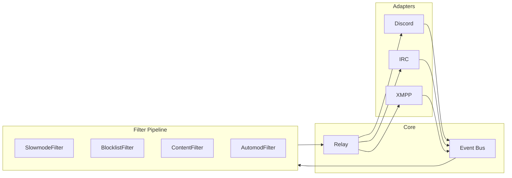

# Bridge Quality-of-Life and Customization Plan

Based on the chat screenshot (joetroll/kaizen): **automod**, **slowmode**, **filtering**, **replying**, and general **customizability** beyond matterbridge. This plan implements these as config-driven, pluggable components so you can tweak behavior without code changes.

---

## Current State

- **Relay flow**: [relay.py](src/bridge/gateway/relay.py) — MessageIn → fan-out MessageOut to Discord/IRC/XMPP. No filtering, no rate limiting, reply_to_id flows through but adapters do not use it when sending.
- **Adapters**: [disc.py](src/bridge/adapters/disc.py) captures `reply_to_id` from Discord but webhook.send() does not pass reference; IRC/XMPP do not emit or render reply context.
- **Config**: [config.example.yaml](config.example.yaml), [config.py](src/bridge/config.py) — mappings, announce toggles, timeouts. No QoL section.

---

## Architecture: Filter Pipeline

Insert a **filter pipeline** between the bus and relay so MessageIn is processed before being relayed. Filters can drop messages or pass them through (optionally modified).




- **Design**: New `gateway/pipeline.py` — `Filter` protocol with `process(source, evt: MessageIn) -> MessageIn | None`. Return `None` to drop; return evt (possibly modified) to pass.
- **Registration**: Pipeline registers as EventTarget for MessageIn; only when a message passes all filters does it call the relay (or a wrapped relay) to publish MessageOut. Avoid looping by having Relay not re-publish MessageIn.
- **Order**: Slowmode → Blocklist → ContentFilter → Automod. Short-circuit on drop.

---

## Phase 1: Filter Pipeline and Config

**1.1 Pipeline module** — `src/bridge/gateway/pipeline.py`

- `Filter` Protocol: `def process(self, source: str, evt: MessageIn) -> MessageIn | None`
- `Pipeline` class: list of filters, `accept_event` for MessageIn, `push_event` runs evt through filters in order; if not dropped, forwards to inner relay (or bus with special handling).
- Wire: Pipeline wraps Relay. Pipeline subscribes to MessageIn; when evt passes, Pipeline calls Relay's logic (or publishes to a relay-specific channel). Simplest: Pipeline has a `_relay: Relay` and calls `relay.push_event` after filters pass.

**1.2 Config schema** — Extend [config.example.yaml](config.example.yaml) and [config.py](src/bridge/config.py)

```yaml
moderation:
  slowmode:
    enabled: true
    messages_per_minute: 5
    per_channel: true
  blocklist:
    enabled: true
    author_ids: []        # Discord IDs, IRC nicks (pattern), XMPP JIDs
    author_patterns: []   # regex for nicks/JIDs
  content_filter:
    enabled: false
    blocked_patterns: []  # regex
    allowed_origins: []    # e.g. ["discord"] to only filter certain origins
  automod:
    enabled: true
    spam_threshold: 5    # identical messages in window
    spam_window_seconds: 60
    caps_ratio: 0.8      # drop if 80%+ caps
    caps_min_length: 10
```

**1.3 Wire pipeline in main** — Register Pipeline (with filters from config) instead of raw Relay; Pipeline holds Relay and forwards after filters.

---

## Phase 2: Individual Filters

**2.1 SlowmodeFilter** — `src/bridge/gateway/filters/slowmode.py`

- Per (channel_id, author_id) sliding window or token bucket.
- Config: `messages_per_minute`, `per_channel`.
- Uses `cachetools.TTLCache` or a small custom structure: `{(channel_id, author_id): [timestamps]}`; drop if over limit.
- Return `None` when over limit (optionally log "slowmode applied").

**2.2 BlocklistFilter** — `src/bridge/gateway/filters/blocklist.py`

- Config: `author_ids` (exact match), `author_patterns` (regex).
- Match `evt.author_id` and `evt.author_display` against blocklist.
- Return `None` if matched.

**2.3 ContentFilter** — `src/bridge/gateway/filters/content.py`

- Config: `blocked_patterns` (regex list), `allowed_origins` (optional).
- If origin in allowed_origins (or empty = all), run regex on `evt.content`; drop if any match.
- Escaping: be careful with regex injection; document that patterns are applied as-is.

**2.4 AutomodFilter** — `src/bridge/gateway/filters/automod.py`

- **Spam**: Per (channel_id, author_id), store last N message contents; if `spam_threshold` identical in `spam_window_seconds`, drop.
- **Caps**: If `len(content) >= caps_min_length` and `caps_ratio` of chars are uppercase, drop (or optionally downcase—simplest: drop).
- Config-driven; no ML.

---

## Phase 3: Reply Threading

**3.1 Message-id store** (AUDIT §3) — Add `gateway/message_store.py`

- `ExpiringDict`-style: `(origin, origin_message_id) -> target_message_id` per (target_origin, channel_id).
- When sending to a target, store mapping after send if we get a message ID back.
- When receiving MessageIn with `reply_to_id`, resolve to origin message for "in reply to X" preamble.
- Size limit ~1k, TTL ~1h (configurable).

**3.2 Discord** — [disc.py](src/bridge/adapters/disc.py) `_webhook_send`

- Webhooks support `reference=MessageReference(message_id=...)` for replies. Pass `evt.reply_to_id` when we have a Discord message ID (from store when reply_to_id was from Discord, or from store lookup when from IRC/XMPP).
- If `reply_to_id` points to a message we haven't stored (e.g. native Discord message), use it directly for Discord-origin replies.

**3.3 IRC** — [irc.py](src/bridge/adapters/irc.py)

- IRCv3 `+draft/reply` / `msgid` if server supports; else fallback: prefix content with `(reply to Alice):`  when we have the original author from the store.
- Outbound: include reply context in the message text when we have stored the original.

**3.4 XMPP** — [xmpp.py](src/bridge/adapters/xmpp.py)

- XEP-0461 (reply) or stanza-id; fallback: `(reply to User):`  preamble when we have the original.
- MUC replies: use `<reply>` element or similar if prosody/ejabberd support; else preamble.

---

## Phase 4: Extras and Commands

**4.1 Per-mapping overrides** — Allow `slowmode`, `blocklist` etc. under each mapping so #general can have different limits than #bot-spam.

**4.2 Admin command (optional)** — `!bridge slowmode 3` (Discord, admin-only) to set slowmode for current channel. Requires config reload or in-memory override; document as optional Phase 4.

**4.3 Logging** — When a filter drops a message, log at DEBUG (or INFO with `log_filter_drops: true   # log when moderation drops a message` in config) so ops can tune.

---

## File Changes Summary


| File                                      | Action                                                             |
| ----------------------------------------- | ------------------------------------------------------------------ |
| `src/bridge/gateway/pipeline.py`          | New — Pipeline + Filter protocol                                   |
| `src/bridge/gateway/filters/__init__.py`  | New                                                                |
| `src/bridge/gateway/filters/slowmode.py`  | New                                                                |
| `src/bridge/gateway/filters/blocklist.py` | New                                                                |
| `src/bridge/gateway/filters/content.py`   | New                                                                |
| `src/bridge/gateway/filters/automod.py`   | New                                                                |
| `src/bridge/gateway/message_store.py`     | New — reply/edit correlation                                       |
| `src/bridge/config.py`                    | Extend — moderation section accessors                              |
| `config.example.yaml`                     | Extend — moderation block                                          |
| `src/bridge/__main__.py`                  | Wire Pipeline around Relay                                         |
| `src/bridge/adapters/disc.py`             | Use reply_to_id for webhook reference                              |
| `src/bridge/adapters/irc.py`              | Emit reply_to_id from IRCv3; render preamble on outbound           |
| `src/bridge/adapters/xmpp.py`             | Emit reply_to_id; render preamble on outbound                      |
| `src/bridge/gateway/relay.py`             | Possibly minor — ensure reply_to_id in MessageOut used by adapters |


---

## Implementation Order

1. **Phase 1** — Pipeline + config; Relay unchanged; filters are no-ops initially (all pass-through).
2. **Phase 2** — Implement each filter; enable via config.
3. **Phase 3** — Message store; update adapters to use reply_to_id.
4. **Phase 4** — Per-mapping overrides, optional admin commands.

---

## Testing

- Unit tests: each filter in isolation (over limit, blocklist match, regex match, spam, caps).
- Integration: Pipeline + Relay; verify dropped messages never reach adapters.
- Reply: test MessageIn with reply_to_id flows to MessageOut and is used by Discord webhook (mock).

---

## Dependencies

No new runtime deps. `cachetools` already present for identity; reuse for slowmode window. `re` for regex filters.
