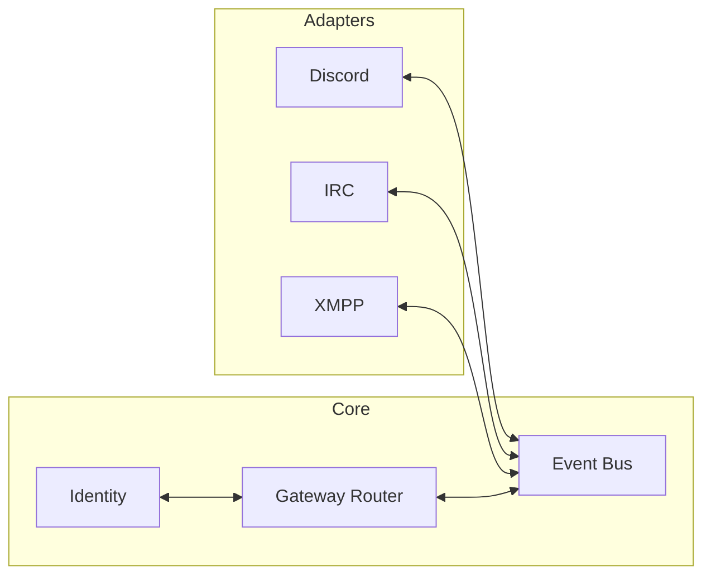

# Custom Discord–IRC–XMPP Bridge (Multi-Presence)

## Audit and structure basis

This plan is **aligned with**:

- **[bridge/audit/AUDIT.md](bridge/audit/AUDIT.md)** — Final consensus from 33 reference audits: event bus, no global locking, Portal as identity source, webhooks per identity, puppet lifecycle, message order queue, reply/edit store, formatting and anti-ping, config and ops (env secrets, announce toggles, room toggle, avatar cache), reliability and testing, commands and moderation, and what we avoid (provisioning on bridge, multi-guild bot without docs, userbots).
- **[bridge/audit/STRUCTURE.md](bridge/audit/STRUCTURE.md)** — We adopt **Option C (Core + adapters + gateway)**: single package `bridge` under `src/`, with `gateway/` (bus, router) and flat `adapters/` (discord, irc, xmpp). Evolve to Option D (protocol subpackages + shared) if files grow. Individual audits live in [bridge/audit/](bridge/audit/) (see [README](bridge/audit/README.md)).

---

## Context

- **Workspace**: [bridge](bridge/) — currently empty except README, .gitignore, .cursorignore, [references/](bridge/references/), and [audit/](bridge/audit/) (33 per-repo audits + AUDIT.md + STRUCTURE.md).
- **atl.chat**: IRC (UnrealIRCd), XMPP (Prosody), [apps/bridge](~/dev/allthingslinux/atl.chat/apps/bridge/) with Biboumi and Matterbridge; `bridge` profile; shared `atl-network`. See [atl.chat README](~/dev/allthingslinux/atl.chat/README.md).
- **Portal** ([portal](~/dev/allthingslinux/portal/)): ATL identity provider / SSO. Users sign up in Portal; IRC and XMPP accounts are **provisioned by Portal** (Atheme JSON-RPC, Prosody). DB: `user`, `account` (e.g. `provider_id = 'discord'`, `account_id` = Discord ID), `irc_account` (userId → nick, server, port), `xmpp_account` (userId → jid, username). One IRC and one XMPP account per user; Discord linked via BetterAuth. See [Portal README](~/dev/allthingslinux/portal/README.md), [INTEGRATIONS.md](~/dev/allthingslinux/portal/docs/INTEGRATIONS.md), [IRC.md](~/dev/allthingslinux/portal/docs/IRC.md).

**Goals**: Own bridge; Discord = home base; IRC and XMPP (atl.chat) as peers; multi-presence so each side feels native; design for all three protocols from the start; no account provisioning on the bridge (Portal only); single bridge instance per Discord guild (documented).

---

## Architecture

### High-level flow




- **Event bus**: Central dispatcher; typed events (e.g. MessageIn, MessageOut, Join, Part). Adapters produce/consume events; **no adapter-to-adapter coupling** and **no global locking** — use per-channel or per-message ordering and queues (AUDIT §1, §8).
- **Identity**: **Portal is the source of truth.** Bridge resolves Discord ID ↔ IRC nick ↔ XMPP JID via Portal Bridge API (preferred) or read-only Portal DB. Optional in-memory TTL cache. No link command; no provisioning on the bridge (AUDIT §1, §8).
- **Gateway router**: Channel mapping (which Discord channel ↔ IRC channel ↔ XMPP MUC); routes events to the right adapters. Config holds mappings; one process can serve multiple mappings (AUDIT §1).

### Portal integration

- **Provisioning**: Only in Portal. Bridge never creates IRC/XMPP accounts.
- **Resolution**: Bridge must answer “Discord ID → IRC nick / XMPP JID?” and “IRC nick or JID → Discord ID?”. **Option A**: Portal exposes bridge API (e.g. `GET /api/bridge/identity?discordId=...`); bridge calls with service token. **Option B (MVP fallback)**: Read-only Portal DB. Prefer A for boundaries; B acceptable until Portal API exists.
- **Puppet rule**: Create IRC/XMPP puppets only for Discord users who have a linked IRC/XMPP account in Portal; create on first message in a bridged channel. Optional `!bridge status` to show linked accounts.

### Multi-presence model


| Direction          | Mechanism                                                                                                                       | Notes                                                         |
| ------------------ | ------------------------------------------------------------------------------------------------------------------------------- | ------------------------------------------------------------- |
| **IRC → Discord**  | Webhooks (one per IRC nick or bridge identity); display name = nick; avatar from cache or default                               | AUDIT §2; queue for order (black-hole pattern).               |
| **Discord → IRC**  | One IRC connection (puppet) per Discord user; only if Portal has IRC account; idle timeout (e.g. 24h); optional postfix (e.g. ` | d`); NickServ; permission-aware channel join where applicable |
| **XMPP → Discord** | Webhook per XMPP JID; avatar from Portal or TTL cache                                                                           | black-hole, discord-xmpp-bridge.                              |
| **Discord → XMPP** | One XMPP puppet per user with Portal XMPP account, or one bridge JID + MUC nick                                                 | Same identity rule as IRC.                                    |
| **IRC ↔ XMPP**     | Optional over same bus; or keep Biboumi for pure XMPP↔IRC                                                                       | Identity links nick ↔ JID.                                    |


### Message and formatting (consensus)

- **Order**: Queue + background consumer for outbound webhooks; configurable delay if needed (AUDIT §3; black-hole).
- **Reply context**: Store message ID mapping; preserve “in reply to X” or IRCv3 reply / “User: reply” (AUDIT §3).
- **Edit/delete**: Store (origin_id, target_id) with TTL (e.g. ExpiringDict-style, 1k entries, ~1h) so edits/deletes apply on the other side (AUDIT §3; black-hole, unifier).
- **IRC ↔ Discord**: Parse IRC formatting → Discord markdown; escape `<` and `\`; **anti-ping** (e.g. zero-width space in nick or word-boundary matching); webhook usernames 2–32 chars (AUDIT §3; chat-bridge, Dis4IRC, black-hole).
- **Mentions**: IRC `[nick]` → Discord `<@userId>` when resolvable; strip/escape @everyone and @here to IRC/XMPP (AUDIT §3).
- **Length/paste**: Length limits and handling for long messages to avoid flooding (AUDIT §3; Dis4IRC, revcord).

### Config and ops (consensus)

- **Secrets**: Env vars only (e.g. `DISCORD_TOKEN`, `PORTAL`_*); no .env parsing beyond what’s documented (AUDIT §5).
- **Config**: YAML (or TOML) for mappings and non-secret options; e.g. `config.yaml` at repo root, `config.example.yaml` (AUDIT §5).
- **Announce toggles**: Configurable relay of join/part/quit/kick and optionally topics/mode changes (AUDIT §5; Dis4IRC, go-discord-irc).
- **Room/channel toggle**: Enable/disable bridging per channel without restart (e.g. command or config reload) (AUDIT §5; black-hole).
- **Avatar cache**: TTL cache for avatar URLs; configurable period (AUDIT §5; black-hole).
- **SIGHUP**: Config reload without restart where applicable (chat-bridge).
- **Docker**: Bind-mounted config; optional data volume; avoid localhost in config inside container (AUDIT §5; matrix-bifrost).

---

## Project structure (Option C)

We use **Option C** from [STRUCTURE.md](bridge/audit/STRUCTURE.md): core + gateway + flat adapters. Split into protocol subpackages (Option D) only when a protocol grows (e.g. `adapters/irc/puppet.py` when >~300 lines).

```
bridge/
├── pyproject.toml
├── config.example.yaml
├── src/
│   └── bridge/
│       ├── __main__.py       # entrypoint
│       ├── config.py        # YAML + env; channel mappings, timeouts, toggles
│       ├── events.py        # event types, Dispatcher, @event decorator
│       ├── identity.py      # Portal client + TTL cache
│       ├── gateway/
│       │   ├── __init__.py
│       │   ├── bus.py       # event bus
│       │   └── router.py    # channel mapping, route to adapters
│       └── adapters/
│           ├── base.py      # interface: subscribe/publish, start/stop
│           ├── discord_.py  # bot, webhooks, queue for outbound
│           ├── irc.py       # main connection + puppet manager
│           └── xmpp.py      # client(s), MUC, puppets if needed
├── tests/
├── audit/                   # reference audits, AUDIT.md, STRUCTURE.md
├── references/
└── README.md
```

**Config shape**: Mappings (Discord channel ID ↔ IRC server/channel ↔ XMPP MUC JID); Discord token (env); IRC server/port/TLS/NickServ (env or config); XMPP jid/password (env); Portal base URL + bridge API path or DB URL (env); optional cache TTL, idle timeout, announce toggles, puppet postfix; clone limit docs.

---

## Technology choices

### Tech stack (libraries)


| Concern                    | Library          | Version / notes                                                                                                                                                                                                         |
| -------------------------- | ---------------- | ----------------------------------------------------------------------------------------------------------------------------------------------------------------------------------------------------------------------- |
| **Runtime**                | Python           | ^3.10 (3.11+ recommended)                                                                                                                                                                                               |
| **Package manager**        | uv               | or Poetry; lockfile and reproducible installs                                                                                                                                                                           |
| **Discord**                | discord.py       | Bot, gateway, webhooks; async                                                                                                                                                                                           |
| **IRC**                    | irc              | Main connection + puppet connections; sync (run in threads/executor) or use async-capable fork if needed; NickServ, TLS                                                                                                 |
| **XMPP**                   | slixmpp          | Async; MUC join/send; component or client; used in jabagram, koishi                                                                                                                                                     |
| **HTTP (Portal API)**      | httpx            | Async; Portal Bridge API client; timeouts per user rules                                                                                                                                                                |
| **Retries**                | tenacity         | Install latest. Retry Portal API and other flaky I/O; exponential backoff, configurable stop/wait; works with async (asyncio).                                                                                          |
| **Config**                 | PyYAML           | Load `config.yaml`; SafeLoader                                                                                                                                                                                          |
| **Env / secrets**          | python-dotenv    | Load `.env` when present (e.g. cwd or documented path); process env overrides. Convenience for local dev and deployment.                                                                                                |
| **Cache (TTL)**            | cachetools       | `TTLCache` for identity and optional avatar cache; or expiringdict (black-hole)                                                                                                                                         |
| **Logging**                | loguru           | Structured logging; replace default logging                                                                                                                                                                             |
| **Tests**                  | pytest + plugins | See [Testing (pytest)](#testing-pytest) below. Core: pytest, pytest-asyncio, pytest-mock, pytest-cov, pytest-timeout, pytest-httpx, pytest-socket, pytest-loguru. Optional: pytest-randomly, pytest-xdist, pytest-html. |
| **Typing (stubs)**         | types-*          | types-pyyaml, types-mock, annotated-types. Add if adopted: types-click, types-aiofiles, types-pytz. See [Typing (stubs)](#typing-stubs) below.                                                                          |
| **Lint / format**          | ruff             | Lint and format; strict typing encouraged                                                                                                                                                                               |
| **Type checking**          | pyright or ruff  | Optional; strict typing encouraged                                                                                                                                                                                      |
| **Git hooks (pre-commit)** | lefthook         | Run ruff, tests (or type check) on commit; config in `lefthook.yml`                                                                                                                                                     |
| **CI/CD**                  | GitHub Actions   | Workflows in `.github/workflows/`: lint (ruff), test (pytest), optional type check; Python matrix; optional Docker build on tag                                                                                         |
| **Persistence (optional)** | —                | Message-id and reply/edit store: in-memory + optional SQLite or reuse cachetools; no identity DB (Portal is source of truth)                                                                                            |


### Testing (pytest)

Dev dependencies for `pyproject.toml` (or uv dev group). Install latest (no version pins). **Core:** `pytest`, `pytest-asyncio`, `pytest-mock`, `pytest-cov`, `pytest-timeout`, `pytest-httpx`, `pytest-socket`, `pytest-loguru`. **Optional:** `pytest-randomly`, `pytest-xdist`, `pytest-html`. Also in [audit/AUDIT.md](bridge/audit/AUDIT.md) §9.

### Typing (stubs)

Dev dependencies. Install latest (no version pins). **Core:** `types-pyyaml`, `types-mock`, `annotated-types`. **Add if adopted:** `types-click`, `types-aiofiles`, `types-pytz`. Also in [audit/AUDIT.md](bridge/audit/AUDIT.md) §9.

**Notes:**

- **Discord**: discord.py for bot + webhook creation/per-identity; queue for outbound webhook order (asyncio.Queue or similar).
- **IRC**: If `irc` is sync, run main and puppet connections in daemon threads or `asyncio.to_thread`; event targets push to gateway bus. Alternative: irc3 (async) if we want full async IRC.
- **XMPP**: slixmpp is asyncio-native; fits async Discord adapter and gateway.
- **Identity**: Portal client implemented with httpx; optional TTL cache (cachetools.TTLCache) in front; separate modules for client vs cache vs resolver as discussed. Use tenacity around Portal API calls (e.g. retry on connection/5xx with exponential backoff, configurable attempts).
- **Env**: Load `.env` via python-dotenv at startup (when present); process environment overrides. Keeps secrets out of config files for local runs and simple deployments.
- **Pre-commit**: lefthook for Git hooks; `lefthook.yml` at repo root; typical hooks: ruff check + format, pytest (or subset), optional type check. Run `lefthook install` after clone.
- **CI/CD**: GitHub Actions in `.github/workflows/` — e.g. `ci.yml` (lint + test on push/PR; Python 3.10–3.12 matrix); optional `docker.yml` (build and push image on tag); cache uv/poetry deps.
- **Persistence**: Optional local store for message-id mapping and reply/edit correlation only; identity stays in Portal (AUDIT §9).

---

## Integration with atl.chat

- Deploy as a bridge service under [atl.chat/apps/bridge](~/dev/allthingslinux/atl.chat/apps/bridge/) (e.g. `bridge/`); compose in existing `bridge` profile; use `atl-network`; connect to IRC and XMPP by hostname per [atl.chat networking](~/dev/allthingslinux/atl.chat/docs/infra/networking.md).
- Secrets via env (same pattern as Biboumi/Matterbridge). Biboumi can remain for pure XMPP↔IRC; this bridge focuses on Discord↔IRC and Discord↔XMPP.

---

## Implementation phases

1. **Scaffold and core** — Repo layout (Option C), `pyproject.toml`, config schema, event types and dispatcher, Portal identity client (API or read-only DB) + TTL cache, gateway bus and router. No adapters yet.
2. **Discord adapter** — Bot: receive messages/reactions; send via webhooks (one per foreign identity) with queue; resolve Discord user → nick/JID via Portal; optional `!bridge status`; no provisioning.
3. **IRC adapter** — Main connection: join mapped channels, emit events; puppet manager: spawn IRC connections only for Discord users with IRC account in Portal; send messages, join/part/away, idle timeout; NickServ; document clone limits.
4. **XMPP adapter** — Client: connect, join MUC(s), emit events; send to MUC; Discord→XMPP only for users with XMPP account in Portal; MUC nick or JID puppets per Prosody setup.
5. **Routing and dedup** — Route by channel mapping; dedupe by message-id/origin to avoid loops; message-id store for reply/edit (TTL, size limit) (AUDIT §3).
6. **Deploy and ops** — Containerfile, healthcheck, compose fragment for atl.chat `bridge` profile; document env, channel mapping, Portal integration, and single-guild caveat; tests for formatting, dedup, identity, adapter failure paths (AUDIT §6).

---

## Reliability and testing (consensus)

- **Reliability**: Errors visible (log/notify); retry or queue messages during downtime so they can be bridged after reconnect (AUDIT §6; out-of-your-element, unifier).
- **Tests**: Formatting, dedup, identity resolution, adapter failure paths; document cache/rate limits (AUDIT §6).

---

## Risks and mitigations

- **IRC clone limits**: Document clone exception or oper approval for UnrealIRCd; idle reaping and optional puppet postfix to limit connections (AUDIT §4).
- **Discord rate limits**: Reuse webhooks per identity; cache webhook IDs; avatar cache with TTL (AUDIT §5).
- **XMPP MUC vs multi-JID**: MVP can use one bridge JID + MUC nicks for Discord-origin messages; add JID puppets later if needed.

---

## What we are not doing (consensus)

- No global locking; use queues and per-resource ordering (AUDIT §8).
- No account provisioning on the bridge; Portal only (AUDIT §8).
- No single bot across multiple guilds without clear docs/constraints (AUDIT §2, §8).
- No over-mapping of protocol features; document limitations instead of fragile hacks (AUDIT §8; biboumi).
- No userbot/puppeting that violates Discord ToS; bot + webhooks only (AUDIT §8; slidcord).

---

## Decisions captured

- **Relay style**: Multi-presence / puppets; native feel on both sides.
- **Scope**: Design for Discord, IRC, and XMPP from the start; implement scaffold first, then adapters.
- **Identity**: Portal is the source of truth; Bridge API preferred, read-only DB acceptable for MVP; no link command or provisioning on the bridge.
- **Structure**: Option C (core + gateway + flat adapters); evolve to Option D if protocol code grows (STRUCTURE.md).
- **Alignment**: Architecture, message handling, config, ops, and constraints follow [bridge/audit/AUDIT.md](bridge/audit/AUDIT.md) and structure follows [bridge/audit/STRUCTURE.md](bridge/audit/STRUCTURE.md).

Next step: implement Phase 1 (scaffold and core) in the bridge repo.