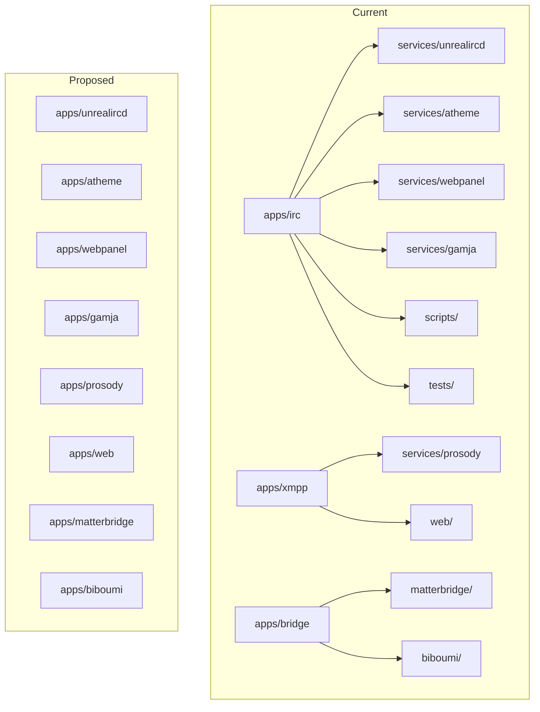

# Flatten apps/ Structure

## Current vs. Proposed Layout




## Target Structure

```
apps/
  unrealircd/     # was apps/irc/services/unrealircd
  atheme/          # was apps/irc/services/atheme
  webpanel/        # was apps/irc/services/webpanel
  gamja/           # was apps/irc/services/gamja
  prosody/         # was apps/xmpp/services/prosody + xmpp/web (merged)
  web/             # unchanged (Next.js)
  matterbridge/    # was apps/bridge/matterbridge
  biboumi/         # was apps/bridge/biboumi

scripts/           # NEW: root-level (from apps/irc/scripts)
  init.sh
  prepare-config.sh

tests/             # NEW: root-level (from apps/irc/tests)
  irc/             # IRC integration tests
  conftest.py
  ...
```

## Migration Steps

### 1. Create new app directories and move content


| From                            | To                                                                               |
| ------------------------------- | -------------------------------------------------------------------------------- |
| `apps/irc/services/unrealircd/` | `apps/unrealircd/`                                                               |
| `apps/irc/services/atheme/`     | `apps/atheme/`                                                                   |
| `apps/irc/services/webpanel/`   | `apps/webpanel/`                                                                 |
| `apps/irc/services/gamja/`      | `apps/gamja/`                                                                    |
| `apps/xmpp/services/prosody/`   | `apps/prosody/`                                                                  |
| `apps/xmpp/web/`                | `apps/prosody/web/` (merged into prosody; Prosody mounts this as http_files_dir) |
| `apps/bridge/matterbridge/`     | `apps/matterbridge/`                                                             |
| `apps/bridge/biboumi/`          | `apps/biboumi/`                                                                  |


### 2. Move shared scripts to root

- `apps/irc/scripts/init.sh` → `scripts/init.sh`
- `apps/irc/scripts/prepare-config.sh` → `scripts/prepare-config.sh`
- Update all path references in these scripts:
  - `APPS_IRC_ROOT` → `PROJECT_ROOT`; paths like `services/unrealircd` → `apps/unrealircd`
  - `services/atheme` → `apps/atheme`
  - `services/unrealircd/config/tls` → `apps/unrealircd/config/tls`

### 3. Move tests to root

- `apps/irc/tests/` → `tests/irc/` (or `tests/` with subdirs)
- Update [pyproject.toml](pyproject.toml): `members = ["tests"]` or create `tests/pyproject.toml` if tests need their own deps
- Update [pyproject.toml](pyproject.toml): `testpaths = ["tests"]`
- The `atl-chat-irc` package currently lives at `apps/irc` with `packages = ["services/atheme", "services/unrealircd"]` (for hatch) – those are config dirs, not Python. Re-evaluate: tests are the main Python code. Option: create `tests/pyproject.toml` as `atl-chat-tests` with irc deps, or keep a minimal `tests/` that depends on a stub package.

### 4. Update compose files

**[infra/compose/irc.yaml](infra/compose/irc.yaml):**

- `context: ../../apps/irc/services/unrealircd` → `context: ../../apps/unrealircd`
- `context: ../../apps/irc/services/atheme` → `context: ../../apps/atheme`
- `context: ../../apps/irc` + `dockerfile: services/webpanel/Containerfile` → `context: ../../apps/webpanel` + `dockerfile: Containerfile`
- Volume paths: `../../apps/irc/services/unrealircd/config` → `../../apps/unrealircd/config`
- Volume paths: `../../apps/irc/services/atheme/config` → `../../apps/atheme/config`

**[infra/compose/xmpp.yaml](infra/compose/xmpp.yaml):**

- `context: ../../apps/xmpp/services/prosody` → `context: ../../apps/prosody`
- Volumes: `../../apps/xmpp/services/prosody/config` → `../../apps/prosody/config`
- Volumes: `../../apps/xmpp/web/assets` → `../../apps/prosody/web` (or `../../apps/prosody/assets`)

### 5. Prosody web assets

Prosody mounts `http_files_dir` from the host. Currently: `apps/xmpp/web/assets` → `/usr/share/prosody/www`. After move: `apps/prosody/web` (or `apps/prosody/assets`). The [prosody Containerfile](apps/xmpp/services/prosody/Containerfile) does not COPY these – they are volume-mounted at runtime. So only compose volume paths change.

### 6. Update root justfile

- `init`: `./apps/irc/scripts/init.sh` → `./scripts/init.sh`
- `mod irc` → remove or repurpose. Options: (a) `mod unrealircd`, `mod atheme`, etc. per app; (b) single `mod irc` pointing to a thin `apps/irc/` that re-exports or delegates; (c) drop mod structure, inline key recipes in root justfile.
- `test`: `just irc test` → `uv run pytest tests/` (tests at root)

### 7. Handle app-specific justfiles

- **IRC justfile** ([apps/irc/justfile](apps/irc/justfile)): 200+ lines (test, ssl-*, modules-*, shell, etc.). Options: (a) Move to root `justfile` as `just irc-test`, `just irc-shell`, etc.; (b) Create `justfile` in `apps/unrealircd` for unrealircd-specific (shell, modules-*), `apps/atheme` for atheme-specific – but many recipes target the whole stack. Recommendation: Consolidate IRC recipes into root justfile under an `irc` group or prefix (e.g. `just irc shell`, `just irc test`).
- **XMPP justfile** ([apps/xmpp/justfile](apps/xmpp/justfile)): Prosody management (shell, reload, adduser, etc.). Move to root as `just prosody shell`, `just prosody reload`, etc., or create `apps/prosody/justfile` and `mod prosody './apps/prosody'`.

### 8. Update workspace and CI

- **[pnpm-workspace.yaml](pnpm-lock.yaml)** / pnpm: Remove `apps/irc`, `apps/xmpp` if they had package.json. [apps/web](apps/web) stays. [apps/irc/package.json](apps/irc/package.json) and [apps/xmpp/package.json](apps/xmpp/package.json) are thin – delete or move to apps that need them.
- **[uv.lock](uv.lock)** / pyproject: `members = ["apps/irc"]` → `members = ["tests"]` or equivalent.
- **[.github/workflows/ci.yml](.github/workflows/ci.yml)**: Path filters `apps/irc/`**, `apps/xmpp/`** → `apps/unrealircd/**`, `apps/atheme/**`, `apps/prosody/**`, `tests/**`, `scripts/**`
- **[.gitignore](.gitignore)**: `apps/irc/services/atheme/config/atheme.conf` → `apps/atheme/config/atheme.conf`; same for unrealircd.

### 9. Delete empty directories

- `apps/irc/` (after moving services, scripts, tests)
- `apps/xmpp/` (after moving prosody, web)
- `apps/bridge/` (after moving matterbridge, biboumi)

### 10. Update documentation

- All docs referencing `apps/irc/`, `apps/xmpp/` → new paths
- [docs/services/irc/](docs/services/irc/), [docs/bridges/](docs/bridges/), [.cursor/plans/](.cursor/plans/) – batch update paths

## Edge Cases

1. **prepare-config.sh** writes to `apps/unrealircd/config/unrealircd.conf` and `apps/atheme/config/atheme.conf`. After move, paths are `apps/unrealircd/config/`, `apps/atheme/config/`.
2. **init.sh** creates `apps/irc/services/unrealircd/config/tls` – becomes `apps/unrealircd/config/tls`.
3. **conftest.py** and pytest fixtures use `project_root`, `services/unrealircd` etc. Update to `apps/unrealircd`.
4. **Webpanel build**: Currently builds from `apps/irc` with `dockerfile: services/webpanel/Containerfile`. After move, build context is `apps/webpanel/` and Dockerfile is `apps/webpanel/Containerfile`.
5. **luacheck**: [.luacheckrc](.luacheckrc) references `apps/xmpp/prosody-modules` – these are build-time artifacts. If they exist, update path to `apps/prosody/` or remove if obsolete.

## Recommended Order

1. Create `scripts/`, move init.sh and prepare-config.sh, update their paths
2. Create `apps/unrealircd`, `apps/atheme`, `apps/webpanel`, `apps/gamja` – move content
3. Create `apps/prosody`, move prosody + merge xmpp/web into prosody/web
4. Create `apps/matterbridge`, `apps/biboumi` – move from bridge
5. Move `apps/irc/tests` → `tests/`
6. Update compose (irc.yaml, xmpp.yaml)
7. Update root justfile, pyproject, CI, .gitignore
8. Consolidate or relocate app justfiles
9. Delete apps/irc, apps/xmpp, apps/bridge
10. Update all documentation

