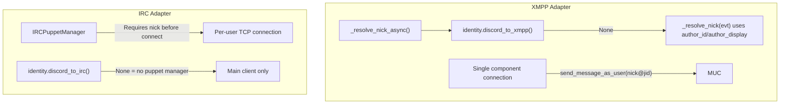

# IRC Puppets and Reference Insights Plan

## Current State

**Implemented:** `DevIdentityResolver` enables IRC puppets without Portal when `BRIDGE_DEV_IRC_PUPPETS=true` and `BRIDGE_PORTAL_BASE_URL` is unset. Nicks come from `BRIDGE_DEV_IRC_NICK_MAP` (discord_id:nick,...) or `atl_dev_{discord_id[-8:]}`.

**Key files:**

- [apps/bridge/src/bridge/identity.py](apps/bridge/src/bridge/identity.py) — `DevIdentityResolver`, `_sanitize_irc_nick`
- [apps/bridge/src/bridge/**main**.py](apps/bridge/src/bridge/__main__.py) — wires `DevIdentityResolver` when Portal absent + env enabled
- [apps/bridge/src/bridge/adapters/irc_puppet.py](apps/bridge/src/bridge/adapters/irc_puppet.py) — `IRCPuppet`, `IRCPuppetManager`

---

## Architecture: Why XMPP Works Without Env, IRC Doesn't

|             | XMPP                                  | IRC                                     |
| ----------- | ------------------------------------- | --------------------------------------- |
| Connections | One component; arbitrary JIDs         | One TCP connection per puppet           |
| Nick source | Event (`author_id`, `author_display`) | Identity resolver (`discord_id` only)   |
| Fallback    | In-adapter, uses event                | Needs identity or explicit dev resolver |

XMPP's `_resolve_nick_async` can fall back to event data; IRC's `IRCPuppetManager` only gets `discord_id` from identity, so it cannot derive a nick from the event without interface changes.

---

## Reference Audit Findings

### go-discord-irc (most relevant)

- **Varys:** One IRC connection per Discord user; RPC-style `Connect`, `Nick`, `GetNick`, `QuitIfConnected`
- **Nick generation:** `sanitiseNickname(nick) + suffix`; fallback `username[:len] + separator + discriminator + suffix` on collision/length
- **Sanitization:** Unidecode, Charybdis-style `IsNickChar`/`IsFakeNickChar`, first-char rules (no `-`, no digit)
- **WebIRC:** `discord {id}.user.discord {ip}` via `SnowflakeToIP`
- **Prejoin:** `MODE ${NICK} +D` (invisible)
- **Ping avoidance:** Zero-width joiner after first rune in nick
- **Simple mode:** Single listener; messages as `<user#discrim> text` when no puppet

### discord-irc, discord-ircv3

- Single connection; no puppets
- Use `member.Nick` or `member.User.Username` for display
- Zero-width joiner for ping avoidance

### matterbridge

- `RemoteNickFormat`: `{NICK}`, `{USERID}`, `{BRIDGE}`, `{PROTOCOL}`, `{CHANNEL}`
- Nick from `msg.Username` on incoming message; no external identity

### IRCv3 specs

- `account-tag`, `account-notify`, `extended-join`, `chghost`, `setname` — useful for identity and metadata

---

## Potential Improvements

### Option A: Auto-enable DevIdentityResolver (no env var)

When `BRIDGE_PORTAL_BASE_URL` is unset, always use `DevIdentityResolver` instead of `identity=None`. IRC puppets would work in dev by default, like XMPP.

- **Pro:** Matches XMPP behavior; no extra env
- **Con:** More IRC connections in dev; may surprise users who expect main-client-only

### Option B: Use `author_display` as fallback (XMPP-style)

Change `IRCPuppetManager.get_or_create_puppet(discord_id, nick_fallback=None)`. When `identity.discord_to_irc` returns `None`, use `nick_fallback` from the event. Requires:

1. `_send_via_puppet` to pass `evt.author_display`
2. Puppet manager to accept optional fallback
3. Creating puppet manager even when identity is `None` (with fallback-only mode)

- **Pro:** Uses event data; no Portal or env
- **Con:** Interface changes; identity and puppet manager both need updates

### Option C: Enhance DevIdentityResolver (reference patterns)

Adopt patterns from go-discord-irc:

1. **Nick sanitization:** Unidecode for Unicode; Charybdis-style validation; first-char rules
2. **Zero-width joiner:** Insert `\u200B` after first rune to avoid pings (when nick comes from display)
3. **WebIRC suffix:** `discord {id}.user.discord {ip}` if WebIRC is used
4. **Prejoin commands:** `MODE {nick} +D` (invisible) via `IRC_PUPPET_PREJOIN_COMMANDS`
5. **Fallback format:** `username + separator + discriminator` when primary nick collides (needs Discord API data)

---

## Recommendation

- **Short term:** Keep current design. `BRIDGE_DEV_IRC_PUPPETS` is explicit and avoids surprise connections.
- **Optional:** Implement Option A if you want IRC to behave like XMPP (no env) in dev.
- **Enhancement:** Apply Option C incrementally (sanitization, prejoin, WebIRC) where it fits the existing config and architecture.

