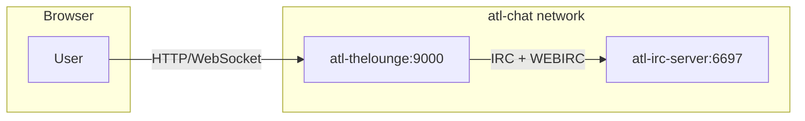

# The Lounge Integration Plan

## Summary

Integrate [The Lounge](https://thelounge.chat) (web-based IRC client) into the atl.chat Docker Compose stack. The Lounge will run in **private mode** (user accounts required), default to the ATL IRC server (`atl-irc-server`), auto-join `#help`, and use **WebIRC** so real user IPs are passed to UnrealIRCd.

## Architecture




## Key Files to Create/Modify


| File                                                                                               | Action                                                  |
| -------------------------------------------------------------------------------------------------- | ------------------------------------------------------- |
| [infra/compose/thelounge.yaml](infra/compose/thelounge.yaml)                                       | **Create** — The Lounge service                         |
| [compose.yaml](compose.yaml)                                                                       | **Modify** — Include thelounge.yaml                     |
| [apps/unrealircd/config/unrealircd.conf.template](apps/unrealircd/config/unrealircd.conf.template) | **Modify** — Add webirc block for The Lounge            |
| [scripts/init.sh](scripts/init.sh)                                                                 | **Modify** — Add `data/thelounge` to create_directories |
| [scripts/prepare-config.sh](scripts/prepare-config.sh)                                             | **Modify** — Generate The Lounge config.js              |
| [apps/thelounge/config.js.template](apps/thelounge/config.js.template)                             | **Create** — Config template with defaults + webirc     |
| [.env.example](.env.example)                                                                       | **Modify** — Add THELOUNGE_* vars                       |
| [.env.dev.example](.env.dev.example)                                                               | **Modify** — Add THELOUNGE_PORT (9000) for dev          |
| [justfile](justfile)                                                                               | **Modify** — Add `mod lounge` and `just lounge add`     |
| [AGENTS.md](AGENTS.md)                                                                             | **Modify** — Document The Lounge in structure           |


---

## 1. Docker Compose Service

**Create** [infra/compose/thelounge.yaml](infra/compose/thelounge.yaml):

- Image: `ghcr.io/thelounge/thelounge:latest` ([thelounge/thelounge-docker](https://github.com/thelounge/thelounge-docker))
- Port: `${THELOUNGE_PORT:-9000}:9000`
- Volume: `../../data/thelounge:/var/opt/thelounge`
- Depends on: `atl-irc-server` (condition: service_healthy)
- Network: `atl-chat`
- Env: `THELOUNGE_HOME=/var/opt/thelounge`
- Command: `sh -c "thelounge install thelounge-plugin-janitor 2>/dev/null || true && thelounge install thelounge-plugin-giphy 2>/dev/null || true && exec thelounge start"` (janitor: upload cleanup; giphy: `/giphy search <term>` / `/giphy random`)
- Load `.env` and `.env.dev` (required: false)

**Update** [compose.yaml](compose.yaml): Add `- infra/compose/thelounge.yaml` to `include`.

**Note:** Official image runs as `node (1000:1000)`. Bind mount `data/thelounge` must be writable by that user; `just init` creates the dir with default ownership (typically matches host UID 1000). Alternative: use a named volume `thelounge:/var/opt/thelounge` for simpler permissions (see [official docker-compose](https://github.com/thelounge/thelounge-docker)).

---

## 2. UnrealIRCd WebIRC Block

The Lounge connects from the Docker network (typically 172.16.0.0/12). Add a **named proxy block** in [unrealircd.conf.template](apps/unrealircd/config/unrealircd.conf.template) (after the existing NPM block). UnrealIRCd 6.2.0+ supports `proxy` blocks with `type webirc`:

```
/* The Lounge web client - passes real user IP via WEBIRC */
proxy thelounge {
	type webirc;
	match { ip 172.16.0.0/12; }
	password "${THELOUNGE_WEBIRC_PASSWORD}";
}
```

The existing block for `ATL_GATEWAY_IP` remains for NPM. The Lounge uses a separate password for security. The name `thelounge` is for clarity; the IRCd will match connections from the Docker network range by IP.

**Optional:** Add an `except ban` block for the Docker network so The Lounge gateway is not seen as connection flooding (see [UnrealIRCd WebIRC docs](https://www.unrealircd.org/docs/WebIRC_Support)).

---

## 3. The Lounge Configuration

**Create** [apps/thelounge/config.js.template](apps/thelounge/config.js.template):

- **defaults**: `name` = IRC_NETWORK_NAME, `host` = `atl-irc-server`, `port` = 6697, `tls` = true, `rejectUnauthorized` = from ATL_ENVIRONMENT (false for dev), `nick` = `atl%%`, `username` = `atl`, `realname` = `The Lounge User`, `join` = `#help`
- **webirc**: Map every IRC server hostname users might connect to → `THELOUNGE_WEBIRC_PASSWORD`:
  - `atl-irc-server` — Docker internal (defaults.host)
  - `irc.atl.chat` — production domain
  - `irc.localhost` — dev domain
- **public**: false (private mode)
- **reverseProxy**: true (for production behind NPM)
- **theme**: `default`
- **fileUpload.enable**: true (optional; enable if desired)
- **deleteUploadsAfter**: `${THELOUNGE_DELETE_UPLOADS_AFTER_MINUTES:-1440}` (1 day default) — requires [thelounge-plugin-janitor](https://www.npmjs.com/package/thelounge-plugin-janitor)

Use `${VAR}` placeholders for envsubst. Template will be processed by prepare-config into `data/thelounge/config.js`.

### Plugins (Pre-installed)

**Janitor** ([thelounge-plugin-janitor](https://www.npmjs.com/package/thelounge-plugin-janitor)): Auto-deletes old uploads. `deleteUploadsAfter` in config.js controls retention (minutes).

**Giphy** ([thelounge-plugin-giphy](https://www.npmjs.com/package/thelounge-plugin-giphy)): `/giphy search <term>` and `/giphy random`. Users set their API key via `/giphy key <api-key>` (get one at [developers.giphy.com](https://developers.giphy.com/dashboard/)).

**Compose** [thelounge.yaml](infra/compose/thelounge.yaml): Override `command` to install both plugins before start:

```yaml
command: >
  sh -c "thelounge install thelounge-plugin-janitor 2>/dev/null || true && thelounge install thelounge-plugin-giphy 2>/dev/null || true && exec thelounge start"
```

The `|| true` ensures startup succeeds if plugins are already installed.

### Theme: Catppuccin (Optional)

The Lounge ships with `default` and `morning` themes. [catppuccin/thelounge](https://github.com/catppuccin/thelounge) provides a soothing pastel theme (Latte, Frappé, Macchiato, Mocha) as raw CSS — not an npm package.

**Per-user setup:** Users can apply Catppuccin via Settings → Appearance → enable **Advanced settings** → **Custom Stylesheet** → paste contents of `theme.css` from the desired flavor:

- `themes/catppuccin-mocha/theme.css` — dark (recommended)
- `themes/catppuccin-macchiato/theme.css` — dark
- `themes/catppuccin-frappe/theme.css` — dark
- `themes/catppuccin-latte/theme.css` — light

**Document** this in user-facing docs (e.g. onboarding or The Lounge usage guide). If CSS breaks the UI, users can load `?nocss` to disable custom styles temporarily.

---

## 4. Init and Prepare-Config

**Update** [scripts/init.sh](scripts/init.sh): Add `data/thelounge` to `data_dirs` in `create_directories()`.

**Update** [scripts/prepare-config.sh](scripts/prepare-config.sh):

- Export `THELOUNGE_WEBIRC_PASSWORD` (default: `change_me_thelounge_webirc`)
- Export `THELOUNGE_DELETE_UPLOADS_AFTER_MINUTES` (default: `1440`)
- Export `IRC_LOUNGE_REJECT_UNAUTHORIZED` (false when ATL_ENVIRONMENT=dev, else true)
- Add section: if `apps/thelounge/config.js.template` exists, run `envsubst` → `data/thelounge/config.js` (create parent dir if needed)

---

## 5. Environment Variables

**Add to** [.env.example](.env.example):

```
# The Lounge (web IRC client)
THELOUNGE_PORT=9000
THELOUNGE_DOMAIN=webirc.atl.chat              # Production URL (DNS + NPM Proxy Host)
THELOUNGE_WEBIRC_PASSWORD=change_me_thelounge_webirc
THELOUNGE_DELETE_UPLOADS_AFTER_MINUTES=1440   # Janitor plugin: delete uploads after 1 day (0 = disable)
```

**Add to** [.env.dev.example](.env.dev.example): `THELOUNGE_PORT=9000` (optional; matches default).

---

## 6. Just Commands

**Update** [justfile](justfile):

- Add `mod lounge './apps/thelounge'`

**Create** [apps/thelounge/justfile](apps/thelounge/justfile):

- `add name`: `docker compose exec atl-thelounge thelounge add <name>`
- `list`: `docker compose exec atl-thelounge thelounge list`
- `reset name`: `docker compose exec atl-thelounge thelounge reset <name>`

---

## 7. Documentation

**Update** [AGENTS.md](AGENTS.md): Add The Lounge to the apps list and per-app commands table.

**Update** [infra/AGENTS.md](infra/AGENTS.md): Add compose/thelounge.yaml to the structure table.

**User-facing docs:** Document Catppuccin theme setup (Settings → Appearance → Custom Stylesheet; link to [catppuccin/thelounge](https://github.com/catppuccin/thelounge)).

---

## Post-Setup: Creating Users

After `just dev`, create the first user:

```bash
just lounge add alice
```

The Lounge will prompt for password and log settings.

---

## Dev vs Prod Behavior


| Setting                     | Dev                                            | Prod                                                         |
| --------------------------- | ---------------------------------------------- | ------------------------------------------------------------ |
| defaults.host               | atl-irc-server                                 | atl-irc-server                                               |
| defaults.rejectUnauthorized | false (self-signed certs)                      | true                                                         |
| reverseProxy                | true                                           | true                                                         |
| Access URL                  | [http://localhost:9000](http://localhost:9000) | [https://webirc.atl.chat](https://webirc.atl.chat) (via NPM) |


---

## Optional: Reverse Proxy (Production)

For production, add an NPM Proxy Host for `webirc.atl.chat` → `atl-thelounge:9000` with WebSocket support. Add a DNS A/CNAME record for `webirc.atl.chat` pointing to your gateway. The Lounge config already has `reverseProxy: true` to honor `X-Forwarded-For`.

---

## Testing & Verification (Dev and Prod)

Ensure The Lounge works in both environments before considering the integration complete.

### Dev Testing

1. **Setup:** `just init` then `just dev` (loads `.env` + `.env.dev`)
2. **Create user:** `just lounge add alice` — set password when prompted
3. **Access:** Open [http://localhost:9000](http://localhost:9000), log in as alice
4. **Connect:** Should auto-connect to ATL IRC (atl-irc-server) and join `#help`
5. **WebIRC check:** From another IRC client (or `/whois` in The Lounge), verify the user's host shows real IP (not Docker gateway IP). IRCOps can use `WHOIS`; `third/showwebirc` exposes webirc info.
6. **TLS:** `defaults.rejectUnauthorized: false` in dev allows self-signed certs

### Prod / Staging Testing

1. **Setup:** `just init` (or re-run with prod `.env`), then `just prod` or `just staging`
2. **NPM + DNS:** Add Proxy Host for `webirc.atl.chat` → `atl-thelounge:9000`, enable WebSockets, ensure DNS A/CNAME exists
3. **Create user:** `just lounge add <username>` (run with prod compose context)
4. **Access:** Open [https://webirc.atl.chat](https://webirc.atl.chat), log in
5. **Connect:** Same as dev — auto-connect and join `#help`
6. **WebIRC check:** Verify real user IP in WHOIS
7. **TLS:** `defaults.rejectUnauthorized: true` in prod — ensure IRC server cert is valid

### Environment Parity


| Item               | Dev                                       | Prod                                                       |
| ------------------ | ----------------------------------------- | ---------------------------------------------------------- |
| Compose            | `just dev` (includes thelounge)           | `just prod` (includes thelounge)                           |
| Config source      | `prepare-config` with `.env` + `.env.dev` | `prepare-config` with `.env`                               |
| rejectUnauthorized | false (self-signed OK)                    | true (valid cert required)                                 |
| Access             | localhost:9000                            | [https://webirc.atl.chat](https://webirc.atl.chat) via NPM |


**Ensure** `prepare-config.sh` is run with the correct env before each `just dev` / `just prod` so `data/thelounge/config.js` has the right `rejectUnauthorized` and webirc password. `just init` and `just dev` already invoke init.sh which runs prepare-config. For prod, run `./scripts/prepare-config.sh` (or `just init`) with prod `.env` before first deploy.

---

## RELAYMSG (third/relaymsg) - Bridge Stateless Mode

The `third/relaymsg` module (atl.chat fork) is installed and configured, enabling **draft/relaymsg** on UnrealIRCd. This allows the bridge to use stateless bridging: a single IRC connection can send messages that appear from arbitrary nicks via `RELAYMSG #channel nick/message :text`, without per-user puppet connections.

**Current setup:**

- Module: `third/relaymsg` (atl.chat fork from contrib/relaymsg)
- Config: `relaymsg { hostmask "bridge@${IRC_DOMAIN}"; }`
- Permission: `relaymsg` granted to `bridge-oper` operclass (bridge)

**Bridge integration (implemented):**
- Bridge requests `draft/relaymsg` and `overdrivenetworks.com/relaymsg` capabilities
- When server supports RELAYMSG and message is sent via main connection (no puppet), uses `RELAYMSG #channel nick/d :message` with spoofed nick from `author_display`
- Echo detection: skips messages with `draft/relaymsg` or `relaymsg` tag matching our nick
- Puppets remain preferred when identity is available; RELAYMSG is used for fallback (no identity or user has no IRC)

---

## References

- [The Lounge](https://thelounge.chat/) · [Docs](https://thelounge.chat/docs) · [Demo](https://demo.thelounge.chat/)
- [thelounge/thelounge-docker](https://github.com/thelounge/thelounge-docker) — official image (`ghcr.io/thelounge/thelounge`, `thelounge/thelounge` on DockerHub)
- Data directory: `/var/opt/thelounge`; container runs as `node (1000:1000)`

