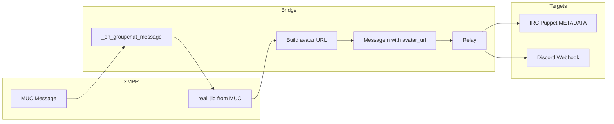

# XMPP Avatar to IRC/Discord Bridge Plan

## Context

- **UnrealIRCd**: `third/metadata` module is already added (previous session)
- **Bridge IRC puppets**: METADATA avatar sync for Discord→IRC is already implemented
- **Gap**: XMPP users have avatars (vCard) but we never pass them when creating `MessageIn`, so XMPP→IRC and XMPP→Discord have no avatar

## Architecture

## Prerequisites: Prosody

### Avatar pipeline (PEP → vCard → HTTP)

1. **mod_pep_vcard_png_avatar** (optional, recommended): Syncs PEP avatars to vCard and converts webp→PNG
  - Conversations (Android) publishes PEP avatars in webp; many clients only read vCard PNG
  - Add to modules.list and modules_enabled
  - Requires `dwebp` from `webp` package — add to Containerfile: `apt-get install webp` (or equivalent)
  - Do NOT load `mod_pep_vcard_avatar` if loading this (it replaces it)
  - Doc: [https://modules.prosody.im/mod_pep_vcard_png_avatar.html](https://modules.prosody.im/mod_pep_vcard_png_avatar.html)
2. **mod_http_avatar**: Serves vCard avatars at `http://host:5280/avatar/<username>`
  - Add to [apps/prosody/modules.list](apps/prosody/modules.list) and [apps/prosody/config/prosody.cfg.lua](apps/prosody/config/prosody.cfg.lua)
  - Run `prosodyctl install mod_http_avatar` (or via Containerfile/entrypoint)
  - Doc: [https://modules.prosody.im/mod_http_avatar.html](https://modules.prosody.im/mod_http_avatar.html)
3. **Avatar URL format**: For JID `alice@xmpp.atl.chat`, avatar at `{base}/avatar/alice` (node = localpart)

## Bridge Changes

### 1. Config

- **File**: [apps/bridge/src/bridge/config.py](apps/bridge/src/bridge/config.py)
- Add property: `xmpp_avatar_base_url: str | None` (default `None`)
  - When set (e.g. `https://xmpp.atl.chat` or `https://xmpp.atl.chat:5280`), XMPP inbound will build avatar URLs
  - When unset, no avatar URL (current behavior)
- **File**: [apps/bridge/config.template.yaml](apps/bridge/config.template.yaml)
- Add: `xmpp_avatar_base_url: "${XMPP_AVATAR_BASE_URL}"`
  - Env var allows `just init` / prepare-config to substitute
- **Env**: Add `XMPP_AVATAR_BASE_URL` to `.env.example` and prepare-config (e.g. `https://${PROSODY_DOMAIN}` or explicit URL)

### 2. XMPP Component: Build and Pass avatar_url

- **File**: [apps/bridge/src/bridge/adapters/xmpp_component.py](apps/bridge/src/bridge/adapters/xmpp_component.py)
- **Location**: `_on_groupchat_message` (lines 203-341)

**Logic**:

1. After echo detection, before creating `MessageIn`, compute `avatar_url`:
  - If `cfg.xmpp_avatar_base_url` is None or empty, skip (avatar_url = None)
  - Get `real_jid` from `muc.get_jid_property(room_jid, nick, "jid")` (already called in echo block; reuse or call again)
  - If `real_jid` is None, avatar_url = None
  - Parse JID: `node = JID(str(real_jid)).local`
  - Optional: only for local users (JID domain in configured XMPP domain) to avoid 404s for federated users
  - `avatar_url = f"{base.rstrip('/')}/avatar/{node}"`
2. Add `avatar_url=avatar_url` to the `message_in()` call (line 329)

**Note**: No async needed; URL construction is synchronous. No fetch/validation; clients handle 404.

### 3. Domain Check (Optional)

- Restrict avatar URL to local users: only when `JID(real_jid).domain` equals a configured XMPP domain (e.g. from component JID or config). Federated users (other servers) will not have avatars on our Prosody. Implement if desired; otherwise always build URL and accept 404s.

### 4. Tests

- **File**: `apps/bridge/tests/test_xmpp_component.py` or new `test_xmpp_avatar.py`
  - Mock `muc.get_jid_property` returning `alice@xmpp.example.com`
  - Mock `cfg.xmpp_avatar_base_url = "https://xmpp.example.com"`
  - Assert `MessageIn` has `avatar_url="https://xmpp.example.com/avatar/alice"`
  - Case: `xmpp_avatar_base_url` None → `avatar_url` None
  - Case: `real_jid` None → `avatar_url` None

### 5. Docs

- [apps/bridge/AGENTS.md](apps/bridge/AGENTS.md): Add `xmpp_avatar_base_url` to config table
- [apps/bridge/src/bridge/adapters/AGENTS.md](apps/bridge/src/bridge/adapters/AGENTS.md): Note XMPP avatar URL flow
- Prosody: Document `mod_http_avatar` in [apps/prosody/AGENTS.md](apps/prosody/AGENTS.md) or a related doc

## Data Flow

1. XMPP user sends MUC message
2. `_on_groupchat_message` runs; gets `real_jid` from MUC
3. If `xmpp_avatar_base_url` set and `real_jid` present: `avatar_url = base/avatar/{node}`
4. `MessageIn(..., avatar_url=avatar_url)` published
5. Relay forwards `avatar_url` to IRC and Discord
6. **IRC**: Puppet sets `METADATA * SET avatar :url` (already implemented)
7. **Discord**: Webhook uses avatar URL (Discord supports HTTP(S) URLs)

## Prosody Install Summary

- **mod_http_avatar**: `prosodyctl install mod_http_avatar` (or add to Containerfile/entrypoint)
- **mod_pep_vcard_png_avatar** (optional): `prosodyctl install mod_pep_vcard_png_avatar` + install `webp` package for `dwebp`
- Ensure `http` and `pep` modules are enabled (already in prosody.cfg.lua)
- Ensure `mod_pep_vcard_avatar` is NOT enabled if using `mod_pep_vcard_png_avatar`

## Files to Modify

| File                                                | Changes                                                                                                              |
| --------------------------------------------------- | -------------------------------------------------------------------------------------------------------------------- |
| `apps/prosody/modules.list`                         | Add `mod_http_avatar`, optionally `mod_pep_vcard_png_avatar`                                                         |
| `apps/prosody/config/prosody.cfg.lua`               | Add `"http_avatar"` to modules_enabled; optionally `"pep_vcard_png_avatar"` (ensure mod_pep_vcard_avatar not loaded) |
| `apps/prosody/Containerfile`                        | Install `webp` package if using mod_pep_vcard_png_avatar                                                             |
| `apps/prosody/Containerfile` or entrypoint          | Ensure mod_http_avatar is installed (if not auto-pulled)                                                             |
| `apps/bridge/src/bridge/config.py`                  | Add `xmpp_avatar_base_url` property                                                                                  |
| `apps/bridge/config.template.yaml`                  | Add `xmpp_avatar_base_url` key                                                                                       |
| `apps/bridge/src/bridge/adapters/xmpp_component.py` | Build avatar_url and pass to message_in                                                                              |
| `scripts/prepare-config.sh`                         | Export `XMPP_AVATAR_BASE_URL` if needed                                                                              |
| `.env.example`                                      | Document `XMPP_AVATAR_BASE_URL`                                                                                      |
| Bridge tests                                        | Add XMPP avatar URL test cases                                                                                       |
| AGENTS.md (bridge, prosody)                         | Document new config and module                                                                                       |

