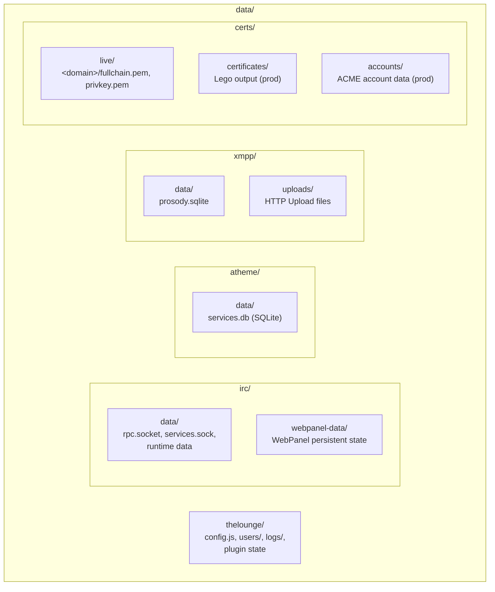

The `data/` directory holds all persistent state for the atl.chat stack — IRC databases, XMPP stores, TLS certificates, and client data — created by `just init` and bind-mounted into containers via Docker Compose volumes.

## How data/ is created

Running `just init` (or `just dev`, which calls init first) executes `scripts/init.sh`. This script creates every directory that Docker Compose expects to bind-mount. The directory is git-ignored — it exists only on the host machine and is never committed.

If you see permission errors on startup, re-run `just init`. The script sets ownership to your current UID/GID and ensures directories are writable by the container processes.

## Directory structure



The canonical layout on disk:

```
data/
├── irc/
│   ├── data/              # UnrealIRCd: rpc.socket, services.sock, runtime data
│   └── webpanel-data/     # WebPanel persistent state
├── atheme/
│   └── data/              # Atheme SQLite database (services.db)
├── xmpp/
│   ├── data/              # Prosody SQLite database (prosody.sqlite)
│   └── uploads/           # Prosody HTTP Upload files
├── thelounge/             # The Lounge home: config.js, users/, packages/
└── certs/
    ├── live/              # Per-domain cert dirs: <domain>/fullchain.pem, privkey.pem
    │   ├── irc.localhost/ # Dev self-signed certs
    │   └── xmpp.localhost/
    ├── certificates/      # Lego output (production)
    └── accounts/          # ACME account data (production)
```

## Volume mount reference

Every bind-mount is defined in the compose fragments under `infra/compose/`. Paths are relative to the repository root.

| Host path | Container mount | Service | Compose file |
|---|---|---|---|
| `data/irc/data` | `/home/unrealircd/unrealircd/data` | UnrealIRCd | `irc.yaml` |
| `data/certs` | `/home/unrealircd/unrealircd/certs` (ro) | UnrealIRCd | `irc.yaml` |
| `data/atheme/data` | `/usr/local/atheme/data` | Atheme | `irc.yaml` |
| `data/irc/webpanel-data` | `/var/www/html/unrealircd-webpanel/data` | WebPanel | `irc.yaml` |
| `data/xmpp/data` | `/var/lib/prosody/data` | Prosody | `xmpp.yaml` |
| `data/xmpp/uploads` | `/var/lib/prosody/uploads` | Prosody | `xmpp.yaml` |
| `data/certs` | `/etc/prosody/certs` | Prosody | `xmpp.yaml` |
| `data/certs` | `/etc/nginx/certs` (ro) | XMPP Nginx | `xmpp.yaml` |
| `data/thelounge` | `/var/opt/thelounge` | The Lounge | `thelounge.yaml` |
| `data/certs` | `/data` | Cert Manager | `cert-manager.yaml` |

> **Note:** The Bridge service does not have a `data/` volume. Its configuration (`apps/bridge/config.yaml`) is bind-mounted read-only from the source tree, not from `data/`.

## Shared certificate store

The `data/certs/` directory is shared across multiple services. In development, `scripts/init.sh` generates self-signed certificates under `data/certs/live/<domain>/`. In production, the cert-manager container (Lego) writes Let's Encrypt certificates to the same location.

Services that consume certificates:

- **UnrealIRCd** — mounts `data/certs` read-only at `/home/unrealircd/unrealircd/certs`. Cert paths are configured via `IRC_SSL_CERT_PATH` and `IRC_SSL_KEY_PATH` environment variables, defaulting to `certs/live/<IRC_DOMAIN>/fullchain.pem` and `privkey.pem`.
- **Prosody** — mounts `data/certs` at `/etc/prosody/certs`. The Prosody config references certs by domain under this path.
- **XMPP Nginx** — mounts `data/certs` read-only at `/etc/nginx/certs` for HTTPS termination on port 5281.
- **Cert Manager (Lego)** — mounts `data/certs` at `/data` (read-write). Lego writes renewed certificates here, and other services pick them up on reload.

After certificate renewal, you need to reload the consuming services:

```bash
# Rehash UnrealIRCd to pick up new certs
just irc reload

# Reload Prosody
just xmpp reload
```

## Permissions

`scripts/init.sh` sets ownership of the entire `data/` tree to your current UID/GID (`id -u`:`id -g`). Directories are set to `755`. This matches the `PUID`/`PGID` environment variables used by the UnrealIRCd and Atheme containers.

If you encounter permission errors after pulling updates or switching users, re-run:

```bash
just init
```

## Obsolete paths

Older documentation and setups may reference paths that no longer exist. If you find any of these directories, you can safely remove them:

| Obsolete path | Current equivalent |
|---|---|
| `data/unrealircd/` | `data/irc/data/` |
| `data/letsencrypt/` | `data/certs/` |
| `data/atheme/atheme.db` | `data/atheme/data/services.db` |
| `logs/atheme/` | Removed — logs go to stdout (Docker) |
| `logs/atl-irc-server/` | Removed — logs go to stdout (Docker) |
| `data/irc/logs/` | Removed — logs go to stdout (Docker) |
| `data/atheme/logs/` | Removed — logs go to stdout (Docker) |
| `data/xmpp/logs/` | Removed — logs go to stdout (Docker) |
| `data/docs/` | Not used — remove if present |

```bash
# Clean up obsolete directories (safe to run; skips if not present)
rm -rf data/unrealircd data/letsencrypt data/docs logs/atheme logs/atl-irc-server data/irc/logs data/atheme/logs data/xmpp/logs
```

## Related pages

- [Architecture Overview](/docs/architecture) — system diagram, compose structure, design decisions
- [Networking](/docs/architecture/networking) — port registry, DNS zones, firewall rules
- [Backups](/docs/operations/backups) — per-service backup and restore procedures
- [SSL/TLS](/docs/operations/ssl-tls) — certificate management and renewal
