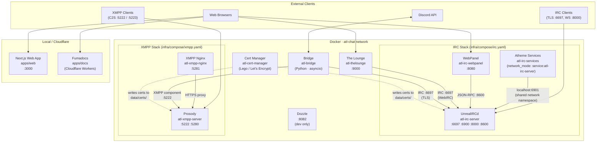
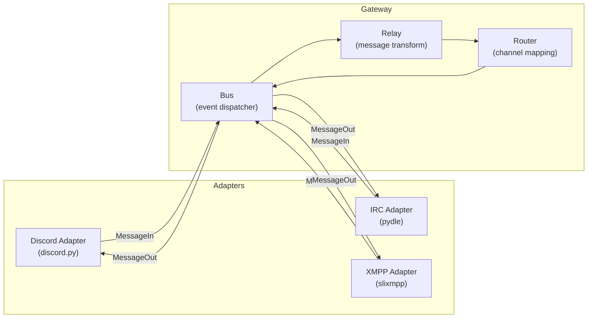

atl.chat is a multi-protocol chat platform where IRC (UnrealIRCd + Atheme), XMPP (Prosody), and Discord are connected by a central event-driven bridge, all orchestrated via Docker Compose on a single shared network.

## System diagram

The following diagram shows all services, their connections, and external interfaces. Dockerised services run on the `atl-chat` bridge network. The Next.js web app and the Fumadocs documentation site run outside Docker.

## Compose structure

The root `compose.yaml` aggregates all service-level configurations using the `include` directive. Each compose fragment lives under `infra/compose/` and defines one logical stack:

| Fragment | Services | Purpose |
|---|---|---|
| `networks.yaml` | — | Defines the shared `atl-chat` bridge network |
| `cert-manager.yaml` | `atl-cert-manager` | Let's Encrypt certificate management via Lego + Cloudflare DNS |
| `irc.yaml` | `atl-irc-server`, `atl-irc-services`, `atl-irc-webpanel` | IRC server, services, and admin panel |
| `xmpp.yaml` | `atl-xmpp-server`, `atl-xmpp-nginx` | XMPP server and HTTPS reverse proxy |
| `bridge.yaml` | `atl-bridge` | Discord↔IRC↔XMPP message bridge |
| `thelounge.yaml` | `atl-thelounge` | Web IRC client |

The root `compose.yaml` also defines `dozzle` (Docker log viewer) under the `dev` profile.

You start the stack with `just dev` (development, includes dev profile) or `just prod` (production). Both commands run `scripts/init.sh` first, which creates `data/` directories, generates self-signed dev certs, and substitutes config templates.

## Key design decisions

### Single Docker Compose network

All Dockerised services share a single bridge network named `atl-chat`, defined in `infra/compose/networks.yaml`. Every compose fragment includes this file and attaches its services to the same network. This means:

- Services discover each other by container name (e.g., the bridge connects to `atl-irc-server` for IRC and `atl-xmpp-server` for XMPP).
- Only services that need external access bind host ports. In development, most ports bind to `127.0.0.1` via the `ATL_CHAT_IP` variable.
- There is no network segmentation between services — all containers can reach each other. This simplifies configuration at the cost of isolation. For production hardening, see the [Security](/docs/operations/security) page.

### Atheme network namespace sharing

Atheme IRC services (`atl-irc-services`) uses `network_mode: service:atl-irc-server` in `infra/compose/irc.yaml`. This means Atheme shares the UnrealIRCd container's network stack — they share the same IP address, hostname, and port space. Atheme connects to UnrealIRCd's uplink port via `127.0.0.1:6901` (localhost within the shared namespace), avoiding any network hop.

This design has several consequences:

- Atheme does not appear as a separate host on the `atl-chat` network. It is invisible to other containers.
- Atheme's HTTP API (port 8081) is exposed through UnrealIRCd's port bindings, not its own.
- Atheme must start after UnrealIRCd is healthy (`depends_on` with `condition: service_healthy`).
- You cannot independently scale or network-isolate Atheme from UnrealIRCd.

### Bridge event bus pattern

The bridge (`apps/bridge/`) uses an event-driven architecture where all protocol adapters communicate through a central `Bus`. No adapter talks directly to another.

The key components are:

- **Bus** (`gateway/bus.py`) — dispatches typed events (`MessageIn`, `MessageOut`, `MessageDelete`, `ReactionIn`, `Join`, `Part`, etc.) to registered adapters.
- **Relay** (`gateway/relay.py`) — transforms inbound `MessageIn` events into `MessageOut` events for target protocols, applying content filtering and format conversion.
- **Router** (`gateway/router.py`) — maps Discord channel IDs to IRC channels and XMPP MUC JIDs based on the `mappings` in `config.yaml`.
- **Identity** (`identity/`) — resolves Discord user IDs to IRC nicks and XMPP JIDs via the Portal API, with TTL caching.

This pattern means you can add a new protocol adapter without modifying existing adapters — you only need to implement the `BridgeAdapter` interface and register with the Bus.

### Config templating via envsubst and prepare-config.sh

Configuration files for UnrealIRCd, Atheme, the Bridge, and The Lounge are generated from templates at init time. The flow is:

1. You define environment variables in `.env` (production) and optionally `.env.dev` (development overrides).
2. `just init` (or `just dev`) runs `scripts/init.sh`, which calls `scripts/prepare-config.sh`.
3. `prepare-config.sh` sources `.env` (and `.env.dev` if `ATL_ENVIRONMENT=dev`), then runs `envsubst` on each template file:
   - `apps/unrealircd/config/unrealircd.conf.template` → `unrealircd.conf`
   - `apps/atheme/config/atheme.conf.template` → `atheme.conf`
   - `apps/bridge/config.template.yaml` → `config.yaml`
   - `apps/thelounge/config.js.template` → `data/thelounge/config.js`
4. The generated config files are bind-mounted into containers via compose volume mounts.

This approach keeps secrets out of version control (they live in `.env`) while allowing config templates to be tracked in Git. The `envsubst` tool replaces `${VAR_NAME}` placeholders with their values from the environment.

> **Warning:** Always run `just init` after changing `.env` values. The config files are not regenerated automatically — you must re-run the template substitution for changes to take effect.

## Related pages

- [Networking](/docs/architecture/networking) — port registry, Tailscale overlay, DNS zones, firewall rules
- [Data Model](/docs/architecture/data-model) — persistent data locations, volume mounts, `data/` directory structure
- [Bridge](/docs/services/bridge) — adapter pattern deep dive, configuration schema, operations
