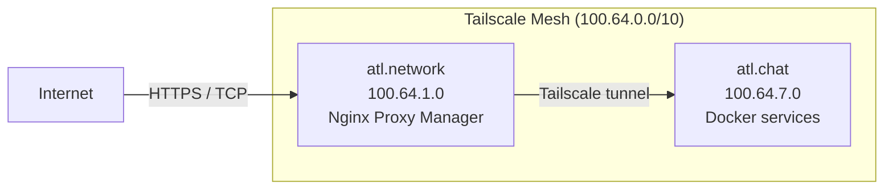

atl.chat uses a Tailscale overlay to connect production servers, a single Docker bridge network for inter-service communication, and structured DNS zones with SRV records for IRC and XMPP client discovery.

## Network topology

Production runs on two Tailscale nodes within the CGNAT subnet `100.64.0.0/10`:

| Node | Tailscale IP | Role |
|---|---|---|
| `atl.network` (gateway) | `100.64.1.0` | Nginx Proxy Manager, TLS termination, public ingress |
| `atl.chat` (services) | `100.64.7.0` | All Dockerised chat services |

The `ATL_GATEWAY_IP` and `ATL_CHAT_IP` variables in `.env` control which IP addresses services bind to. In development, `.env.dev` overrides `ATL_CHAT_IP` to `127.0.0.1` so ports bind to localhost only.



### Traffic flow

HTTP/S traffic and raw TCP (IRC, XMPP) follow different paths through the gateway:

1. **HTTP/S traffic** — `Internet → Cloudflare → atl.network (Nginx Proxy Manager) → Tailscale tunnel → atl.chat (containers)`
2. **TCP traffic (IRC/XMPP)** — `Internet → atl.network (NPM stream pass-through) → Tailscale tunnel → atl.chat (TCP ports)`

All inter-node traffic is encrypted by Tailscale. TLS termination for HTTPS happens at the gateway; IRC and XMPP handle their own TLS within the containers.

## Docker network model

All Dockerised services share a single bridge network named `atl-chat`, defined in `infra/compose/networks.yaml`. Every compose fragment includes this file and attaches its services to the same network.

- Services discover each other by container name (e.g., the bridge connects to `atl-irc-server`).
- Only services that need external access bind host ports.
- There is no network segmentation between containers — all services can reach each other on the bridge network.
- Atheme uses `network_mode: service:atl-irc-server`, sharing UnrealIRCd's network namespace. It connects via `127.0.0.1:6901` (localhost within the shared stack) and its HTTP API (port 8081) is exposed through UnrealIRCd's port bindings.

For production network hardening, see the [Security](/docs/operations/security) page.

## Port registry

The following table lists every port exposed by the Docker Compose stack, verified against `infra/compose/*.yaml` and `compose.yaml`. The "Bind IP" column shows which variable controls the host bind address.

### External ports (host-mapped)

| Port | Service | Container | Protocol | Bind IP | Env Variable | Compose File |
|---|---|---|---|---|---|---|
| 6697 | UnrealIRCd | `atl-irc-server` | IRC (TLS) | `ATL_CHAT_IP` | `IRC_TLS_PORT` | `irc.yaml` |
| 6900 | UnrealIRCd | `atl-irc-server` | IRC (S2S link) | `ATL_CHAT_IP` | `IRC_SERVER_PORT` | `irc.yaml` |
| 8600 | UnrealIRCd | `atl-irc-server` | JSON-RPC (HTTPS) | `ATL_CHAT_IP` | `IRC_RPC_PORT` | `irc.yaml` |
| 8000 | UnrealIRCd | `atl-irc-server` | IRC WebSocket | `ATL_CHAT_IP` | `IRC_WEBSOCKET_PORT` | `irc.yaml` |
| 8081 | Atheme | `atl-irc-server`¹ | HTTP (JSON-RPC) | `ATL_CHAT_IP` | `ATHEME_HTTPD_PORT` | `irc.yaml` |
| 8080 | WebPanel | `atl-irc-webpanel` | HTTP | — | `WEBPANEL_PORT` | `irc.yaml` |
| 5222 | Prosody | `atl-xmpp-server` | XMPP C2S (STARTTLS) | — | `PROSODY_C2S_PORT` | `xmpp.yaml` |
| 5223 | Prosody | `atl-xmpp-server` | XMPP C2S (Direct TLS) | — | `PROSODY_C2S_DIRECT_TLS_PORT` | `xmpp.yaml` |
| 5269 | Prosody | `atl-xmpp-server` | XMPP S2S (STARTTLS) | — | `PROSODY_S2S_PORT` | `xmpp.yaml` |
| 5270 | Prosody | `atl-xmpp-server` | XMPP S2S (Direct TLS) | — | `PROSODY_S2S_DIRECT_TLS_PORT` | `xmpp.yaml` |
| 5280 | Prosody | `atl-xmpp-server` | HTTP (BOSH/WebSocket) | — | `PROSODY_HTTP_PORT` | `xmpp.yaml` |
| 5281 | XMPP Nginx | `atl-xmpp-nginx` | HTTPS (BOSH/WebSocket) | — | `PROSODY_HTTPS_PORT` | `xmpp.yaml` |
| 5000 | Prosody | `atl-xmpp-server` | Proxy65 (file transfer) | — | `PROSODY_PROXY65_PORT` | `xmpp.yaml` |
| 9000 | The Lounge | `atl-thelounge` | HTTP (Web IRC) | — | `THELOUNGE_PORT` | `thelounge.yaml` |
| 8082 | Dozzle | `dozzle` | HTTP (log viewer) | — | `DOZZLE_PORT` | `compose.yaml` |

¹ Atheme shares UnrealIRCd's network namespace (`network_mode: service:atl-irc-server`), so its port 8081 is exposed through the `atl-irc-server` container's port bindings.

> **Note:** Dozzle is only available under the `dev` profile (`docker compose --profile dev up`). It is not started in production.

### Internal ports (container-to-container only)

These ports are used for inter-service communication on the `atl-chat` Docker network and are not mapped to the host:

| Port | Service | Protocol | Used By |
|---|---|---|---|
| 6901 | UnrealIRCd | IRC (S2S uplink) | Atheme connects via `127.0.0.1:6901` (shared namespace) |
| 5347 | Prosody | XMPP component | Bridge connects as `bridge.atl.chat` component |
| 8081 | Atheme HTTP | JSON-RPC | Bridge and Portal query Atheme via `atl-irc-server:8081` |
| 8600 | UnrealIRCd RPC | JSON-RPC | WebPanel queries UnrealIRCd via `atl-irc-server:8600` |

### Bind address behaviour

The `ATL_CHAT_IP` variable controls which host IP the IRC stack ports bind to:

| Environment | `ATL_CHAT_IP` | Effect |
|---|---|---|
| Development (`.env.dev`) | `127.0.0.1` | Ports only accessible from localhost |
| Production (`.env`) | `100.64.7.0` | Ports bind to the Tailscale IP, accessible only within the Tailnet |

XMPP, WebPanel, The Lounge, and Dozzle ports do not use `ATL_CHAT_IP` — they bind to `0.0.0.0` by default. In production, firewall rules (see below) restrict access.


## Tailscale overlay

Production servers communicate via [Tailscale](https://tailscale.com/), which provides a mesh VPN using the CGNAT subnet `100.64.0.0/10`. This eliminates the need for public IPs between servers and provides automatic key rotation, NAT traversal, and MagicDNS.

### Setup

1. Install Tailscale on both the gateway (`atl.network`) and the services node (`atl.chat`):

   ```bash
   # Ubuntu/Debian
   curl -fsSL https://tailscale.com/install.sh | sh
   sudo tailscale up --advertise-tags=tag:server
   ```

2. Assign stable IPs in the Tailscale admin console:
   - `atl.network` → `100.64.1.0`
   - `atl.chat` → `100.64.7.0`

3. Set the IPs in `.env`:

   ```bash
   ATL_GATEWAY_IP=100.64.1.0
   ATL_CHAT_IP=100.64.7.0
   ```

4. Run `just init` to regenerate configs, then `just prod` to start services bound to the Tailscale IPs.

### Service discovery

Services on the `atl.chat` node discover each other by Docker container name on the `atl-chat` bridge network (e.g., `atl-irc-server`, `atl-xmpp-server`). The gateway node (`atl.network`) reaches the services node via its Tailscale IP `100.64.7.0`.

Tailscale also provides MagicDNS, so you can optionally use `atl-chat.tailnet-name.ts.net` for internal service discovery between nodes. However, the compose stack uses container names for intra-node communication and Tailscale IPs for inter-node communication.

### ACLs

Restrict Tailscale ACLs so only the gateway node can reach the services node on the required ports. Example Tailscale ACL policy:

```json
{
  "acls": [
    {
      "action": "accept",
      "src": ["tag:gateway"],
      "dst": ["tag:server:6697,8000,5222,5223,5269,5270,5280,5281,9000,8080"]
    }
  ],
  "tagOwners": {
    "tag:gateway": ["autogroup:admin"],
    "tag:server": ["autogroup:admin"]
  }
}
```

## DNS zone layout

atl.chat uses structured DNS zones for each protocol. All public DNS records point to the gateway node (`atl.network`), which proxies traffic through the Tailscale tunnel to the services node.

### A/AAAA records

| Hostname | Points To | Purpose |
|---|---|---|
| `atl.chat` | Gateway public IP | Main web interface, XMPP domain |
| `irc.atl.chat` | Gateway public IP | IRC server (TLS, WebSocket, RPC) |
| `xmpp.atl.chat` | Gateway public IP | XMPP BOSH/WebSocket HTTPS endpoint |
| `chat.atl.chat` | Gateway public IP | The Lounge web IRC client |
| `turn.atl.network` | Gateway public IP | TURN/STUN server for XMPP media |

### SRV records for XMPP

XMPP clients and servers use SRV records to discover connection endpoints. These records are required for federation and recommended for client auto-configuration:

```text
; Client-to-server (C2S) — STARTTLS on port 5222
_xmpp-client._tcp.atl.chat.  3600  IN  SRV  5 0 5222  xmpp.atl.chat.

; Client-to-server (C2S) — Direct TLS on port 5223
_xmpps-client._tcp.atl.chat. 3600  IN  SRV  5 0 5223  xmpp.atl.chat.

; Server-to-server (S2S) — STARTTLS on port 5269
_xmpp-server._tcp.atl.chat.  3600  IN  SRV  5 0 5269  xmpp.atl.chat.

; Server-to-server (S2S) — Direct TLS on port 5270
_xmpps-server._tcp.atl.chat. 3600  IN  SRV  5 0 5270  xmpp.atl.chat.
```

> **Note:** The `_xmpps-*` records (with the `s`) advertise Direct TLS ports (5223/5270), which skip the STARTTLS negotiation step. Both STARTTLS and Direct TLS records should be published for maximum client compatibility.

### SRV records for IRC

IRC does not have a standardised SRV record scheme, but you can optionally publish one for clients that support it:

```text
; IRC client (TLS on port 6697)
_ircs._tcp.atl.chat.  3600  IN  SRV  5 0 6697  irc.atl.chat.
```

### MUC and component subdomains

XMPP multi-user chat (MUC) and bridge components use subdomains of the XMPP domain. These do not need separate DNS records — Prosody handles them internally — but they must be resolvable if federation is enabled:

| Subdomain | Purpose |
|---|---|
| `muc.atl.chat` | MUC (multi-user chat) rooms |
| `bridge.atl.chat` | Bridge XMPP component JID |
| `upload.atl.chat` | HTTP file upload (mod_http_file_share) |
| `pubsub.atl.chat` | PubSub service |
| `proxy.atl.chat` | Proxy65 file transfer |

## Firewall rules

### Gateway node (`atl.network`)

The gateway is the only node with a public IP. Open these ports to the internet:

| Port | Protocol | Service |
|---|---|---|
| 80 | TCP | HTTP (Let's Encrypt challenges, redirect to HTTPS) |
| 443 | TCP | HTTPS (Nginx Proxy Manager → web, BOSH, WebSocket) |
| 6697 | TCP | IRC TLS (stream pass-through to `atl.chat`) |
| 5222 | TCP | XMPP C2S STARTTLS (stream pass-through) |
| 5223 | TCP | XMPP C2S Direct TLS (stream pass-through) |
| 5269 | TCP | XMPP S2S STARTTLS (stream pass-through) |
| 5270 | TCP | XMPP S2S Direct TLS (stream pass-through) |
| 3478 | UDP | TURN (media relay) |
| 5349 | TCP | TURNS (TLS media relay) |

Example `ufw` rules:

```bash
# Web
sudo ufw allow 80/tcp
sudo ufw allow 443/tcp

# IRC
sudo ufw allow 6697/tcp

# XMPP
sudo ufw allow 5222/tcp
sudo ufw allow 5223/tcp
sudo ufw allow 5269/tcp
sudo ufw allow 5270/tcp

# TURN/STUN
sudo ufw allow 3478/udp
sudo ufw allow 5349/tcp
```

### Services node (`atl.chat`)

The services node should not have any ports open to the public internet. All traffic arrives via the Tailscale tunnel from the gateway. Only allow Tailscale and SSH:

```bash
# Allow Tailscale interface
sudo ufw allow in on tailscale0

# Allow SSH (for management)
sudo ufw allow 22/tcp

# Deny everything else from public interfaces
sudo ufw default deny incoming
sudo ufw enable
```

The Docker daemon manages its own iptables rules for container port bindings. Since `ATL_CHAT_IP` is set to the Tailscale IP (`100.64.7.0`), container ports are only reachable from within the Tailnet.

> **Warning:** Docker bypasses `ufw` rules by inserting its own iptables chains. If you bind a container port to `0.0.0.0`, it will be accessible from the public internet regardless of `ufw` settings. Always use `ATL_CHAT_IP` to restrict bind addresses in production.

## Related pages

- [Architecture Overview](/docs/architecture) — system diagram, compose structure, design decisions
- [Data Model](/docs/architecture/data-model) — persistent data locations, volume mounts
- [Ports Reference](/docs/reference/ports) — quick-reference port table
- [SSL/TLS](/docs/operations/ssl-tls) — certificate management and renewal
- [Security](/docs/operations/security) — network isolation, secret management
- [Deployment](/docs/operations/deployment) — production deployment runbook
