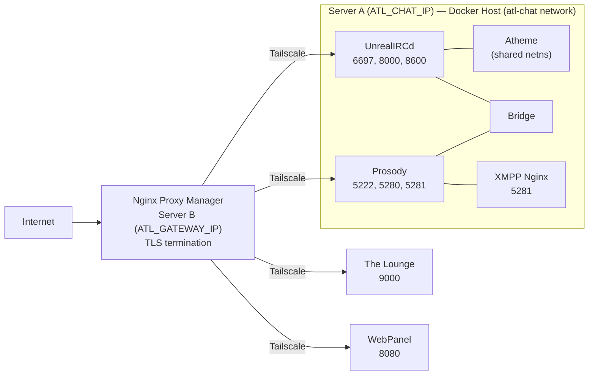

This page is the production deployment runbook for atl.chat — it covers server topology, Tailscale setup, pre-deployment checks, deployment commands, verification, and rollback.

## Server Topology

The production stack runs across two servers connected via a Tailscale overlay network. An external Nginx Proxy Manager instance handles TLS termination and reverse proxying for all public-facing services.

| Server | Tailscale IP | Role | What runs here |
|---|---|---|---|
| Chat (Server A) | `ATL_CHAT_IP` (e.g. `100.64.7.0`) | Primary | All Docker services: UnrealIRCd, Atheme, Prosody, Bridge, The Lounge, WebPanel, cert-manager |
| Gateway (Server B) | `ATL_GATEWAY_IP` (e.g. `100.64.1.0`) | Reverse proxy | Nginx Proxy Manager (TLS termination — not part of this compose stack) |

All Docker services run on Server A using the `atl-chat` bridge network. IRC ports bind to `ATL_CHAT_IP` so they are only reachable via Tailscale. Atheme shares the UnrealIRCd container's network namespace (`network_mode: service:atl-irc-server`) so it communicates with UnrealIRCd over `127.0.0.1`. The Nginx Proxy Manager on Server B reverse-proxies public traffic over Tailscale to Server A's services. `ATL_GATEWAY_IP` is passed to UnrealIRCd so it can identify the gateway's Tailscale IP in its configuration.



## Tailscale Setup

Tailscale provides encrypted mesh networking between servers. This means internal services are never exposed on public IPs — only the Tailscale interface carries inter-server traffic.

### Installing Tailscale on a New Server

1. Install Tailscale:

   ```bash
   # Ubuntu/Debian
   curl -fsSL https://tailscale.com/install.sh | sh
   ```

2. Authenticate and bring the node up:

   ```bash
   sudo tailscale up
   ```

3. Note the assigned Tailscale IP:

   ```bash
   tailscale ip -4
   # Example output: 100.64.7.0
   ```

4. Update `.env` on the deployment host with the Tailscale IPs:

   ```bash
   # .env (production)
   ATL_GATEWAY_IP=100.64.1.0
   ATL_CHAT_IP=100.64.7.0
   ```

### Firewall Rules

On each server, only the Tailscale UDP port needs to be open between hosts. Public-facing ports are handled by Nginx Proxy Manager on the gateway.

```bash
# Allow Tailscale
sudo ufw allow 41641/udp

# Allow SSH (for management)
sudo ufw allow 22/tcp

# On the gateway: allow public HTTPS
sudo ufw allow 443/tcp
```

## Docker Compose Production Configuration

Production uses `just prod`, which runs `scripts/init.sh` with `ATL_ENVIRONMENT=prod` and then starts Docker Compose with only the `.env` file (no `.env.dev` overlay).

The root `compose.yaml` includes all service fragments from `infra/compose/`:

| Fragment | Services |
|---|---|
| `infra/compose/networks.yaml` | `atl-chat` bridge network |
| `infra/compose/irc.yaml` | `atl-irc-server` (UnrealIRCd), `atl-irc-services` (Atheme), `atl-irc-webpanel` |
| `infra/compose/xmpp.yaml` | `atl-xmpp-server` (Prosody), `atl-xmpp-nginx` (HTTPS proxy) |
| `infra/compose/bridge.yaml` | `atl-bridge` (Discord↔IRC↔XMPP) |
| `infra/compose/thelounge.yaml` | `atl-thelounge` (web IRC client) |
| `infra/compose/cert-manager.yaml` | `cert-manager` (Lego / Let's Encrypt) |

### Key Differences: Production vs Development

| Aspect | Production (`just prod`) | Development (`just dev`) |
|---|---|---|
| Env files loaded | `.env` only | `.env` + `.env.dev` |
| Port binding IP | `ATL_CHAT_IP` (Tailscale IP) | `127.0.0.1` |
| Domains | `irc.atl.chat`, `atl.chat` | `irc.localhost`, `xmpp.localhost` |
| TLS certificates | Let's Encrypt (cert-manager) | Self-signed (generated by `init.sh`) |
| TLS verification | Enforced | Disabled (`BRIDGE_IRC_TLS_VERIFY=false`) |
| Prosody encryption | Required (`PROSODY_S2S_SECURE_AUTH=true`) | Relaxed for self-signed certs |
| Dozzle log viewer | Not started (no `--profile dev`) | Started on port 8082 |
| `ATL_ENVIRONMENT` | `prod` | `dev` |

## Pre-Deployment Checklist

Complete these checks before deploying to production:

1. **Environment file configured** — `.env` exists with production values:

   ```bash
   # Verify .env exists and has production domains
   grep -E '^IRC_DOMAIN=' .env
   # Expected: IRC_DOMAIN=irc.atl.chat
   grep -E '^ATL_ENVIRONMENT=' .env
   # Expected: ATL_ENVIRONMENT=prod (or will be set by just prod)
   ```

2. **Secrets rotated** — all default passwords have been changed:

   ```bash
   # Check for unchanged default passwords
   grep -c 'change_me' .env
   # Expected: 0 (all secrets should be replaced with real values)
   ```

   See [Security — Secret Management](/docs/operations/security) for generation commands.

3. **Tailscale connected** — both servers are on the Tailscale network:

   ```bash
   tailscale status
   # Verify both gateway and chat hosts appear
   ```

4. **DNS records configured** — public DNS points to the gateway's public IP:

   ```bash
   dig +short irc.atl.chat
   dig +short _irc._tcp.atl.chat SRV
   ```

   See [Architecture — Networking](/docs/architecture/networking) for the full DNS zone layout.

5. **TLS certificates ready** — Let's Encrypt certificates exist in `data/certs/`:

   ```bash
   ls data/certs/live/irc.atl.chat/
   # Expected: fullchain.pem  privkey.pem
   ```

   If certificates are not yet provisioned, cert-manager will attempt to obtain them on first start. Ensure `CLOUDFLARE_DNS_API_TOKEN` is set in `.env` for DNS-01 challenges.

6. **Docker available** — Docker daemon is running and compose plugin is installed:

   ```bash
   docker compose version
   # Expected: Docker Compose version v2.x.x
   ```

## Deployment Commands

### First-Time Deployment


For a brand-new server, run the full initialization and startup sequence:

1. Clone the repository:

   ```bash
   git clone https://github.com/allthingslinux/atl.chat.git
   cd atl.chat
   ```

2. Create and configure the environment file:

   ```bash
   cp .env.example .env
   ```

   Edit `.env` with production values — set real domains, rotate all secrets (anything containing `change_me`), and configure Tailscale IPs. See [Environment Variables](/docs/reference/environment-variables) for the full reference.

3. Run the production startup command:

   ```bash
   just prod
   ```

   This command does two things:
   - Runs `scripts/init.sh` with `ATL_ENVIRONMENT=prod` — creates `data/` directories, sets permissions, sets up the CA bundle, generates config files from templates via `envsubst`, and runs `scripts/prepare-config.sh`
   - Starts all Docker Compose services: `docker compose --env-file .env up -d`

4. Verify all containers are running:

   ```bash
   just status
   ```

### Updating an Existing Deployment

To deploy updates (new code, config changes, or image rebuilds):

1. Pull the latest code:

   ```bash
   git pull origin main
   ```

2. Rebuild images if Dockerfiles or application code changed:

   ```bash
   just build
   ```

3. Re-run the production startup to regenerate configs and restart services:

   ```bash
   just prod
   ```

   This is safe to run repeatedly — `init.sh` is idempotent (it skips directories and certs that already exist).

### Restarting Individual Services

To restart a single service without affecting others:

```bash
# Restart UnrealIRCd only
docker compose restart atl-irc-server

# Restart Prosody only
docker compose restart atl-xmpp-server

# Restart the bridge
docker compose restart atl-bridge
```

For IRC configuration changes that do not require a full restart, use a rehash instead:

```bash
just irc reload
```

## Post-Deployment Verification

After deploying, verify each service is healthy:

### 1. Check Container Status

```bash
just status
# All containers should show "Up" with "(healthy)" status
```

### 2. Verify UnrealIRCd

```bash
# Check the health endpoint via JSON-RPC socket
docker exec atl-irc-server sh -c \
  'echo "{\"jsonrpc\":\"2.0\",\"method\":\"rpc.info\",\"params\":{},\"id\":1}" | nc -U /home/unrealircd/unrealircd/data/rpc.socket'

# Test TLS connectivity from outside
openssl s_client -connect irc.atl.chat:6697 -servername irc.atl.chat </dev/null 2>/dev/null | head -5
```

### 3. Verify Atheme

```bash
# Confirm the process is running (Atheme shares UnrealIRCd's network namespace)
docker exec atl-irc-services pgrep -f atheme-services
# Expected: a PID number

# Check Atheme logs for successful link
docker compose logs atl-irc-services --tail 20
# Look for: "connection to uplink established"
```

### 4. Verify Prosody

```bash
# HTTP health check
curl -sf http://localhost:5280/status
# Expected: HTTP 200

# Check XMPP C2S connectivity
openssl s_client -connect atl.chat:5222 -starttls xmpp -xmpphost atl.chat </dev/null 2>/dev/null | head -5
```

### 5. Verify The Lounge

```bash
# Check the web interface is responding
curl -sf -o /dev/null -w '%{http_code}' http://localhost:9000
# Expected: 200
```

### 6. Verify the Bridge

```bash
# Check bridge process is running
docker exec atl-bridge pgrep -f 'bridge.__main__'
# Expected: a PID number

# Check bridge logs for successful connections
docker compose logs atl-bridge --tail 20
# Look for: successful IRC and XMPP connection messages
```

### 7. Verify WebPanel

```bash
# Check the web interface
curl -sf -o /dev/null -w '%{http_code}' http://localhost:8080
# Expected: 200
```

### 8. Verify cert-manager

```bash
# Check certificate files exist
ls -la data/certs/live/irc.atl.chat/
# Expected: fullchain.pem, privkey.pem with recent timestamps

# Check cert-manager logs
docker compose logs cert-manager --tail 20
```

## Rollback Procedure

If a deployment causes issues, roll back to the previous working state:

### Quick Rollback (Code Revert)

1. Stop the current stack:

   ```bash
   just down-prod
   ```

2. Revert to the previous commit:

   ```bash
   git log --oneline -5
   # Identify the last known-good commit
   git checkout <commit-hash>
   ```

3. Rebuild and restart:

   ```bash
   just build
   just prod
   ```

4. Verify services are healthy using the [post-deployment checks](#post-deployment-verification) above.

### Data Rollback

If the issue involves corrupted data rather than code, restore from backups:

1. Stop the affected service:

   ```bash
   docker compose stop atl-irc-server atl-irc-services
   ```

2. Restore the data directory from your most recent backup:

   ```bash
   # Example: restore IRC data
   cp -a /path/to/backup/data/irc/data/* data/irc/data/
   cp -a /path/to/backup/data/atheme/data/* data/atheme/data/
   ```

3. Restart the service:

   ```bash
   docker compose start atl-irc-server atl-irc-services
   ```

See [Backups](/docs/operations/backups) for detailed backup and restore procedures.

### Configuration Rollback

If a configuration change (`.env` or template) caused the issue:

1. Restore the previous `.env`:

   ```bash
   cp .env.backup .env
   ```

2. Regenerate configs and restart:

   ```bash
   just prod
   ```

> **Tip:** Always back up your `.env` file before making changes: `cp .env .env.backup`

## Ongoing Maintenance

### Viewing Logs

```bash
# Follow all service logs
just logs

# Follow a specific service
just logs atl-irc-server
just logs atl-xmpp-server
just logs atl-bridge
```

### Stopping the Production Stack

```bash
just down-prod
```

### Cleaning Up Docker Resources

```bash
# Remove unused images, containers, and volumes
just clean
```

## Related Pages

- [SSL/TLS](/docs/operations/ssl-tls) — certificate management and renewal
- [Monitoring](/docs/operations/monitoring) — health checks and alerting
- [Backups](/docs/operations/backups) — backup and restore procedures
- [Troubleshooting](/docs/operations/troubleshooting) — cross-service diagnostic commands and common issues
- [Security](/docs/operations/security) — secret management and network isolation
- [Environment Variables](/docs/reference/environment-variables) — complete variable reference
- [Architecture](/docs/architecture) — system design and networking
