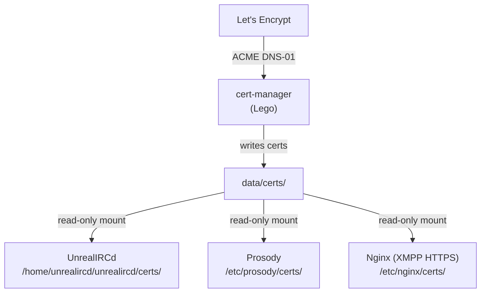

TLS certificates for all atl.chat services are managed centrally through the `cert-manager` compose service, which uses [Lego](https://go-acme.github.io/lego/) to obtain wildcard certificates from Let's Encrypt via DNS-01 challenges with Cloudflare. In development, `just init` generates self-signed certificates automatically.

## How it works

The certificate infrastructure follows a shared-volume pattern. A single `cert-manager` container obtains and renews certificates, storing them in `data/certs/` on the host. Each service container mounts this directory read-only and references certificates by domain path.



## cert-manager service

The `cert-manager` service is defined in `infra/compose/cert-manager.yaml` and runs the `goacme/lego:latest` image. On startup it requests a wildcard certificate covering `*.atl.chat` and the bare `atl.chat` domain, then enters a renewal loop that checks every 24 hours.

### Configuration

The service requires two environment variables in your `.env` file:

| Variable | Description | Required |
|---|---|---|
| `CLOUDFLARE_DNS_API_TOKEN` | Cloudflare API token with DNS edit permissions for your zone | Yes (production) |
| `LETSENCRYPT_EMAIL` | Email for Let's Encrypt account registration and expiry notices | Yes |
| `IRC_ROOT_DOMAIN` | Root domain for certificates (default: `atl.chat`) | No |
| `SSL_DOMAIN` | Alternative domain override (fallback if `IRC_ROOT_DOMAIN` is unset) | No |

If `CLOUDFLARE_DNS_API_TOKEN` is not set, the cert-manager logs a warning and sleeps indefinitely — this is normal in development where self-signed certificates are used instead.

### Challenge type: DNS-01

The cert-manager uses the DNS-01 challenge exclusively via Cloudflare's DNS API. This is required because the stack obtains wildcard certificates (`*.atl.chat`), which cannot be validated with HTTP-01 challenges.

DNS-01 works by creating a temporary `_acme-challenge` TXT record in your Cloudflare DNS zone. Lego handles this automatically when given a valid API token.

To create a Cloudflare API token:

1. Go to [Cloudflare Dashboard](https://dash.cloudflare.com/) → My Profile → API Tokens
2. Click "Create Token"
3. Use the "Edit zone DNS" template
4. Scope it to the specific zone (e.g., `atl.chat`)
5. Copy the token into `CLOUDFLARE_DNS_API_TOKEN` in your `.env` file

### Volumes

The cert-manager mounts a single volume:

```yaml
volumes:
  - ../../data/certs:/data
```

Lego writes certificates into `/data/certificates/` inside the container, which maps to `data/certs/certificates/` on the host. The certificate files follow Lego's naming convention for wildcard domains.

## Certificate paths per service

All services read certificates from the shared `data/certs/` directory, mounted at different container paths. Certificates follow a `live/<domain>/` layout with `fullchain.pem` and `privkey.pem` files.

### Host paths

```
data/certs/
└── live/
    ├── <IRC_DOMAIN>/          # e.g., irc.atl.chat
    │   ├── fullchain.pem
    │   └── privkey.pem
    └── <XMPP_DOMAIN>/        # e.g., xmpp.atl.chat
        ├── fullchain.pem
        └── privkey.pem
```

### Per-service mount points

| Service | Container mount | Certificate path inside container |
|---|---|---|
| UnrealIRCd | `data/certs` → `/home/unrealircd/unrealircd/certs` | `/home/unrealircd/unrealircd/certs/live/${IRC_DOMAIN}/fullchain.pem` |
| Prosody | `data/certs` → `/etc/prosody/certs` | `/etc/prosody/certs/live/${XMPP_DOMAIN}/fullchain.pem` |
| Nginx (XMPP HTTPS) | `data/certs` → `/etc/nginx/certs` (read-only) | `/etc/nginx/certs/live/${XMPP_DOMAIN}/fullchain.pem` |

### Environment variable overrides

You can override the default certificate paths using environment variables:

| Variable | Default | Service |
|---|---|---|
| `IRC_SSL_CERT_PATH` | `/home/unrealircd/unrealircd/certs/live/${IRC_DOMAIN}/fullchain.pem` | UnrealIRCd |
| `IRC_SSL_KEY_PATH` | `/home/unrealircd/unrealircd/certs/live/${IRC_DOMAIN}/privkey.pem` | UnrealIRCd |
| `PROSODY_SSL_CERT` | `certs/live/${XMPP_DOMAIN}/fullchain.pem` | Prosody |
| `PROSODY_SSL_KEY` | `certs/live/${XMPP_DOMAIN}/privkey.pem` | Prosody |

## TLS configuration

### UnrealIRCd

UnrealIRCd is configured with modern TLS settings in `apps/unrealircd/config/unrealircd.conf.template`:

- Protocols: TLS 1.2 and TLS 1.3 only
- Ciphers: ECDHE suites with forward secrecy (CHACHA20-POLY1305, AES-GCM)
- ECDH groups: X25519MLKEM768 (post-quantum hybrid), X25519, secp521r1, secp384r1, prime256v1
- STS (Strict Transport Security): redirects clients to port 6697 with configurable duration via `IRC_STS_DURATION`
- Certificate expiry notifications: enabled

### Prosody

Prosody's TLS is configured in `apps/prosody/config/prosody.cfg.lua`:

- Protocols: TLS 1.2+
- Ciphers: `ECDHE+AESGCM:ECDHE+CHACHA20:DHE+AESGCM:DHE+CHACHA20:!aNULL:!MD5:!DSS`
- Each VirtualHost and Component (MUC, upload, proxy) has its own `ssl` block pointing to the same certificate files
- The `certificates = "certs"` directive tells Prosody to look for certificates in its cert directory

### Nginx (XMPP HTTPS proxy)

The nginx proxy for Prosody HTTPS (port 5281) uses the same certificate files, configured via the `prosody-https.conf.template`:

- Protocols: TLS 1.2 and TLS 1.3
- Ciphers: same strong suite as Prosody

## Renewal process

### Automatic renewal

The cert-manager container runs a continuous loop:

1. On startup, it requests certificates from Let's Encrypt using `lego run`
2. It then sleeps for 24 hours
3. After waking, it runs `lego renew`, which only renews certificates within 30 days of expiry
4. The loop repeats indefinitely

Let's Encrypt certificates are valid for 90 days. With daily renewal checks, certificates are renewed approximately 30 days before expiry.

### Post-renewal hooks

After certificates are renewed on disk, services that cache TLS state in memory need to reload. Currently, the cert-manager does not execute post-renewal hooks automatically. You need to signal services manually after a renewal:

1. Reload UnrealIRCd TLS certificates (no downtime, no client disconnection):

   ```bash
   # Rehash reloads config and TLS certificates without restarting
   docker exec atl-irc-server /home/unrealircd/unrealircd/bin/unrealircd rehash
   ```

   Alternatively, from inside IRC as an operator:

   ```
   /REHASH -tls
   ```

2. Reload Prosody to pick up new certificates:

   ```bash
   docker exec atl-xmpp-server prosodyctl reload
   ```

3. Reload nginx for the XMPP HTTPS proxy:

   ```bash
   docker exec atl-xmpp-nginx nginx -s reload
   ```

> **Tip:** You can automate post-renewal hooks by adding a cron job or a script that runs after `lego renew` completes. Check the cert-manager container logs to confirm renewal occurred before signalling services.

## Manual renewal

To force a certificate renewal outside the automatic cycle:

```bash
# Run the cert-manager container with the renew command
docker compose -f compose.yaml run --rm cert-manager \
  lego --email "$LETSENCRYPT_EMAIL" \
  --dns cloudflare \
  --domains "*.$IRC_ROOT_DOMAIN" \
  --domains "$IRC_ROOT_DOMAIN" \
  --path /data \
  --accept-tos renew --days 90
```

After manual renewal, reload all services:

```bash
# Reload UnrealIRCd TLS
docker exec atl-irc-server /home/unrealircd/unrealircd/bin/unrealircd rehash

# Reload Prosody
docker exec atl-xmpp-server prosodyctl reload

# Reload nginx
docker exec atl-xmpp-nginx nginx -s reload
```

### Verification

Confirm the new certificate is active:

```bash
# Check UnrealIRCd certificate expiry
echo | openssl s_client -connect localhost:6697 -servername irc.atl.chat 2>/dev/null | openssl x509 -noout -dates

# Check Prosody HTTPS certificate expiry
echo | openssl s_client -connect localhost:5281 -servername xmpp.atl.chat 2>/dev/null | openssl x509 -noout -dates
```

## Development certificates

In development, `just init` (via `scripts/init.sh`) generates self-signed certificates automatically. No cert-manager or Cloudflare token is needed.

The `generate_dev_certs` function creates certificates for each service domain:

```bash
# Generated by scripts/init.sh
data/certs/live/irc.localhost/fullchain.pem
data/certs/live/irc.localhost/privkey.pem
data/certs/live/xmpp.localhost/fullchain.pem
data/certs/live/xmpp.localhost/privkey.pem
```

These self-signed certificates include SANs (Subject Alternative Names) for the main domain, wildcard, Prosody components (`muc.`, `upload.`, `proxy.`, `pubsub.`, `bridge.`), and `localhost`. They are valid for 365 days.

> **Note:** Browsers and IRC clients will show certificate warnings for self-signed certificates. This is expected in development. Use `-k` or `--insecure` flags with `curl` and `openssl` commands when testing locally.

## Troubleshooting

### cert-manager sleeps immediately

If the cert-manager container logs show "CLOUDFLARE_DNS_API_TOKEN is not set" and sleeps, set the token in your `.env` file. This is expected in development.

### Certificate not found errors

Verify the certificate files exist at the expected paths:

```bash
ls -la data/certs/live/*/
```

Check that the domain directories match your `IRC_DOMAIN` and `XMPP_DOMAIN` values in `.env`.

### TLS handshake failures

If clients report TLS errors after renewal:

1. Confirm the certificate was renewed: check file modification times in `data/certs/live/`
2. Reload the affected service (see [Post-renewal hooks](#post-renewal-hooks) above)
3. Verify the certificate chain is complete: `openssl verify -CAfile /etc/ssl/certs/ca-certificates.crt data/certs/live/<domain>/fullchain.pem`

### Permission errors

Certificate files must be readable by the container user (UID set by `PUID` in `.env`, default `1000`). The `init.sh` script sets permissions to `644` for private keys in development. In production, ensure the cert-manager writes files with appropriate permissions.

## Related pages

- [Environment Variables](/docs/reference/environment-variables) — SSL/TLS-related variables
- [Deployment](/docs/operations/deployment) — production deployment including TLS setup
- [IRC Configuration](/docs/services/irc/configuration) — UnrealIRCd TLS settings
- [XMPP Configuration](/docs/services/xmpp/configuration) — Prosody TLS settings
- [Networking](/docs/architecture/networking) — port mappings and network architecture
