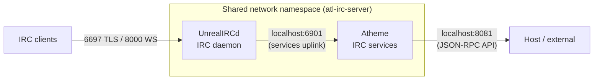

Atheme provides IRC services for the atl.chat stack, running service bots like NickServ (nickname registration), ChanServ (channel management), OperServ (network administration), MemoServ (user messaging), HostServ (virtual hosts), and more — all connecting to UnrealIRCd via a server-to-server uplink in a shared network namespace.

## How Atheme fits in the stack

Atheme runs as the `atl-irc-services` container and shares UnrealIRCd's network namespace via `network_mode: service:atl-irc-server` in Docker Compose. This means Atheme connects to UnrealIRCd over `127.0.0.1:6901` (the services uplink port) without crossing any Docker network boundaries. Atheme waits for UnrealIRCd's health check to pass before starting.

Atheme's HTTP API (JSON-RPC) listens on port 8081 inside the shared namespace. Since UnrealIRCd's port bindings expose 8081 to the host, you can reach the Atheme API at `http://localhost:8081` in development.

## Core service bots

Atheme runs multiple service bots, each handling a specific domain. The primary bots you interact with daily are:

| Bot | Purpose |
|---|---|
| NickServ | Nickname registration, identification, password management, and account settings |
| ChanServ | Channel registration, access control lists, mode locks, and topic management |
| OperServ | Network administration — AKILLs, clones monitoring, server jupes, and runtime settings |
| MemoServ | Private messaging between registered users and channels |
| HostServ | Virtual host (vhost) requests, offers, and management |
| GroupServ | Account grouping for shared channel access and permissions |

Additional service bots are also active:

| Bot | Purpose |
|---|---|
| SaslServ | SASL authentication (PLAIN and SCRAM-SHA mechanisms) |
| HelpServ | Help ticket system and service directory |
| InfoServ | Network announcements displayed at login |
| Global | Network-wide broadcast messages from operators |
| StatServ | Network statistics — server, channel, and netsplit tracking |
| ALIS | Channel directory and search (Advanced List Service) |
| Proxyscan | DNSBL-based proxy and open relay detection |

> **Note:** BotServ, GameServ, and RPGServ modules are present in the config template but disabled (commented out) by default. You can enable them by uncommenting the relevant `loadmodule` lines in `atheme.conf.template` and regenerating the config.

## Architecture

Atheme is built from source in a multi-stage Docker build (`apps/atheme/Containerfile`). The build stage compiles Atheme with `--enable-contrib`, `--with-libidn` (for SCRAM-SHA support), and `--enable-large-net`. The runtime stage uses a minimal Alpine image with `tini` as the init system.

Configuration lives in `apps/atheme/config/atheme.conf.template` and is processed by `scripts/prepare-config.sh` during `just init`. The script substitutes `${VAR}` placeholders with values from your `.env` file to produce the final `atheme.conf`.

Key architectural details:

- **Protocol module:** `protocol/unreal4` — speaks UnrealIRCd's server-to-server protocol
- **Database backend:** `backend/opensex` — Atheme's native flat-file database format (stored at `data/atheme/data/services.db`)
- **Password hashing:** `crypto/pbkdf2v2` configured for SCRAM-SHA-256 with 64,000 iterations
- **SASL support:** PLAIN and SCRAM-SHA mechanisms via `saslserv/plain` and `saslserv/scram`
- **HTTP API:** JSON-RPC via `misc/httpd` and `transport/jsonrpc` on port 8081
- **Health check:** `pgrep -f atheme-services` every 30 seconds

## Technology

| Component | Technology |
|---|---|
| Software | Atheme IRC Services (built from `master` branch) |
| Base image | Alpine Linux 3.23 |
| Init system | tini |
| Config management | Template substitution via `scripts/prepare-config.sh` |
| Database | opensex flat-file backend |
| Password hashing | PBKDF2v2 (SCRAM-SHA-256, 64k rounds) |
| Container name | `atl-irc-services` |
| Network mode | Shares UnrealIRCd namespace (`network_mode: service:atl-irc-server`) |
| Uplink | `127.0.0.1:6901` |
| HTTP API | JSON-RPC on port `8081` |

## Data and volumes

The compose configuration mounts three volumes into the Atheme container:

| Host path | Container path | Purpose |
|---|---|---|
| `apps/atheme/config/` | `/usr/local/atheme/etc` | Configuration (read-only at runtime after generation) |
| `data/atheme/data/` | `/usr/local/atheme/data` | Database file (`services.db`) — persistent |
| `data/atheme/logs/` | `/usr/local/atheme/logs` | Log files (`atheme.log`) — persistent |

## Related pages

- [Configuration](/docs/services/atheme/configuration) — config template, modules, SASL setup, service bot identities
- [Operations](/docs/services/atheme/operations) — service commands for NickServ, ChanServ, OperServ, and database management
- [IRC Stack Overview](/docs/services/irc) — UnrealIRCd and the broader IRC stack
- [IRC Configuration](/docs/services/irc/configuration) — UnrealIRCd config including the services uplink
