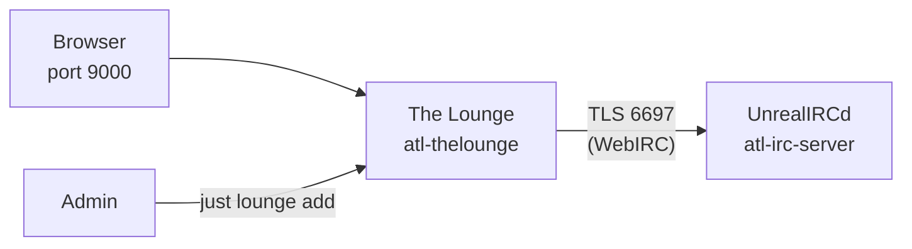

The Lounge is the web-based IRC client for atl.chat, running in private mode with WebIRC support so that users can connect to UnrealIRCd through a browser with persistent sessions and always-on connectivity.

## How The Lounge fits in the stack

The Lounge runs as the `atl-thelounge` container and connects to UnrealIRCd over TLS on port 6697 using the internal Docker network (`atl-chat`). It depends on the `atl-irc-server` health check passing before it starts, ensuring UnrealIRCd is ready to accept connections.

The Lounge operates in **private mode** — there is no public registration. An administrator must create each user account via the `just lounge add` command. Once logged in, users get always-on IRC connectivity: The Lounge maintains the connection to UnrealIRCd even when the browser is closed, and messages are buffered for the next session.

**WebIRC** is configured so that UnrealIRCd sees each user's real IP address instead of the container's internal IP. The Lounge sends a WebIRC handshake (authenticated by a shared password from `THELOUNGE_WEBIRC_PASSWORD`) for every client connection. This means bans, cloaks, and connection limits apply per-user rather than per-container.

## Private mode

The Lounge is configured with `public: false` in its config, which means:

- Users cannot self-register — an admin creates accounts with `just lounge add <name>`
- Each user has a persistent session tied to their account
- The Lounge stays connected to IRC on behalf of the user, even when the browser tab is closed
- Message history, highlights, and unread markers are preserved across sessions

This model is ideal for a community like atl.chat where you want controlled access and always-on presence without requiring users to run a local IRC client or bouncer.

## Default connection settings

The Lounge's config template (`apps/thelounge/config.js.template`) sets these defaults for every new user:

| Setting | Value | Notes |
|---|---|---|
| Server host | `atl-irc-server` | Docker service name, resolved via the `atl-chat` network |
| Port | `6697` | TLS-encrypted IRC |
| TLS | Enabled | Always on |
| Reject unauthorized certs | Configurable | Set via `IRC_LOUNGE_REJECT_UNAUTHORIZED` (typically `false` in dev for self-signed certs) |
| Default nick | `atl%%` | `%%` is replaced with a random number by The Lounge |
| Default channel | `#help` | Users auto-join this channel on first connect |

## Plugins

The Lounge container installs two plugins at startup before launching the main process:

| Plugin | Purpose | Usage |
|---|---|---|
| `thelounge-plugin-janitor` | Automatically deletes uploaded files after a configurable interval | Controlled by `THELOUNGE_DELETE_UPLOADS_AFTER_MINUTES` (set in `.env`) |
| `thelounge-plugin-giphy` | Adds a `/giphy` command for searching and posting GIFs | `/giphy search <term>` or `/giphy random` |

File uploads are enabled by default. The janitor plugin keeps disk usage in check by cleaning up old uploads based on the configured retention period.

## Data and volumes

The compose configuration mounts a single volume into The Lounge container:

| Host path | Container path | Purpose |
|---|---|---|
| `data/thelounge/` | `/var/opt/thelounge` | All persistent data — config, user accounts, message logs, uploads |

The `data/thelounge/` directory is created by `scripts/init.sh` during `just init`. The Lounge's generated config file, user database, and uploaded files all live here.

## Technology

| Component | Technology |
|---|---|
| Software | [The Lounge](https://thelounge.chat/) (latest) |
| Base image | `ghcr.io/thelounge/thelounge:latest` |
| Container name | `atl-thelounge` |
| Mode | Private (admin-managed accounts) |
| WebIRC | Enabled (shared password with UnrealIRCd) |
| IRC connection | TLS on port 6697 to `atl-irc-server` |
| Web interface | Port `9000` |
| Plugins | janitor (upload cleanup), giphy (GIF search) |
| Config management | Template substitution via `scripts/prepare-config.sh` |
| Network | `atl-chat` Docker network |
| User/group | Runs as `${PUID}:${PGID}` (default `1000:1000`) |

## Related pages

- [Configuration](/docs/services/thelounge/configuration) — config template, plugins, environment variables
- [Operations](/docs/services/thelounge/operations) — user management via `just lounge` commands, log management
- [IRC Stack Overview](/docs/services/irc) — UnrealIRCd and the broader IRC stack
- [IRC Configuration](/docs/services/irc/configuration) — UnrealIRCd config including WebIRC settings
- [Environment Variables](/docs/reference/environment-variables) — all configurable variables including The Lounge settings
