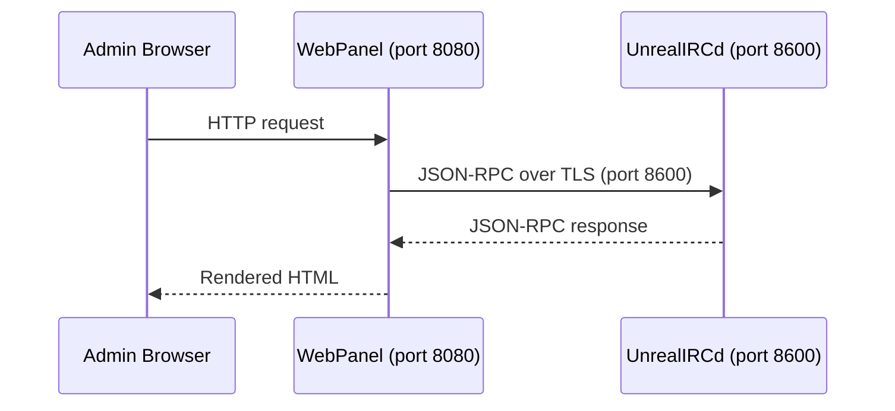

The WebPanel connects to UnrealIRCd via JSON-RPC on port 8600 using credentials you define in `.env` — this page covers the environment variables, RPC authentication chain, Nginx security layer, and authentication backend options.

## Environment variables

The WebPanel uses three variables from `.env.example`, all in the IRC service section under `--- WebPanel ---`:

| Variable | Description | Default | Sensitive |
|---|---|---|---|
| `WEBPANEL_PORT` | Host port mapped to the WebPanel container (container always listens on 8080 internally) | `8080` | No |
| `WEBPANEL_RPC_USER` | Username for JSON-RPC authentication against UnrealIRCd | `adminpanel` | No |
| `WEBPANEL_RPC_PASSWORD` | Password for JSON-RPC authentication against UnrealIRCd | `change_me_webpanel_password` | Yes |

> **Warning:** Change `WEBPANEL_RPC_PASSWORD` from the default before any public deployment. This password grants full administrative RPC access to UnrealIRCd. The same credential is also referenced by the external Portal integration as `IRC_UNREAL_RPC_PASSWORD`.

To apply changes after editing `.env`:

```bash
# Regenerate configs and restart the stack
just init
just dev
```

The WebPanel does not use the `scripts/prepare-config.sh` envsubst pipeline. Instead, the RPC credentials are consumed on the UnrealIRCd side through the config template, and the WebPanel reads them during its first-run setup wizard or from its own stored configuration in `data/irc/webpanel-data/`.

## RPC connection

The WebPanel communicates with UnrealIRCd through the JSON-RPC API. The connection chain works like this:



### UnrealIRCd RPC configuration

On the UnrealIRCd side, the RPC listener and user are defined in `apps/unrealircd/config/unrealircd.conf.template`:

1. A TLS-enabled RPC listener on port 8600:

   ```
   listen {
       ip *;
       port 8600;
       options { rpc; tls; }
       tls-options {
           certificate "...fullchain.pem";
           key "...privkey.pem";
       }
   }
   ```

2. An `rpc-user` block that authorises the WebPanel:

   ```
   rpc-user "${WEBPANEL_RPC_USER}" {
       match { ip 172.16.0.0/12; ip 127.0.0.0/8; }
       rpc-class full;
       password "${WEBPANEL_RPC_PASSWORD}";
   }
   ```

The `match` block restricts RPC access to Docker network IPs (`172.16.0.0/12`) and localhost (`127.0.0.0/8`). The `rpc-class full` grants all permissions — user management, channel administration, server bans, spamfilters, and log access.

### RPC classes

UnrealIRCd defines two RPC permission classes:

| Class | Permissions | Use case |
|---|---|---|
| `full` | All RPC operations | WebPanel (default) |
| `read-only` | Stats, logs, user/server/channel listing, bans listing | Monitoring tools, read-only dashboards |

The WebPanel uses `full` because it needs write access for ban management, spamfilter editing, and other administrative actions. If you want a restricted monitoring-only integration, create a separate `rpc-user` with `rpc-class read-only`.

## Port configuration

The compose service definition in `infra/compose/irc.yaml` maps the WebPanel port:

```yaml
ports:
  - '${WEBPANEL_PORT:-8080}:8080'
```

The container always listens on port 8080 internally (Nginx inside the container). The `WEBPANEL_PORT` variable only controls the host-side mapping. To change the access port:

```bash
# In .env
WEBPANEL_PORT=9090
```

Then restart the stack:

```bash
docker compose down atl-irc-webpanel
just dev
```

Access the WebPanel at `http://localhost:<WEBPANEL_PORT>` — by default `http://localhost:8080`.

## Authentication

The WebPanel supports two authentication backends for admin login.

### File-based authentication (default)

On first access, the WebPanel runs a setup wizard that creates an admin account stored in `data/irc/webpanel-data/`. This is the default and simplest option — no external database is required.

User credentials are stored as files within the data volume:

| Host path | Container path | Contents |
|---|---|---|
| `data/irc/webpanel-data/` | `/var/www/html/unrealircd-webpanel/data` | Config state, session data, user accounts |

The `data/irc/webpanel-data/` directory is created by `scripts/init.sh` during `just init`.

### SQL authentication

The WebPanel also supports SQL-backed authentication (SQLite or MySQL). To switch from file-based to SQL, configure the database connection through the WebPanel's admin settings page after initial setup. This is useful for larger deployments where you want centralised user management.

## Nginx configuration

The WebPanel container uses `trafex/php-nginx` as its base image, which bundles PHP-FPM and Nginx. A custom Nginx config at `apps/webpanel/nginx.conf` adds security hardening:

### Security headers

```nginx
add_header X-Frame-Options "SAMEORIGIN" always;
add_header X-Content-Type-Options "nosniff" always;
add_header X-XSS-Protection "1; mode=block" always;
```

| Header | Effect |
|---|---|
| `X-Frame-Options: SAMEORIGIN` | Prevents the WebPanel from being embedded in iframes on other domains (clickjacking protection) |
| `X-Content-Type-Options: nosniff` | Prevents browsers from MIME-sniffing responses away from the declared content type |
| `X-XSS-Protection: 1; mode=block` | Enables the browser's built-in XSS filter and blocks the page if an attack is detected |

### Access restrictions

The Nginx config denies direct access to sensitive directories:

```nginx
# Deny access to dotfiles
location ~ /\. {
    deny all;
}

# Deny access to data and config directories
location ~ /(data|config) {
    deny all;
}
```

This prevents browsers from directly accessing the WebPanel's stored configuration, session data, or internal config files — even if someone guesses the URL path.

### PHP and static file handling

| Setting | Value | Notes |
|---|---|---|
| PHP-FPM | `127.0.0.1:9000` (inside container) | FastCGI to the local PHP-FPM process |
| `fastcgi_read_timeout` | `300s` | Allows long-running RPC operations to complete |
| Static file caching | `1 year`, `Cache-Control: public, immutable` | JS, CSS, images are aggressively cached |
| URL rewriting | `try_files $uri $uri/ /index.php?$query_string` | All routes fall through to PHP |

## Container setup

The WebPanel container is built from `apps/webpanel/Containerfile` using a multi-stage build:

1. **Builder stage** (`composer/composer`): clones the [upstream WebPanel repository](https://github.com/unrealircd/unrealircd-webpanel) and runs `composer install --no-dev --optimize-autoloader`
2. **Runtime stage** (`trafex/php-nginx`): copies the built application, installs `php84-sodium` for cryptographic operations, and sets file permissions

The compose definition in `infra/compose/irc.yaml`:

| Setting | Value |
|---|---|
| Container name | `atl-irc-webpanel` |
| Restart policy | `unless-stopped` |
| Depends on | `atl-irc-server` (healthy) |
| Volume | `data/irc/webpanel-data` → `/var/www/html/unrealircd-webpanel/data` |
| Port | `${WEBPANEL_PORT:-8080}:8080` |
| Network | `atl-chat` |

The `depends_on` with `condition: service_healthy` ensures UnrealIRCd's JSON-RPC API is ready before the WebPanel starts. UnrealIRCd's health check verifies the RPC socket is responding.

## Related pages

- [WebPanel Overview](/docs/services/webpanel) — features, architecture, and troubleshooting
- [IRC Configuration](/docs/services/irc/configuration) — UnrealIRCd config including the RPC listener and module loading
- [Environment Variables Reference](/docs/reference/environment-variables) — complete variable reference including `WEBPANEL_*` variables
- [Security](/docs/operations/security) — credential rotation for `WEBPANEL_RPC_PASSWORD`
- [Ports Reference](/docs/reference/ports) — complete port registry
