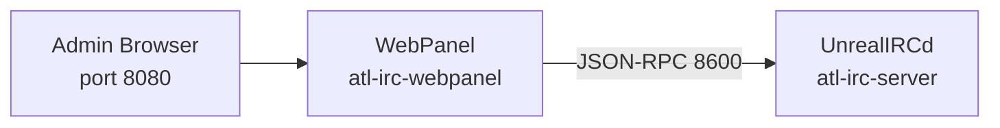

The WebPanel is a web-based administration interface for UnrealIRCd, connecting via JSON-RPC to provide server management, user oversight, and channel administration without direct shell access.

## How the WebPanel fits in the stack

The WebPanel runs as the `atl-irc-webpanel` container and connects to UnrealIRCd's JSON-RPC API on port 8600 over the internal `atl-chat` Docker network. It depends on the `atl-irc-server` health check passing before it starts, ensuring UnrealIRCd is ready to accept RPC requests.

The WebPanel is the [official UnrealIRCd web admin panel](https://github.com/unrealircd/unrealircd-webpanel), built with PHP and served by Nginx. It provides a browser-based interface for common IRC administration tasks that would otherwise require an IRC operator connection or direct config file editing.



## Features

The WebPanel provides these administration capabilities through the browser:

### Dashboard

- Server status and uptime monitoring
- Online user count and channel statistics
- Recent activity overview

### User management

- View currently connected users
- Manage server bans (K-line, Z-line, G-line)
- Search and inspect user details

### Channel administration

- Browse the channel list with details
- Manage channel modes
- Edit channel topics

### Server administration

- View and manage loaded modules
- Browse server logs
- Manage spamfilters and other server-level settings

## Data and volumes

The compose configuration mounts a single bind-mount volume into the WebPanel container:

| Host path | Container path | Purpose |
|---|---|---|
| `data/irc/webpanel-data/` | `/var/www/html/unrealircd-webpanel/data` | Persistent data — configuration state, session data, SQLite database |

The `data/irc/webpanel-data/` directory is created by `scripts/init.sh` during `just init`. The WebPanel stores its runtime configuration and any file-based authentication data here.

## Technology

| Component | Technology |
|---|---|
| Software | [UnrealIRCd WebPanel](https://github.com/unrealircd/unrealircd-webpanel) (latest) |
| Base image | `trafex/php-nginx` (PHP 8.4 + Nginx) |
| Container name | `atl-irc-webpanel` |
| Build | Multi-stage — Composer dependency install, then PHP-Nginx runtime |
| Web interface | Port `8080` (configurable via `WEBPANEL_PORT`) |
| RPC connection | JSON-RPC to UnrealIRCd on port `8600` |
| Authentication | File-based (default) or SQL |
| Network | `atl-chat` Docker network |
| Security headers | `X-Frame-Options`, `X-Content-Type-Options`, `X-XSS-Protection` via Nginx |

## Troubleshooting

### WebPanel shows "Connection failed"

If the WebPanel cannot reach UnrealIRCd's JSON-RPC API:

1. Verify UnrealIRCd is running and healthy:

   ```bash
   docker compose ps atl-irc-server
   ```

2. Check RPC connectivity from the WebPanel container:

   ```bash
   docker exec atl-irc-webpanel nc -z atl-irc-server 8600
   ```

3. Check UnrealIRCd logs for RPC-related errors:

   ```bash
   docker compose logs atl-irc-server | grep -i rpc
   ```

4. Verify the RPC credentials in your `.env` file match what UnrealIRCd expects (`WEBPANEL_RPC_USER` and `WEBPANEL_RPC_PASSWORD`).

### WebPanel not loading

If the web interface is not responding on port 8080:

1. Check the container is running:

   ```bash
   docker compose ps atl-irc-webpanel
   ```

2. Check container logs for Nginx or PHP errors:

   ```bash
   docker compose logs atl-irc-webpanel
   ```

3. Restart the WebPanel container:

   ```bash
   docker compose restart atl-irc-webpanel
   ```

## Related pages

- [Configuration](/docs/services/webpanel/configuration) — port settings, RPC credentials, authentication setup
- [IRC Stack Overview](/docs/services/irc) — UnrealIRCd and the broader IRC stack
- [IRC Configuration](/docs/services/irc/configuration) — UnrealIRCd config including JSON-RPC settings
- [Environment Variables](/docs/reference/environment-variables) — all configurable variables including WebPanel settings
- [Ports Reference](/docs/reference/ports) — complete port registry
