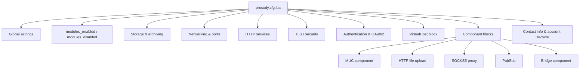

Prosody is configured through a single Lua file (`prosody.cfg.lua`) that uses environment variable substitution at container startup, giving you full control over domains, security, storage, and components without editing Lua directly.

## Configuration file structure

The main configuration lives at `apps/prosody/config/prosody.cfg.lua`. It is a monolithic Lua file organised into clearly labelled sections. Environment variables are read via `os.getenv()` with sensible fallback defaults.



### Section overview

| Section | Purpose |
|---|---|
| Plugin paths | Community and custom module directories |
| `modules_enabled` | All globally loaded modules, grouped by function |
| `modules_disabled` | Explicitly disabled auto-loaded modules |
| Core server settings | PID file, user/group, admin JIDs |
| Data storage | SQLite/PostgreSQL backend, per-store assignments |
| Message archiving (MAM) | Retention, compression, query limits |
| Networking | Ports, interfaces, IPv6, backend tuning |
| HTTP services | BOSH, WebSocket, file upload, CORS, security headers |
| TURN/STUN | External TURN server for audio/video calls |
| Logging | Console and file log levels, OpenMetrics |
| Security | Rate limits, registration throttling, anti-spam |
| TLS/SSL | Protocol version, ciphers, certificate paths |
| Authentication | SASL mechanisms, hashed storage, blocked usernames |
| OAuth2 | Bearer token generation for Portal integration |
| Push notifications | Cloud notify settings for mobile clients |
| VirtualHost | Primary domain with per-host modules and SSL |
| Components | MUC, file upload, proxy65, PubSub, bridge |
| Contact info | Admin contacts, server info, account cleanup |

## Environment variables

All Prosody settings can be tuned via environment variables defined in `.env`. The config reads them with `os.getenv()` and falls back to defaults when unset.

### Core XMPP variables

| Variable | Description | Default |
|---|---|---|
| `XMPP_DOMAIN` | Primary XMPP domain (sets `PROSODY_DOMAIN` in compose) | `atl.chat` |
| `PROSODY_ADMIN_EMAIL` | Admin email for contact info | `admin@allthingslinux.org` |
| `PROSODY_ADMIN_JID` | Admin JID for prosodyctl and MUC ownership | `admin@<domain>` |
| `PROSODY_ALLOW_REGISTRATION` | Enable in-band registration (`true`/`false`) | `false` |
| `PROSODY_LOG_LEVEL` | Minimum log level (`debug`, `info`, `warn`, `error`) | `info` |

### Port variables

| Variable | Description | Default |
|---|---|---|
| `PROSODY_C2S_PORT` | Client-to-server (STARTTLS) | `5222` |
| `PROSODY_S2S_PORT` | Server-to-server (federation) | `5269` |
| `PROSODY_HTTP_PORT` | HTTP (BOSH/WebSocket) | `5280` |
| `PROSODY_HTTPS_PORT` | HTTPS (via nginx proxy) | `5281` |
| `PROSODY_C2S_DIRECT_TLS_PORT` | Client-to-server direct TLS | `5223` |
| `PROSODY_S2S_DIRECT_TLS_PORT` | Server-to-server direct TLS | `5270` |
| `PROSODY_PROXY65_PORT` | SOCKS5 file transfer proxy | `5000` |

### Security variables

| Variable | Description | Default |
|---|---|---|
| `PROSODY_C2S_REQUIRE_ENCRYPTION` | Require TLS for client connections | `true` |
| `PROSODY_S2S_REQUIRE_ENCRYPTION` | Require TLS for server federation | `true` |
| `PROSODY_S2S_SECURE_AUTH` | Require certificate-based s2s auth | `true` |
| `PROSODY_ALLOW_UNENCRYPTED_PLAIN_AUTH` | Allow plaintext passwords without TLS | `false` |
| `PROSODY_TLS_CHANNEL_BINDING` | Enable TLS channel binding for SASL | `true` |
| `PROSODY_OAUTH2_REGISTRATION_KEY` | OAuth2 dynamic client registration key | *(must be set)* |
| `PROSODY_MAX_CONNECTIONS_PER_IP` | Max concurrent connections per IP | `5` |
| `PROSODY_REGISTRATION_THROTTLE_MAX` | Max registrations per throttle period | `3` |
| `PROSODY_REGISTRATION_THROTTLE_PERIOD` | Throttle window for registration rate limiting (seconds) | `3600` |

### Database variables

| Variable | Description | Default |
|---|---|---|
| `PROSODY_DB_PORT` | Database port | `5432` |
| `PROSODY_DB_NAME` | Database name | `prosody` |
| `PROSODY_DB_USER` | Database user | `prosody` |
| `PROSODY_DB_PASSWORD` | Database password | *(change before production)* |

### MAM (message archiving) variables

| Variable | Description | Default |
|---|---|---|
| `PROSODY_ARCHIVE_EXPIRES_AFTER` | Archive retention period | `1y` |
| `PROSODY_ARCHIVE_POLICY` | Archive all conversations by default | `true` |
| `PROSODY_ARCHIVE_COMPRESSION` | Compress archived messages | `true` |
| `PROSODY_ARCHIVE_MAX_QUERY_RESULTS` | Max results per MAM query | `250` |

### MUC variables

| Variable | Description | Default |
|---|---|---|
| `PROSODY_MUC_DEFAULT_PUBLIC` | New rooms are public by default | `true` |
| `PROSODY_MUC_DEFAULT_PERSISTENT` | New rooms persist by default | `true` |
| `PROSODY_MUC_LOCKING` | Lock rooms until configured | `false` |
| `PROSODY_MUC_LOG_BY_DEFAULT` | Archive MUC messages by default | `true` |
| `PROSODY_MUC_LOG_EXPIRES_AFTER` | MUC archive retention | `1y` |
| `PROSODY_RESTRICT_ROOM_CREATION` | Restrict who can create rooms | `false` |

### TURN/STUN variables

| Variable | Description | Default |
|---|---|---|
| `TURN_SECRET` | Shared secret with TURN server | *(change before production)* |
| `TURN_EXTERNAL_HOST` | TURN server hostname | `turn.atl.network` |
| `TURN_PORT` | TURN/STUN UDP port | `3478` |
| `TURNS_PORT` | TURN over TLS port | `5349` |

### Rate limiting variables

| Variable | Description | Default |
|---|---|---|
| `PROSODY_C2S_RATE` | Client connection rate limit | `10kb/s` |
| `PROSODY_C2S_BURST` | Client burst allowance | `25kb` |
| `PROSODY_C2S_STANZA_SIZE` | Max client stanza size (bytes) | `262144` |
| `PROSODY_S2S_RATE` | Server federation rate limit | `30kb/s` |
| `PROSODY_S2S_BURST` | Server burst allowance | `100kb` |
| `PROSODY_S2S_STANZA_SIZE` | Max server stanza size (bytes) | `524288` |

For the complete list of all environment variables, see the [Environment Variables reference](/docs/reference/environment-variables).

## VirtualHost configuration

Prosody uses a single `VirtualHost` block for the primary domain. The domain is set dynamically from the `XMPP_DOMAIN` environment variable (mapped to `PROSODY_DOMAIN` in compose).

```lua
-- Domain from environment
local domain = os.getenv("PROSODY_DOMAIN") or "atl.chat"
allow_registration = os.getenv("PROSODY_ALLOW_REGISTRATION") == "true"

VirtualHost(domain)
http_host = __http_host  -- maps HTTP Host header to this VirtualHost

ssl = {
    key = os.getenv("PROSODY_SSL_KEY") or
        ("certs/live/" .. domain .. "/privkey.pem"),
    certificate = os.getenv("PROSODY_SSL_CERT") or
        ("certs/live/" .. domain .. "/fullchain.pem")
}

-- VirtualHost-scoped modules (not loaded globally)
modules_enabled = {
    "http_admin_api",     -- REST API for user account management
    "default_bookmarks",  -- Default bookmarks when user has none
}

-- Default MUC bookmark for new users
default_bookmarks = {
    { jid = "general@muc." .. domain, name = "General", autojoin = true },
}
```

Key points about the VirtualHost:

- `http_host` maps incoming HTTP requests to this VirtualHost, which is important when Prosody sits behind a reverse proxy
- `http_admin_api` is loaded only on the VirtualHost (not globally) so the REST API is scoped to this domain
- `default_bookmarks` auto-joins new users to the `#general` MUC room
- SSL certificates follow the Let's Encrypt directory layout (`certs/live/<domain>/`)
- Converse.js BOSH/WebSocket URLs are dynamically derived from `PROSODY_HTTP_EXTERNAL_URL` when set

## Component blocks

Components extend Prosody with additional services. Each component gets its own subdomain and SSL certificate.

### MUC (multi-user chat)

```lua
Component("muc." .. domain) "muc"

modules_enabled = {
    "muc_notifications",      -- Push notifications for MUC events
    "muc_offline_delivery",   -- Offline delivery for MUC events
    "muc_thread_polyfill",    -- Infer thread from XEP-0461 reply
    "pastebin",               -- Intercept large messages, replace with paste URL
    "muc_limits",             -- Rate-limit room events to prevent floods
    "muc_moderation",         -- XEP-0425: Message moderation
    "muc_mam_hints",          -- XEP-0334: Respect store/no-store hints
    "muc_mam_markers",        -- XEP-0333: Archive chat markers in MAM
    "muc_markers",            -- Rewrite message id to stanza-id for reactions
    "muc_defaults",           -- Create default MUCs on startup
    "muc_slow_mode",          -- Per-user rate limit set by room owners
}
```

The MUC component creates a `general` room on startup with the admin JID as owner. Room defaults (public, persistent, logged) are controlled via `PROSODY_MUC_*` environment variables.

MUC rate limiting is configured globally:

| Setting | Value | Description |
|---|---|---|
| `muc_event_rate` | `0.5` | Max events/second (one every 2 seconds) |
| `muc_burst_factor` | `6` | Allow 6× burst for 6 seconds |
| `muc_max_nick_length` | `23` | Max nickname length |
| `muc_max_char_count` | `5664` | Max bytes per message |
| `muc_max_line_count` | `23` | Max lines per message |

### HTTP file upload

```lua
Component("upload." .. domain) "http_file_share"
http_host = __http_host
http_external_url = os.getenv("PROSODY_UPLOAD_EXTERNAL_URL")
    or ("https://upload." .. domain .. "/")
```

| Setting | Value |
|---|---|
| Max file size | 100 MB |
| Daily quota per user | 1 GB |
| Global quota | 10 GB |
| File expiration | 30 days |

### SOCKS5 proxy (XEP-0065)

```lua
Component("proxy." .. domain) "proxy65"
proxy65_address = os.getenv("PROSODY_PROXY_ADDRESS") or ("proxy." .. domain)
```

Provides peer-to-peer file transfer proxying. The proxy listens on port 5000 (configurable via `PROSODY_PROXY65_PORT`).

### PubSub with RSS feeds

```lua
Component("pubsub." .. domain) "pubsub"
modules_enabled = { "pubsub_feeds" }
feeds = {
    feed = os.getenv("PROSODY_FEED_URL") or "https://allthingslinux.org/feed",
}
```

The PubSub component pulls RSS/Atom feeds and publishes them as XMPP PubSub nodes. Registered users can create their own PubSub nodes.

### Bridge component (XEP-0114)

```lua
Component("bridge." .. domain) "component"
component_secret = os.getenv("BRIDGE_XMPP_COMPONENT_SECRET")
    or os.getenv("XMPP_COMPONENT_SECRET")
    or "change_me_xmpp_component_secret"
```

The bridge service connects as an external XMPP component on port 5347. The component interface listens on all interfaces (`component_interfaces = { "*" }`) so the bridge container can reach it across the Docker network.

> **Warning:** Change `BRIDGE_XMPP_COMPONENT_SECRET` from the default before production deployment.

## Storage configuration

Prosody uses SQLite by default for development and can be switched to PostgreSQL for production via `PROSODY_STORAGE=sql`.

```lua
default_storage = "sql"

sql = {
    driver = "SQLite3",
    database = "data/prosody.sqlite",
}
```

Storage is assigned per data type:

| Data type | Backend | Notes |
|---|---|---|
| accounts, roster, vcard, private, blocklist | `sql` | User data |
| archive, muc_log, offline | `sql` | Message archives |
| pubsub_nodes, pubsub_data, pep | `sql` | PubSub and PEP |
| http_file_share | `sql` | File upload metadata |
| caps, carbons | `memory` | Ephemeral (not persisted) |

Data is stored in Docker volumes mapped to `data/xmpp/data/` on the host.

## TLS and security

### Global TLS settings

```lua
ssl = {
    protocol = "tlsv1_2+",
    ciphers = "ECDHE+AESGCM:ECDHE+CHACHA20:DHE+AESGCM:DHE+CHACHA20:!aNULL:!MD5:!DSS",
    curve = "secp384r1",
    options = { "cipher_server_preference", "single_dh_use", "single_ecdh_use" },
}
```

This enforces TLS 1.2+ with modern AEAD ciphers and ECDHE key exchange. The certificate directory follows the Let's Encrypt layout:

```
/etc/prosody/certs/live/<domain>/
├── fullchain.pem
└── privkey.pem
```

### Encryption enforcement

| Setting | Default | Recommendation |
|---|---|---|
| `c2s_require_encryption` | `true` | Always `true` in production |
| `s2s_require_encryption` | `true` | Always `true` in production |
| `s2s_secure_auth` | `true` | `true` for certificate-based federation auth |
| `allow_unencrypted_plain_auth` | `false` | Never `true` in production |

### Authentication

Prosody uses hashed password storage with SCRAM-SHA-256 as the primary SASL mechanism:

```lua
authentication = "internal_hashed"
sasl_mechanisms = {
    "SCRAM-SHA-256",
    "SCRAM-SHA-1",
}
```

SCRAM-SHA-1 is kept for compatibility with older clients. In-band registration is disabled — users are provisioned via the Portal through `mod_http_admin_api`.

### Rate limiting

Three rate limit tiers protect against abuse:

| Tier | Rate | Burst | Max stanza |
|---|---|---|---|
| Client (c2s) | 10 KB/s | 25 KB | 256 KB |
| Server (s2s) | 30 KB/s | 100 KB | 512 KB |
| HTTP upload | 2 MB/s | 10 MB | — |

Additional protections:

- `max_connections_per_ip`: 5 (increase if bridge shares an IP)
- `anti_spam_services`: subscribes to `xmppbl.org` real-time block lists
- `block_registrations_users`: blocks common abusive usernames (admin, root, postmaster, etc.)
- `block_registrations_require`: enforces `^[a-zA-Z0-9_.-]+$` pattern for usernames

### HTTP security headers

Prosody serves HTTP responses with hardened headers:

| Header | Value |
|---|---|
| `Strict-Transport-Security` | `max-age=31536000; includeSubDomains; preload` |
| `X-Frame-Options` | `DENY` |
| `X-Content-Type-Options` | `nosniff` |
| `X-XSS-Protection` | `1; mode=block` |
| `Referrer-Policy` | `strict-origin-when-cross-origin` |
| `Content-Security-Policy` | Allows `self`, Converse.js CDN, and XMPP endpoints |

## Audit findings and recommendations

The following findings are from a configuration audit and remain relevant to the current setup.

### Resolved issues

These critical issues from the original audit have been fixed in the current configuration:

- **TLS enforcement defaults**: `.env.example` now ships with `PROSODY_C2S_REQUIRE_ENCRYPTION=true`, `PROSODY_S2S_REQUIRE_ENCRYPTION=true`, `PROSODY_S2S_SECURE_AUTH=true`, and `PROSODY_ALLOW_UNENCRYPTED_PLAIN_AUTH=false`.
- **Global SSL block**: The `ssl` block is now active (not commented out) with TLS 1.2+ and modern ciphers.
- **Legacy auth removed**: `legacyauth` is no longer in `modules_enabled` — only SASL (SCRAM-SHA-256/SHA-1) is used.
- **HTTP status endpoint**: `http_status_allow_cidr` is restricted to `172.16.0.0/12` and `127.0.0.0/8` (Docker networks and localhost), not world-open.

### Active considerations

- **Archive retention**: `PROSODY_ARCHIVE_EXPIRES_AFTER` defaults to `1y`. Monitor SQLite database size over time, especially with many active users.
- **Connections per IP**: `PROSODY_MAX_CONNECTIONS_PER_IP` defaults to `5`. In Docker environments where the bridge and other services connect from the same network IP, you may need to increase this value.
- **`mod_register` for password changes**: Registration is disabled (Portal provisions users), but `mod_register` is also needed for password changes by existing users. Consider enabling it with `allow_registration = false` if users need self-service password changes.
- **Namespace exclusions**: `dont_archive_namespaces` excludes typing indicators (`chatstates`) and Jingle call signaling from archives, reducing storage usage.

### Positive findings

The configuration exceeds typical Prosody deployments in several areas:

- Comprehensive module selection covering core protocol, modern messaging (MAM, carbons, smacks), mobile optimization (CSI, cloud_notify), and spam prevention (anti_spam, blocklist, report_forward)
- Push notification privacy: `push_notification_with_body` and `push_notification_with_sender` are both `false` by default
- Anti-spam with xmppbl.org RTBL subscription
- Thorough HTTP security headers including HSTS, CSP, and X-Frame-Options
- Proper TURN/STUN external configuration for audio/video calls
- Certificate handling with Let's Encrypt layout, legacy fallback, and self-signed generation

## Customising the configuration

To modify Prosody settings:

1. Set environment variables in `.env` (preferred for most settings)
2. Edit `apps/prosody/config/prosody.cfg.lua` directly for structural changes
3. Reload the configuration without restarting:
   ```bash
   just xmpp reload
   ```
4. Verify the configuration is valid:
   ```bash
   just xmpp check-config
   ```

For TLS certificate changes, Prosody needs a reload:

```bash
just xmpp reload
```

To verify certificates are correctly configured:

```bash
just xmpp check-certs
```

## Related pages

- [XMPP Overview](/docs/services/xmpp) — architecture and technology stack
- [XMPP DNS](/docs/services/xmpp/dns) — SRV records and DNS setup
- [XMPP Modules](/docs/services/xmpp/modules) — module reference
- [XMPP Operations](/docs/services/xmpp/operations) — operational commands and management
- [Environment Variables](/docs/reference/environment-variables) — complete variable reference
- [SSL/TLS](/docs/operations/ssl-tls) — certificate management across all services
