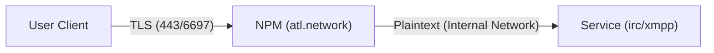

# SSL/TLS Termination Strategy

In the `atl.chat` ecosystem, SSL/TLS termination is decentralized from individual application containers and centralized at the network gateway.

## The `atl.network` Gateway
All external traffic passes through the **Nginx Proxy Manager (NPM)** instance at the `atl.network` gateway.

### Traffic Flow

## Benefits of Centralization
1. **Simplified Backends**: Services like UnrealIRCd or Prosody don't need to manage Let's Encrypt challenges directly.
2. **Unified Certificate Renewal**: All certificates for `*.atl.chat` are managed in one location.
3. **Internal Security**: Communication between NPM and the chat services happens within the secure Tailscale VPC.

## Port Mappings
| External Port | Service | Internal Protocol |
|---------------|---------|-------------------|
| 6697 (SSL)    | IRC     | 6667 (Plaintext)  |
| 5222 (STARTTLS)| XMPP    | 5222 (Plaintext)  |
| 443 (HTTPS)   | Web/API | 3000/8080 (HTTP)  |

## Note on Internal TLS
While external traffic is halted at NPM, some services may still utilize internal self-signed certificates for specific protocol handshakes (e.g., legacy S2S links) if requested by the protocol standard.
